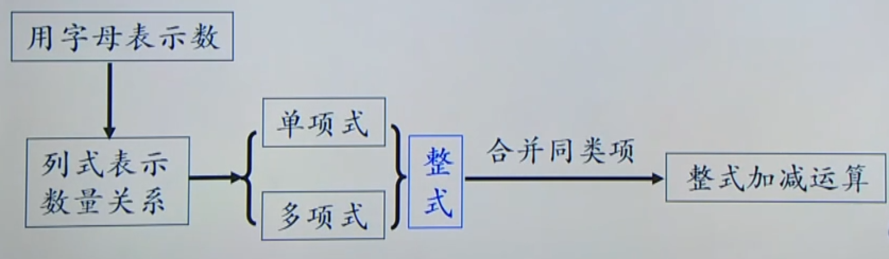

# 整式
## 用含有字母的式子表示数量关系

审题时 
1. 抓关键词、明确它们的意义以及它们之间的关系，如和、差、积、商；大、小、倍、分等；如比…提高/降低、顺水/逆水、打折等; 
2. 理清语句层次，明确运算顺序; 
3. 牢记概念和公式

书写时
1. 数与字母、字母与字母相乘省略乘号；如：100t vt
2. 数与字母相乘时，数字在前；如：0.7k
3. 除法运算时，一般按分数形式写；如 $\frac {m}{7}$
4. 带分数与字母相乘时，可以化成假分数；如$\frac {4}{3}$n
5. 带单位时，和的形式要加括号；如：（3x+5y+2z)元

## 用字母表示数
特殊到一般

数式通性

数形结合

## 单项式
像0.8p，$a^2$h 这样表示数或字母的积的式子叫做单项式。单独的一个数或一个字母也是单项式。 
例如，$\frac {2}{3}$xy，-3，x等都是单项式，x＋1，x-y，等都不是单项式。

单项式中的数字因数叫做这个单项式的系数。例如，100t的系数是100

单项式中所有字母的指数的和叫做这个单项式的次数。例如，2$x^2$$y^3$的次数是5；5$a^4$的次数是4。

对于单独一个非零的数，规定它的次数为0。例如，3的次数是0

## 多项式
像这样，几个单项式的和叫做多项式。在多项式中，每个单项式叫做多项式的项，其中，不含字母的项，叫做常数项。例如，多项式 $x^2$+2x+18 的项是$x^2$，2x与18，其中18是常数项；多项式v-2.5的项是v与-2.5，其中-2.5是常数项
> 注意：多项式的各项应包括它前面的符号

多项式里，次数最高项的次数，叫做这个多项式的次数。

例如，$x^2$+2x+18含有三项$x^2$，2x与18。$x^2$是二次项，2x是一次项，18是常数项，次数最高项是二次项$x^2$。多项式$x^2$+2x+18的次数是2

**单项式与多项式统称为整式**

# 整式的加减
## 同类项 
### 定义
所含字母相同，并且相同字母的指数也相同的项叫做同类项。 

### 特征
“两个相同” ：一是所含的字母完全相同， 二是相同字母的指数相同； 
“两个无关” ：同类项只与字母及其指数有关，与系数无关，与字母的顺序无关

## 合并同类项
### 概念
把多项式中的同类项合并成一项，叫做合并同类项。

### 法则
合并同类项后，所得项的系数是合并前各同类项的系数的和，且字母连同它的指数不变

### 基本步骤
一找，找出多项式中的同类项，不同的同类项用不同的标记标出； 

二移，利用加法的交换律、 结合律，将不同类的同类项集中到不同的括号内； 

三并，将同一括号内的同类项相加

> 说明：运算结果通常按照同一个字母的指数从大到小（降幂）或从小到大（升幂）的顺序排列。

## 去括号规律
如果括号外的因数是正数，去括号后原括号内各项的符号原来的符号相同； 

如果括号外的因数是负数，去括号后原括号内各项的符号与原来的符号相反。

简单来说，去括号，看符号：是“+” 号 ，不变号： 是“-” 号 ，全变号

注意符号变化规律，不要漏乘括号前面的倍数，不要丢项。

## 整式运算法则
一般地，几个整式相加减，如果有括号就先去括号，然后再合并同类项

# 总结
