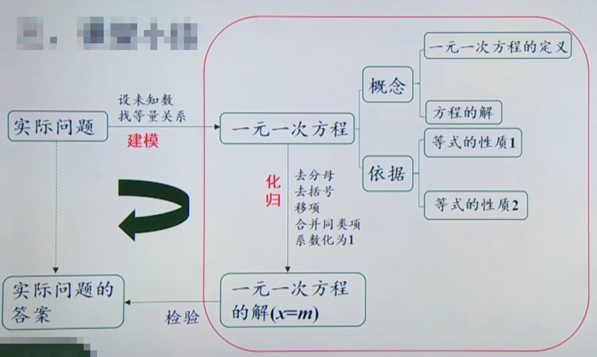

# 解决问题步骤
1. 分析题意，圈画关键词、列表或画图找出相等关系
2. 设未知数，列方程

# 定义
只含有一个未知数，未知数的次数都是1，等号两边都是整式，这样的方程叫做一元一次方程

例子：$\frac {3}{x}$ = 2 不是一元一次方程，左侧不是整式，单项式不是积的形式

# 解方程
解方程就是求出使方程中等号左右两边相等的未知数的值，这个值就是方程的解。

# 等式
用等号表示相等关系的式子，叫做等式。

通常可以用a=b表示一般的等式

方程是含有未知数的等式

# 等式性质
## 性质一 
等式两边加（或减）同一个数(或式子），结果仍相等。
   
如果a = b，那么a ${\plusmn}$ c=b ${\plusmn}$ c

## 性质2
等式两边乘同一个数，或除以同一个不为0的数，结果仍相等。

如果a = b，那么ac = bc;

如果a = b(c ${\ne}$ 0),那么$\frac {a}{c}$ = $\frac {b}{c}$

## 注意
等式两边都要参加运算，并且是作同一种运算

等式两边都不能除以0，即0不能作除数或分母

# 解一元一次方程
目标：x=a

步骤：去分母，去括号，移项，合并同类项，系数化为1

注意：
1. 去分母要方程两边同乘分母的最小公倍数 
2. 分数线的作用，有括号的作用，即分子是多项式的，要加括号
3. 去括号时要用分配律
4. 移项要变号。

# 数学建模思想
通过实际问题，设未知数、根据相等关系列方程，抽象出数学模型，最终列出一元一次方程，体现了数学建模思想

# 总结
