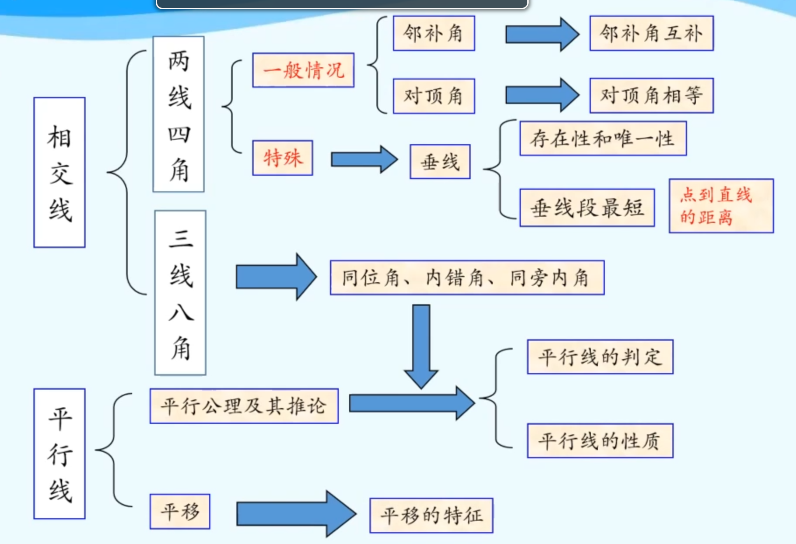

# 邻补角
## 概念
如果两个角有一条公共边，它们的另一边互为反向延长线，那么这两个角互为邻补角

## 特征
1. 两条直线相交形成的角
2. 有公共顶点
3. 有一条公共边

## 性质
邻补角互补

# 对顶角
## 概念
如果两个角有一个公共顶点，并且其中一个角的两边是另一个角的两边的反向延长线，那么这两个角互为对顶角

## 特征
1. 两条直线相交形成的角
2. 有公共顶点
3. 没有公共边

## 性质
对顶角相等

# 邻补角与对顶角异同
## 相同点
1. 都是两条直线相交而成的角
2. 都有一个公共顶点
3. 都是成对出现的

## 不同点
1. 有无公共边
2. 两直线相交时，对顶角有两对，邻补角有四对

# 垂线
## 定义
当两条直线相交所成的四个角中，有一个角是直角时，就说这两条直线互相垂 直，其中一条直线叫做另一条直线的垂线， 它们的交点叫做垂足。

## 符号语言
&because; &ang;1=90° (已知)

&there4; AB&perp;CD于O（垂线定义）

反之

&because; AB&perp;CD于O（垂线定义）

&there4; &ang;1=90° (已知)

## 图形语言
略

## 性质
1. 经过一点（已知直线上或直线外），能画出已知直线的一条垂线，并且只能画出一条垂线，即：在同一平面内，过一点有且只有一条直线与已知直线垂直

2. 连接直线外一点与直线上各点的所有线段中，垂线段最短。简单说成，垂线段最短

# 点到直线的距离
直线外一点到这条直线的垂线段的长度，叫做点到直线的距离。

# 同位角、内错角、同旁内角
两直线AB、CD被第三条直线EF所截，构成8个角，简称“三线八角”

直线AB、CD是被截直线，EF是截线

由于截取会产生同位角、内错角、同旁内角

## 同位角
### 特征
截线：同侧

被截线：同一方

### 基本图形
类似F

## 内错角
### 特征
截线：同侧

被截线：内部

### 基本图形
类似U

## 同旁内角
### 特征
截线：两侧
被截线：内部

### 基本图形
类似Z

## 共同特征
没有公共顶点

# 平行线
## 定义
在同一平面内，直线a与直线b不相交时，我们就说a与b互相平行（parallel）。记作a&par;b。

## 符号语言
a&par;b

## 图形语言
略

## 基本事实
经过直线外一点，有且只有一条直线与这条直线平行

## 公理推论
如果两条直线都与第三条直线平行，那么这两条直线也互相平行

推理：

&because; b&par;a, c&par;a

&there4; b&par;c

## 平行线三种判断方法
1. 同位角相等，两直线平行
2. 内错角相等，两直线平行
3. 同旁内角互补，两直线平行

## 平行线的性质 
1. 两条平行线被第三条直线所截，同位角相等 
2. 两条平行线被第三条直线所截，内错角相等
3. 两条平行线被第三条直线所截，同旁内角互补

# 平移
## 概念 
在平面内，将一个图形沿某个方向移动一定的距离，这样的图形运动称为平移

## 性质
1. 平移前后图形的形状和大小,完全相同
2. 对应线段平行(或在同一直线上)且相等
3. 各对应点所连线段平行(或在同一直线上)且相等 
   
## 平移作图
关键在于按要求作出对应点；然后顺次连接对应点即可

# 总结

