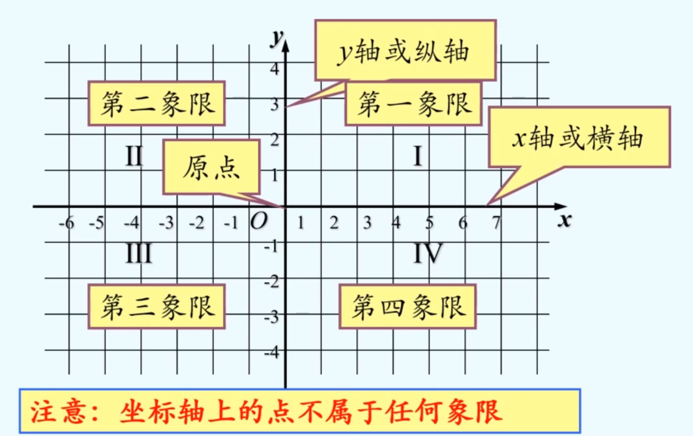
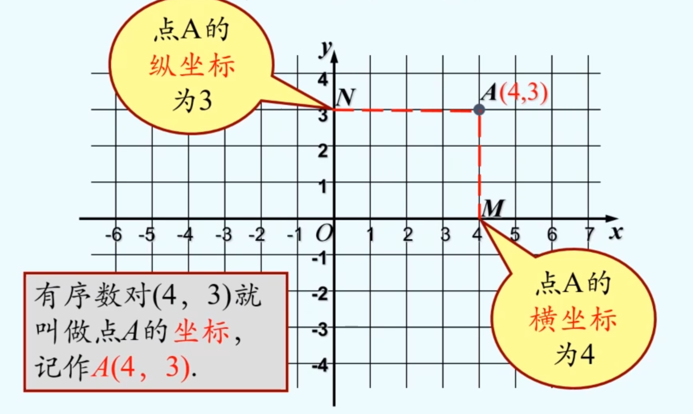

# 有序数对
## 定义
有顺序的两个数a与b组成的数对，叫做有序数对 (ordered pair)，记作(a,b)
> 注：利用有序数对，可以准确地表示出一个位置

# 平面直角坐标系

平面上的点与坐标（有序数对）是一一对应的

平面上一点到x轴的距离是|y|，到y轴的距离是|x|

## 用坐标表示地理位置
一、建立平面直角坐标系描述地理位置的一般过程 
1. 建立坐标系，选择一个适当的参照点为原点，确定x轴、y轴的正方向；
2. 根据具体问题确定单位长度;
3. 在坐标平面内画出这些点，写出各点的坐标和各个地点的名称
 
二、还能用方位角和长度的方法表示地理位置

## 用坐标表示平移
略