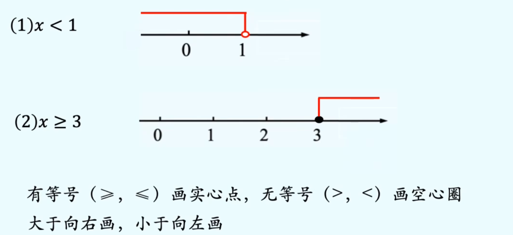
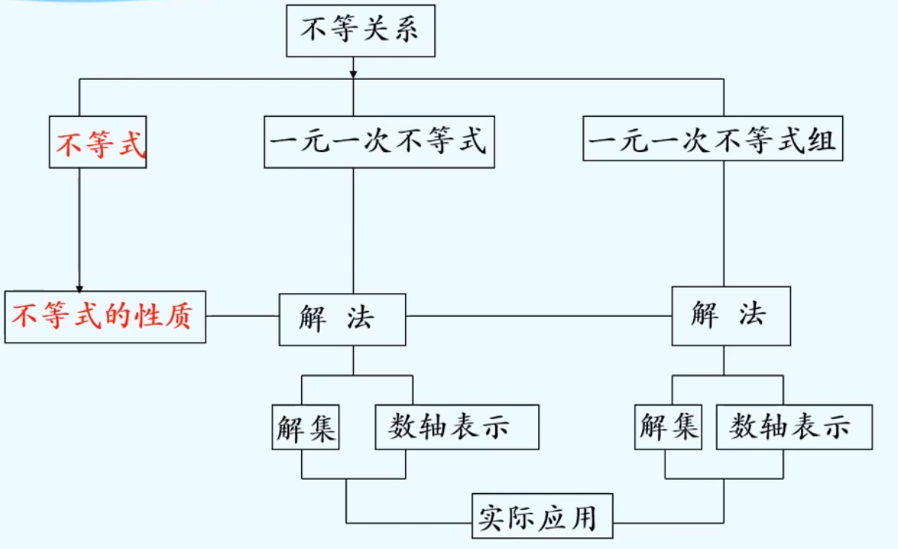

# 不等式
## 概念
像这样，用“>”或“<”表示大小关系的式子，叫做不等式。 

不等号：“＞"，“＜”，“&ge;”，“&le;”，“&ne;”

## 不等式的解
使不等式成立的未知数的值，叫做不等式的解。

例如：x=9，x=10叫做2x＞8的解

代入法是检验某个值是否是不等式的解的简单、实用的方法

## 不等式的解集
一般地，一个含有未知数的不等式的所有的解，组成这个不等式的解集

求不等式的解集的过程叫做解不等式

## 用数轴表示不等式解集

# 不等式的性质
## 文字语言
1. 不等式两边加（或减）同一个数（或式子），不等号的方向不变. 
2. 不等式两边乘（或除以）同一个正数，不等号的方向不变
3. 不等式两边乘（或除以）同一个负数，不等号的方向政变。

## 符号语言
1. 如果a＞b， 那么a+c>b+c, a-c>b-c
2. 如果a＞b，c>0， 那么ac>bc，$\frac {a}{c}$>$\frac {b}{c}$
3. 如果a＞b，c<0， 那么ac<bc，$\frac {a}{c}$<$\frac {b}{c}$

# 一元一次不等式 
## 概念
只含有一个未知数，未知数的次数都是1，且不等号两边都是整式的不等式，叫做一元一次不等式
> 与一元一次方程定义只差在符号上

## 解法
类比一元一次方程

# 一元一次不等式组
## 概念
类似于方程组，把这两个不等式合起来，组成一个一元一次不等式组

## 求解
类比方程组的解（几个方程的公共解） 

解不等式组就是求各不等式解集的公共部分

## 不等式组解集
一般地，几个不等式的解集的公共部分，叫做由它们所组成的不等式组的解集。解不等式组就是求它的解集

### 求解步骤
先求出不等式组中各不等式的解集；

再求出这些解集的公共部分(可借助数轴）

# 总结

