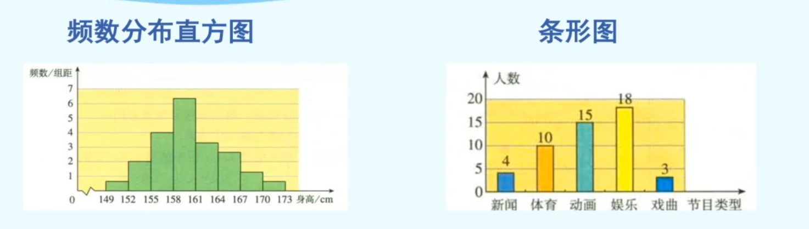

# 统计调查
## 数据处理的一般过程
收集数据、整理数据、描述数据、分析数据

## 全面调查
考察全体对象的调查叫全面调查

## 抽样调查
只抽取一部分对象进行调查，然后根据调查数据推断全体对象的情况，这种调查方法叫做抽样调查。 

要考察的全体对象称为总体。

组成总体的每一个考察对象称为个体。

被抽取的那些个体组成一个样本

样本中个体的数目称为样本容量

## 归纳

全面调查和抽样调查是收集数据的两种方法

全面调查收集到的数据全面、准确，但一般花费多、耗时长，而且某些调查不宜用全面调查

抽样调查具有花费少、省时的特点，但抽取的样本是否具有代表性，直接关系到对总体估计的准确程度

## 简单随机抽样
抽取样本的过程中，总体中的每一个个体都有相等的机会被抽到，像这样的抽样方法是一种简单的随机抽样。

# 直方图
## 步骤
1. 计算最大值与最小值的差
2. 决定组距和组数
3. 列频数分布表
4. 画频数分布直方图。

## 与条形图的联系

### 联系
它们都是用小长方形来表示数据分布情况的

当等距分组时，都是用矩形的高来表示频数的多少 

### 区别
直方图中分组数据具有连续性，各矩形之间通常连续排列，中间没有空隙，宽度表示组距

条形图中各矩形是分开排列購 中间有一定的间隔 宽度无实际意义