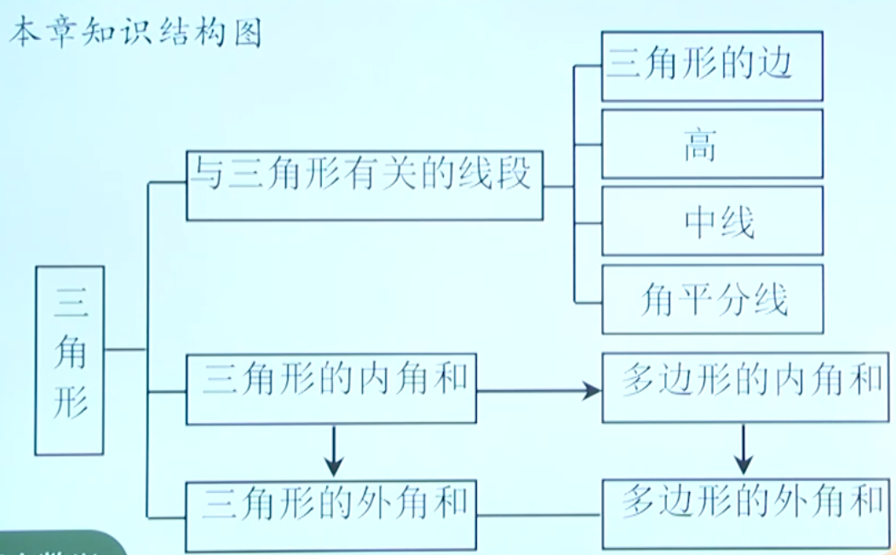

# 三角形
## 定义
由不在同一条直线上的三条线段首尾顺次相接所组成的图形叫做三角形

相邻两边组成的角，叫做三角形的内角，简称三角形的角

顶点是A，B，C的三角形，记作：$\triangle$ABC，读作：三角形ABC

## 顶点、边、内角对应关系：
| 顶点 | 点A  | 点B | 点C |
|  ----  | ----  | ----  | ----  |
| 边  | BC | AC | AB |
|   | a | b | c |
| 内角  | &angle;A | &angle;B | &angle;C |

## 按照内角大小分类
锐角三角形

直角三角形

钝角三角形

## 按照边的关系分类
```
三边都不相等的三角形
等腰三角形   
    底边和腰不相等的等腰三边形
    等边三角形
```

## 三角形边的关系
三角形两边的和大于第三边
> 依据：两点直线，线段最短

三角形两边的差小于第三边

两边的差 < 第三边 < 两边的和

判断三条线段是否可以组成三角形，只需判断两条较短线段的和是否大于第三条线段即可

## 稳定性
三角形是具有稳定性的图形，而四边形没有稳定性。

## 三角形的高
从三角形的一个项点向它的对边所在直线作垂线，顶点和垂足之间的线段叫做三角形的高线，简称三角形的高.

## 三角形的中线
在三角形中，连接一个顶点与它对边的中点的线段，叫做三角形的中线。

三角形中线都在三角形的内部，且必交于一点

三角形三条中线的交点叫做三角形的重心

## 三角形的角平分线
在三角形中，一个内角的平分线与它的对边相交，这个角的顶点与交点之间的线段叫做三角形的角平分线

三角形的角平分线都在三角形的内部，且必交于一点

## 内角和
三角形三个内角的和是180°

可通过做一边的平行线来证明

## 直角三角形判定
直角三角形的两个锐角互余

有两个角互余的三角形是直角三角形

## 三角形外角
像这样，三角形的一边与另一边的延长线组成的角，叫做三角形的外角。

三角形外角和为360°

### 推论
三角形的外角等于与它不相邻的两个内角的和
> 推论是由定理直接推出的结论．和定理一样，推论可以作为进一步推理的依据.

# 多边形
## 定义
**在平面内**，由一些线段首尾顺次相接组成的图形叫做多边形
> 大于3条边可以不在同一平面内

## 多边形的边、角（内角、外角）、对角线； 

对角线的主要作用：分割成三角形，把多边形的问题转化为三角形的问题来解決；

| 名称 | 四边形  | 五边形 | 六边形 | n边形 |
|  ----  | ----  | ----  | ----  | ----  |
| 从一个顶点出发<br/>能做的对角线条数  | 1 | 2 | 3 | n-3 |
| 过一个顶点的对角线<br/>把多边形分成的<br/>三角形个数  | 2 | 3 | 4 | n-2 |
| 对角线总条数  | 2 | 5 | 9 | $\frac{n(n-3)}{2}$ |

## 凸多边形
画出多边形的任何一条边所在在线，如果整个多边形都在这条直线的同一侧。这样的多边形叫做凸多边形

## 正多边形
各个角都相等，各条边都相等的多边形叫做正多边形。

## 思想方法
类比、转化等数学思想。

把多边形的问题可以转化为三角形的问题来研究，将未知转化为已知。 

## 内角和
多边形的内角和为(n-2)*180°，内角和仅与边数有关，与多边形的大小无关，边数每增加1，内角和增加180° 

## 外角和
多边形的外角和为360°，不随边数的改变而改变

# 总结
