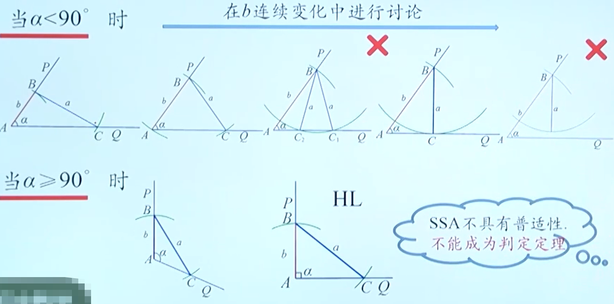
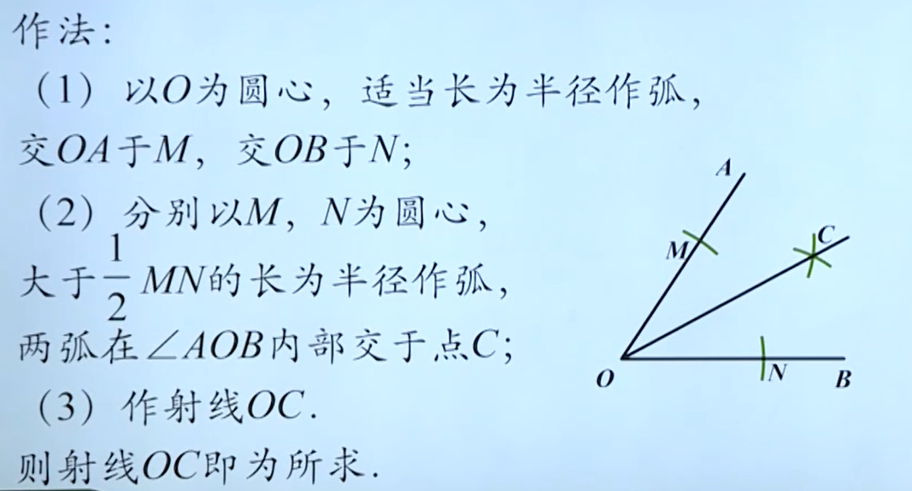
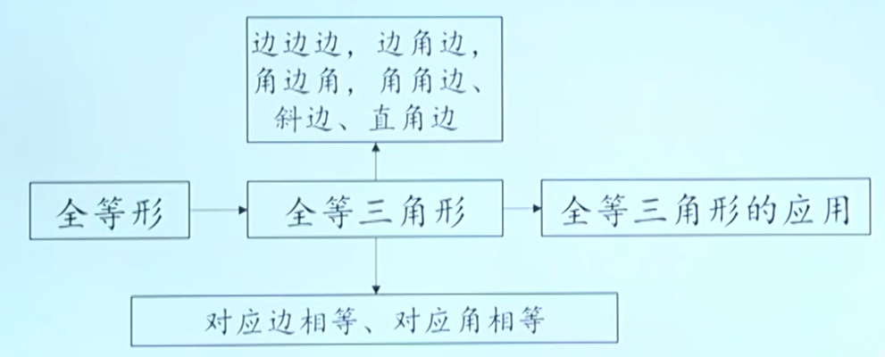

# 全等形
形状、大小相同的图形放在一起能够完全重合，能够完全重合的两个图形叫做全等形

# 全等三角形
## 定义
能够完全重合的两个三角形叫做全等三角形

一个图形经过平移、翻折、旋转后，位置变化了，但形状大小都没有改变，即平移、翻折、旋转前后的图形全等。

其中，重合的顶点叫做对应顶点，重合的边叫做对应边，重合的角叫做对应角

如果$\triangle$ABC 和 $\triangle$DEF, 记作$\triangle$ABC $\cong$ $\triangle$ABC

符号“$\cong$”表示全等，读作“全等于”

## 性质
全等三角形对应边相等

全等三角形对应角相等

## 全等三角形判定
### “SSS” 判定方法
三边对应相等的两个三角形全等

(可简写成“边边边” 或 “SSS”)

### "SAS" 判定方法
两边和它们的夹角分別相等的两个三角形全等 

(可简写成“边角边” 或 “SAS”)

### "ASA" 判定方法
两角和它们的夹边分別相等的两个三角形全等 

(可简写成“角边角” 或 “ASA”)

### "AAS" 判定方法
两角和其中一角的对边分別相等的两个三角形全等 

(可简写成“角角边” 或 “AAS”)

>由上述两个判定我们发现，当两个三角形有两个角分别相等后，相等的那条边可以为三边中的任意边。因此我们可以归纳为 “若两角一边相等，则三角形全等”

### 直角三角形 “HL” 判定方法
斜边和一条直角边分别相等的两个直角三角形全等 (简写为“斜边、直角边”或“HL”)

### 归纳 SSA判定？

# 角的平分线
## 尺规作图

## 性质
角平分线上的点到角的两边的距离相等

角的内部到角的两边的距离相等的点在角平分线上

# 总结
