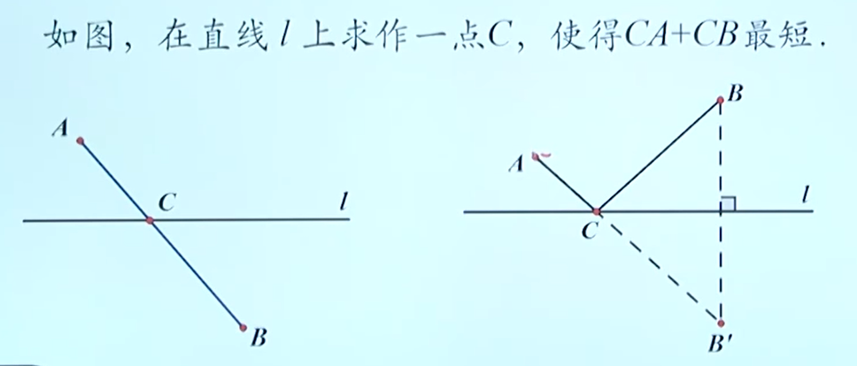
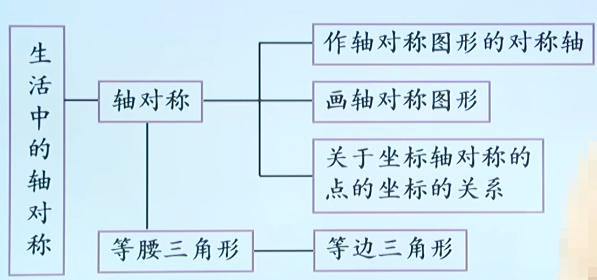

# 轴对称
如果一个平面图形沿一条直线折叠，直线两旁的部分能够互相重合，这个图形叫做轴对称图形，这条直线就是它的对称轴。

把一个图形沿着某一条直线折叠，如果它能够与另一个图形重合，那么就说这两个图形关于这条直线成轴对称。这条直线叫做对称轴，折叠后重合的点是对应点，叫对称点

## 区别
|  | 轴对称图形 | 两个图形成抽对称 |
|  ----  | ----  | ----  |
| 图形  | 一个图形自身的对称特征 | 两个图形自身的对称特征 |
| 对称点位置  | 在同一个图形上 | 在两个图形上 |
| 对称轴条数  | 至少一条 | 一条 |

## 联系
都沿着某直线翻折后能够互相重合。 

可转化：如果把轴对称的两个图形看作一个整体，那么这个整体就是一个轴对称图形。如果把一个轴对称图形位于对称轴两旁的部分看成两个图形， 那么这两部分图形就成轴对称

# 线段的垂直平分线
## 性质
线段垂直平分线上的点与这条线段两个端点的距离相等

与线段两个端点距离相等的点在这条线段的垂直平分线上
> 可证：三角形三边的垂直平分线交于一点

## 尺规作图
1. 作一条线段等于已知线段
2. 作己知线段的垂直平分线（中点）
3. 作已知角的角平分线；
4. 作一个角等于已知角；
5. 过一点作已知直线的垂线

# 用坐标表示轴对称
## 关于坐标轴对称的点的坐标规律
点(a,b)关于x轴对称的点的坐标为(a,-b)

点(a,b)关于y轴对称的点的坐标为(-a,b)）

## 求已知点关于坐标轴对称的点的坐标
关于x轴对称，横坐标不变，纵坐标变为相反数 
关于y轴对称，纵坐标不变，橫坐标变为相反数 

## 在坐标系中作已知图形的对称图形
只要先求出已知图形中的一些特殊点的对称点的坐标，描出并连接这些点，就可以得到这个图形关于坐标轴对称的图形

# 等腰三角形 
## 定义
有两条边相等的三角形叫做等腰三角形

等腰三角形中，相等的两边叫做腰，另一边叫做底边，两腰的夹角叫做顶角，腰和底边的夹角叫做底角

## 性质
等腰三角形的两个底角相等。简写成“等边对等角”

等腰三角形顶角的平分线、底边上的中线及底边上的高线互相重合。简写成：“三线合一”

## 判定
如果一个三角形有两个角相等，那么这两个角所对的边也相等(简写成“等角对等边〞）

# 等边三角形
## 定义
三边都相等的三角形叫做等边三角形（正三角形）

## 性质
三条边相等

三个内角都相等，都为60°

“三线合一”

轴对称图形

## 判定
三条边相等

三个角相等

一个叫是60°的等腰三角形

# 最短路径问题

## 依据
两点之间，线段最短

## 关键
利用轴对称、平移把已知问题转换为容易解决的问题

## 思想
化归思想

## 造桥选址问题
1. 实际问题用数学语言表达。 
2. 利用**平移**，实现线段的转移。
3. 把已知问题转化成容易解决的问题．
4. 用符号语言进行推理和表达.

# 总结

