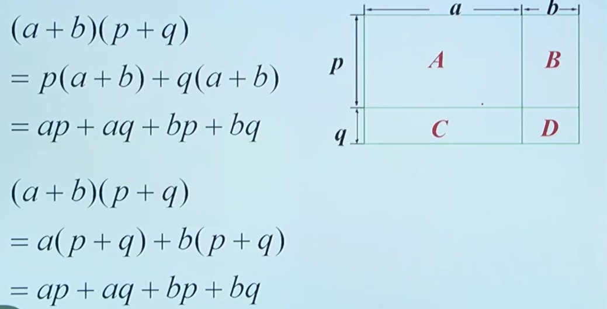

# 同底数幂的乘法
同底数幂相乘，底数不变，指数相加

$a^m$·$a^n$=$a^{m+n}$（m,n为正整数）

# 幂的乘方
幂的乘方，底数不变，指数相乘

$(a^m)^n$=$a^{mn}$（m,n为正整数）

# 积的乘方
积的乘方，等于把积的每一个因式分别乘方，再把所得的幂相乘

$(ab)^n$=$a^{n}$$b^{n}$（n为正整数）

# 整式的乘法
## 单项式乘法
### 运算法则
单项式与单项式相乘，把它们的系数、同底数幂分别相乘，对于只在一个单项式里含有的字母，则连同它的指数作为积的一个因式

### 步骤
1. 系数相乘
2. 相同字母，同底数幂相乘
3. 不同字母连同指数抄下来

### 运算依据
运算律：乘法交换律、乘法结合律

运算性质：同底数幂相乘

### 数学思想
有理数的乘法运算 -> 单项式乘单项式
> 类比思想

有理数的乘法运算、幂的运算 <- 单项式乘单项式
> 转化思想

### 数式通性
有理数的运算和整式的运算，在运算律、运算性质、运算顺序上都是一致的

## 单项式与多项式乘法
### 运算法则 
单项式与多项式相乘，就是用单项式去乘多项式的每一项，再把所得的积相加

### 步骤
1. 用单项式去乘多项式的每一项
2. 转化为单项式与单项式的乘法运算 
3. 把所得的积相加

### 运算依据
运算律：乘法分配率

## 多项式与多项式相乘
### 运算法则
多项式与多项式相乘，先用一个多项式的每一项乘另一个多项式的每一项，再把所得的积相加

### 数学思想
转化思想： 多乘多 -> 单乘多 -> 单乘单

数形结合：

## 同底数幂的除法
同底数幂相除，底数不变，指数相减

$a^m$÷$a^n$=$a^{m-n}$（a不等于0，m,n为正整数，并且m>n）

### 推导
$a^m$÷$a^m$=$a^{m-m}$=$a^0$ （a不等于0，m为正整数）

根据除法的意义可知：$a^m$÷$a^m$=1（a不等于0，m为正整数）

$a^0$=1（a不等于0）

## 单项式除以单项式
### 运算法则
单项式相除，把系数与同底数幂分别相除，作为商的因式，对于只在被除式里含有的字母，则连同它的指数作为商的一个因式 

## 多项式除以单项式
### 运算法则
多项式除以单项式,先把这个多项式的每一项除以这个单项式,再把所得的商相加

# 平方差公式
## 公式
(a+b)(a-b)=$a^2$-$b^2$

文宇描述：“两个数的和与这两个数差的积，等于这两个数的平方差”

## 推导
代数推导、几何推导

# 完全平方公式
## 公式
$(a±b)^2$=$a^2$±2ab+$b^2$

文宇描述：“两数和（或差）的平方，等于他们的平方和，加上（或减去）他们的积的2倍”

## 添括号法则
如果括号前面是正号，括到括号里的各项都不变符号； 

如果括号前面是负号，括到括号里的各项都改变符号 

符号语言：

a+b+c=a+(b+c)

a-b-c=a-(b+c)

>主要应用在底数为三项以及以上时，将底数转化为可以使用完全平方公式的形式

# 因式分解
像这样，把一个多项式化成几个整式的积的形式，这样的变形叫做这个多项式的因式分解，也叫把这个多项式分解因式.
> 整式乘法和因式分解互为逆运算

> 多项式中各项都有的公共因式，叫做多项式各项的公因式

## 提公因式法
一般地，如果多项式中的各项有公因式，可以把公因式提取出来，将多项式写成公因式与另一个因式的乘积的形式，这种分解的方法叫做提公因式法

## 因式分解的步骤
1. 若多项式中有公因式，应先提取公因式，再进一步分解因式；
2. 观察是否可以用平方差或者完全平方公式分解因式
   
>注意：每个因式要分解到不能继续分解为止
> 1. 数字写在字母前
> 2. 因式之问省略乘号
> 3. 相同因式写成幂的形式
> 4. 每个因式中能合并的同类项要合并
> 5. 每一个因式分解到不能再分解为止

# 总结

