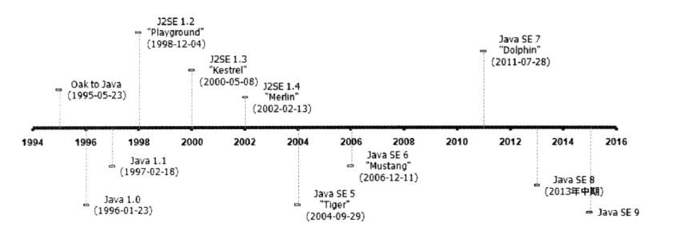
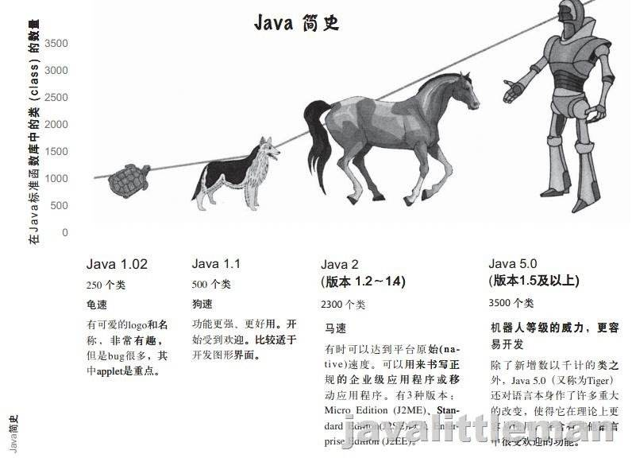

[TOC]

## 前言

#### Java技术体系

- 支撑Java程序运行的虚拟机
- 提供各开发领域接口支持的Java API
- Java编程语言
- 许多第三方Java框架（如Spring、Struts等）

> 在国内，后三个方面的技术资料和书籍非常丰富，相比之下，有关Java虚拟机的资料却异常贫乏。这种状况在很大程度上是由Java开发技术本身的一个重要优点导致的：在虚拟机层面隐藏了底层技术的复杂性以及机器与操作系统的差异性。运行程序的物理机器的情况干差万别， 而Java虚拟机则在千差万别的物理机上建立了统一的运行平台，实现了在任意一台虚拟机上编译的程序都能在任何一台虚拟机上正常运行。这一极大优势使得Java应用的开发比传统C/C++应用的井发更高效和快捷，程序员可以把主要精力集中在具体业务逻辑上，而不是物理硬件的兼容性上。在一般情况下， 一个程序员只要了解了必要的Java API、Java语法， 以及学习适当的第三方开发框架，就已经基本能满足日常开发的需要了，虚拟机会在用户不知不觉中完成对硬件平台的兼容及对内存等资源的管理工作。因此，了解虚拟机的运作并不是一般开发人员必须掌握的知识。

> 然而， 凡事都具备两面性。随着Java技术的不断发展， 它被应用于越来越多的领域之中。其中一些领域，如电力、金融、通信等，对程序的性能、稳定性和可扩展性方面都有极高的要求。程序很可能在10个人同时使用时完全正常，但是在10000个人同时使用时就会缓慢、死锁，甚至崩溃.毫无疑问，要满足10000个人同时使用需要更高性能的物理硬件，但是在绝大多数情况下，提升硬件效能无法等比例地提升程序的运作性能和并发能力，甚至可能对程序运作状况完全没有任何改善。这里面有Java虚拟机的原因：为了达到给所有硬件提供一致的虚拟平台的目的，牺牲了一些与硬件相关的性能特性。更重要的是人为原因：如果开发人员不了解虚拟机一些技术特性的运行原理，就无法写出最适合虚拟机运行和自优化的代码。

> 其实，目前商用的高性能Java虚拟机都提供了相当多的优化特性和调节手段，用于满足应用程序在实际生产环境中对性能和稳定性的要求。如果只是为了入门学习，让程序在自己的机器上正常运行，那么这些特性可以说是可有可无的；如果用于生产开发，尤其是企业级生产开发， 就迫切需要幵发人员中至少有一部分人对虚拟机的特性及调节方法具有很清晰的认识，所以在 Java开发体系中，对架构师、系统调优师、高级程序员等角色的需求一直都非常大。学习虚拟机 中各种自动运作特性的原理也成为了 Java程序员成长道路上必然会接触到的一课。

# 走进Java

Java不仅仅是一门编程语言，还是一个由一系列计算机软件和规范形成的技术体系，这个技术体系提供了完整的用于软件开发和跨平台部署的支持环境，并广泛应用于嵌入式系统、移动终端、企业服务器、大型机等各种场合。

Java获得广泛认有以下原因：

- 一门结构严谨、面向对象的编程语言
- 拜托了硬件平台的束缚，实现”一次编写，到处运行“
- 提供了一个相对安全的内存管理和访问机制，避免了绝大多数的内存泄漏和指针越界问题
- 实现了热点代码检测和运行时编译及优化，使得Java能够随着运行时间的增加获得更高的性能
- 有一套完善的应用程序接口，以及无数来自商业机构和开源社区的第三方类库
- 等等

#### Java技术体系

从广义上讲，Clojure、JRuby、Groovy等运行于Java虚拟机上的语言及其相关的程序都属于Java技术体系中的一员。如果仅从传统意义上来看，Sun官方所定义的Java技术体系包括以下几个组成部分：

- Java程序设计语言
- 各种硬件平台上的Java虚拟机
- Class文件格式
- Java API 类库
- 来自商业机构和开源社区的第三方Java类库

我们可以把Java程序设计语言、Java虚拟机、Java API类库这三部分统称为JDK (Java Development Kit)，JDK是用于支持Java程序开发的最小环境，在后面的内容中，为了讲解方便，有一些地方会以JDK来代替整个Java技术体系。另外，可以把Java API类库中的 Java SE API子集和Java虚拟机这两部分统称为JRE (Java Runtime Environment)，JRE是支持Java程序运行的标准环境。下图展示了Java技术体系所包含的内容，以及JDK和JRE所涵盖的范围：

[图片来源]: https://docs.oracle.com/javase/7/docs/

以上是根据各个组成部分的功能来进行划分的，如果按照技术所服务的领域来划分，或者说按照Java技术关注的重点业务领域来划分，Java技术体系可以分为4个平台，分别为：

- Java Card:支持一些Java小程序（Applets)运行在小内存设备（如智能卡）上的平台。

- Java ME (Micro Edition):支持Java程序运行在移动终端（手机、PDA)上的平台， 对Java API有所精简，并加入了针对移动终端的支持，这个版本以前称为J2ME。

- Java SE (Standard Edition):支持面向桌面级应用（如Windows下的应用程序）的Java平台，提供了完整的Java核心API,这个版本以前称为J2SE。

- Java EE (Enterprise Edition):支持使用多层架构的企业应用（如ERP、CRM应用）的Java平台，除了提供Java SE API外，还对其做了大量的扩充并提供了相关的部署支持，这个版本以前称为J2EE。

  > 这些扩充一般以javax.* 作为包名，java.*  包名是Java SE API的核心包，但是由于历史原因，一部分曾经是扩展包的API进入了核心包。

#### Java发展史

#### Java虚拟机发展史

从1996年Sun公司发布的JDK1.0包含的Sun Classic VM开始就涌现过各种虚拟机。以下进行一些简单介绍，通过这些介绍可以了解到虚拟机的功能在朝着哪个方向进性发展。

##### Sun Classic/Exact VM：

这款虚拟机的技术很原始，是世界上第一款商用的java虚拟机，只能使用纯解释的方式来执行，如果要使用JIT编译器就必须进行外挂，但是如果外挂了JIT编译器它就会完全接手虚拟机的执行系统，解释器就不工作了，由于解释器和编译器不能配合工作，意味着如果要使用编译器执行就要针对每一个方法每一行代码进行编译，无论执行的效率是否具有编译的价值。基于响应时间问题导致不敢采取编译耗时的稍高优化技术，因此这个阶段的虚拟机即使使用了JIT输出本地代码，执行效率也比c++有很大差距。

之后在平台上又发布了Exact VM,它的执行模式已经很接近现代的高性能虚拟机的雏型：如两级即时编译、编译器与解释器混合工作模式等，它使用准确式内存管理（名称由来），即虚拟机可以知道内存某个位置的数据具体是什么类型，这是一个非常重要的功能，因为只有这样才有能力判断堆上的数据是否可以可能被使用（比如内存中有一个32位的整数虚拟机将有能力分辨出它到底是一个reference类型还是一个32位的整数）。所以可以抛弃传统的基于handler的对象查找方式，因为在没有明确的信息表示内存中的信息哪些是数据哪些是reference的前提下，虚拟机是不能直接把值进行改变的（改变是因为在清理的过程中对象可能会被移动位置）。

##### SUN HotSpot VM

是SUN JDK和OPEN JDK中所带的虚拟机，名称中指的就是热点代码探测技术，这个能力可以通过执行计数器找出最具有编译价值的代码，然后通过JIT编译器以方法为单位进行编译，如果一个方法被频繁调用或方法中有效循环次数很多，将会分别触发标准编译和OSR（栈上替换）编译动作，通过编译器与解释器协同工作，可以在最优化的程序响应时间与最佳执行性能中获得平衡，减轻了即时编译的压力。

##### Sun Mobile-Embedded VM/Meta-Circular VM ：

Sun公司发布的其他虚拟机有：

1. KVM：强调简单轻量高度可移植性，但是运行速度较慢，在以前的手机平台上广泛应用。

2. CDC/CLDC HotSpot Implementation：初衷是在手机、电子书、PDA等设备上建立统一的编程接口，CDC/CLDC是它们的一组参考实现

3. Squawk VM：是一个java代码比重很高的嵌入式虚拟机实现，诸如类加载器、字节码验证器、垃圾收集器、解释器、编译器和线程调度都是Java本身实现，只有靠c语言来编写设备的IO和必要的本地代码。

4. JavaInJava：是一个实验性质的的虚拟机，试图以java语言来实现java语言的运行环境即元循环，所以必须在另外一个宿主虚拟机之上，内部没有编译器只有解释器

5. Maxine VM：它是一个几乎全部以java代码实现的元循环java虚拟机，只有用于启动JVM的加载器使用C语言编写，拥有先进的JIT编译器和垃圾收集器但是没有解释器，可在独立模式或者是宿主模式下执行，已经接近了HotSpot Client VM的水平。

 

##### BEA JRockit/IBM J9VM

除了Sun公司其他的公司也研发过java虚拟机，其中规模最大、最著名的就是BEA和IBM了

JRockit是一个专门为服务器硬件和服务器端应用场景高度优化的虚拟机，由于专注于服务端应用，他可以不太关注程序启动速度，因此不包含解析器实现，全部代码都靠即时编译器编译后执行。     

J9 VM是IBM主力发展的虚拟机，它是由SmallTalk的虚拟机扩展而来，该虚拟机的定位与HotSpot比较接近，是一款从服务器端到桌面应用在到嵌入式都全面考虑的多用途虚拟机，J9的开发目的是作为java各种产品的执行平台。

 ##### Azul VM/BEA Liquid VM

我们平时所提及的“高性能Java虚拟机”一般指HotSpot、JRockit、J9这类在通用平台上运行的虚拟机，但其实Azul和BEA这些特定硬件平台专有的虚拟机才算是高性能。Azul是在HotSpot基础上大量改进，运行于Azul System公司的专有硬件上的java虚拟机，提供在大范围内存下可控的GC时间的垃圾收集器，为专有硬件优化的线程调度等。

Liquid即是现在的JRockit VM的运行在BEA公司自己系统Hypervisor上的虚拟化版本，不需要操作系统的支持它自己本身就实现了一个专用操作系统的必要功能，直接越过操作系统有很多好处，比如在线程调度时不需要在进行内核态和用户态的切换等。

##### 其余虚拟机

- Apache Harmony/Google Android Dalvik VM

- Microsoft JVM及其他

- JamVM

- cacaovm

- SableVM

- Kaffe

- Jelatine JVM

- NanoVM

- MRP

- Moxie JVM

- Jikes RVM
- ......

#### Java与虚拟机关系

#####  JDK1.0发布时自带的虚拟机Sun Classic VM
Sun Classic VM 第一款商用Java虚拟机
1996年1月23日，Sun公司发布JDK1.0，Java首次拥有了商用的正式运行环境——Sun Classic VM。然而这款虚拟机十分缓慢，原因是它不能是解释器和编译器混合工作，也就是要么只使用纯解释器，这样运行时速度会很慢，要么使用纯编译器，这样必须对每一个方法、每一行代码进行编译，编译耗时会很高。“Java语言很慢”的形象就是在这时候在用户心中树立起来的。

##### JDK1.2发布时,发布一个名为Exact VM
Exact VM 现代高性能虚拟机的雏形。为了解决Sun Classic VM所面临的各种问题，Sun发布了一台名为Exact VM的虚拟机，这款虚拟机的执行系统，已经具备现代高性能虚拟机的雏形——两级即时编译器、编译器和解释器混合工作模式等，同时Exact VM采用准确式内存管理，即虚拟机可以知道内存某个位置的数据具体是什么类型，即这个位置是一个指向数字123的内存的reference，还是就是数字123，这样在垃圾收集时可以准确判断这些数据是否可用，大大提高了垃圾回收的效率。虽然Exact VM在技术上比Sun Classic VM先进了许多，但是很快，就被更为优秀的HotSpot VM所取代。

##### JDK1.3时 Sun HotSpot VM变成了默认的虚拟机

Sun HotSpot VM JDK默认虚拟机。我们现在上**[Oracle](https://link.zhihu.com/?target=http%3A//lib.csdn.net/base/oracle)**官网，下载JDK，自带的虚拟机，就是HotSpot。然而，HotSpot最初并非Sun公司开发的，而是由一家名为“Longview Technologies”的小公司设计的，甚至这款虚拟机一开始也不是为Java语言开发的，Sun公司注意到了这款虚拟机在JIT编译技术(Just In Time，即时编译技术)上有许多优秀的理念，在1997年收购了这家公司，获得了HotSpot VM。
HotSpot VM的最大特点，正如其名，就是热点代码探测能力，这项能力，可以通过执行计数器，找出最具有编译价值的代码，然后通知JIT编译器进行编译，通过编译器和解释器的协同合作，在最优程序响应时间和最佳执行性能中取得平衡。
在2008年和2009年，**[oracle](https://link.zhihu.com/?target=http%3A//lib.csdn.net/base/oracle)**分别收购了BEA和Sun，这样Oracle就同时拥有了两款优秀的Java虚拟机：JRockit VM和HotSpot VM，Oracle将这两款虚拟机的优势进行整合，打造出更加优秀的HotSpot.

直到目前，Java默认使用的虚拟机都是HotSpot 

#### 展望Java技术的未来

##### 模块化

模块化是解决系统与技术平台越来越复杂、越来越庞大问题的一个重要途径。无论是开发人员还是产品最终用户，都不希望为了系统中一小块的功能而不得不下载、安装、部署及维护整套庞大的系统。在未来的Java平台中,很可能会对模块化提出语法层面上的支持。

##### 混合语言

单一的Java开发已无法满足当前软件的复杂需求,Java平台上的多语言混合编程正成为主流。通过特定语言去解决特定领域的问题是当前软件开发对日趋复杂的项目需求的一个发展方向。
除了催生了大量的新语言,很多有很长历史的程序语言也出现了基于JVM实现的版本。推动JVM从"Java语言的虚拟机"向"多语言的虚拟机"的方向发展。

##### 多核并行

CPU硬件的发展已经从高频率转向了多核心,随着多核时代的来领,软件开发将越来越注重并行编程的领域。JDK 1.5加入了java.util.concurrent包，JDK1.7加入java.util.concurrent.forkjoin包。Fork/Join模式是处理并行编程的经典方法。在Java8中提供的Lambda表达式能极大改善当前Java语言不适合函数式编程的现状。目前显卡的算术运算能力,并行能力已远远超过了CPU,Sumatra项目就是为Java提供使用GPU和APU运算能力的工具。以后它将提供Java语言层面的API,或者为Lambda和其他JVM语言提供底层的并行运算支持。在JDK外围,也出现了专为满足并行计算需求的计算框架。如Apache的Hadoop Map/Reduce就是一个简单易懂的并行框架，能运行在上千个商用机器之上,可靠的处理TB级别的数据集。

##### 进一步丰富语法.

Sun(已被Oracle收购)专门为改进Java语法在OpenJDK中建立Coin子项目来统一处理对Java语法的细节修改。除了Coin项目之外,JSR-335中定义的Lambda表达式也将对Java语法和语言习惯产生很大的影响,面向函数式编程很有可能成为主流。

##### 64位VM

Java程序运行在64VM上需要付出较大的额外代价。相对于32位，如消耗更多内存及慢得多运行速度。但在Java EE方面,企业级应用常常需要超过4GB的内存,对64VM的需求是非常迫切的。由于上述原因，很多企业应用仍采用在虚拟集群方式在32位VM上进行部署。但随着硬件的发展,计算机终究会过渡到64位时代,主流的VM应用也将从32位发展到64位,VM对64位的支持将进一步完善。

#### 自己编译JDK（待执行）

