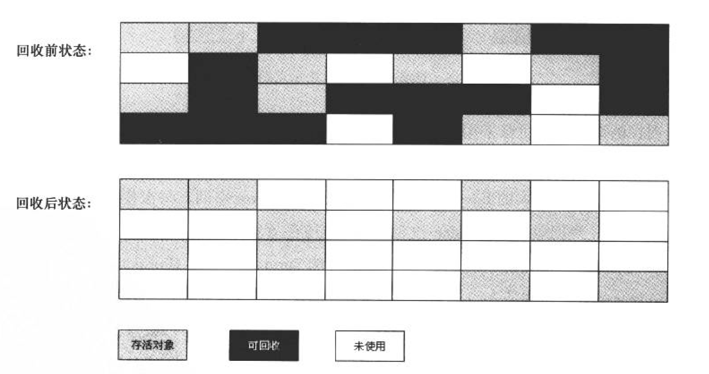
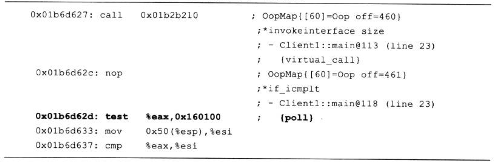
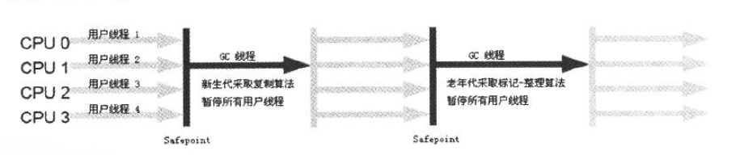
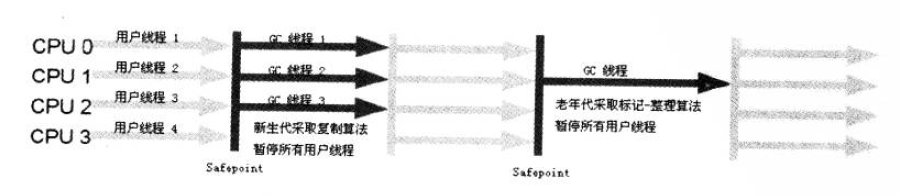
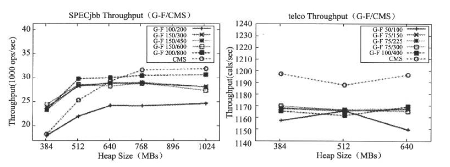
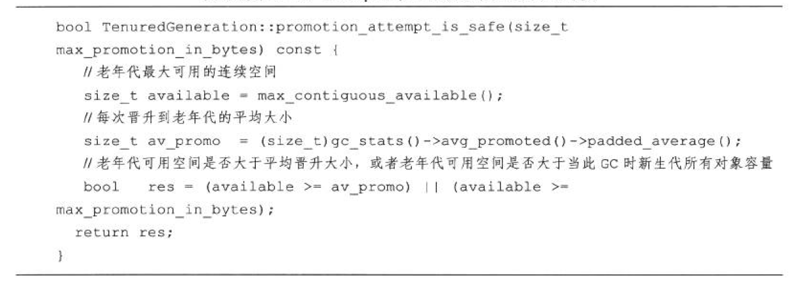

[TOC]

Java与C++之间有一堵由内存动态分配和垃圾收集技术所围成的“高墙”，墙外面的人想进去，墙里面的人却想出来。

# 概述

说起垃圾收集（Garbage Collection, GC),大部分人都把这项技术当做Java语言的伴生产物。事实上，GC的历史比Java久远，1960年诞生于**MIT的Lisp是第一门真正使用内存动态分配和垃圾收集技术的语言**。当Lisp还在胚胎时期时，人们就在思考GC需要完成的3件事情：

- 哪些内存需要回收？
- 什么时候回收？
- 如何回收？

经过半个多世纪的发展，目前内存的动态分配与内存回收技术已经相当成熟，一切看起来都进入了“自动化”时代，那为什么我们还要去了解GC和内存分配呢？答案很简单：当需要排杳各种内存溢出、内存泄漏问题时，当垃圾收集成为系统达到更高并发量的瓶颈时， 我们就需要对这些“自动化”的技术实施必要的监控和调节。

把时间从半个多世纪以前拨回到现在，回到我们熟悉的Java语言。第2章介绍了Java内存运行时区域的各个部分，其中**程序计数器、虚拟机栈、本地方法栈**3个区域随线程而生，随线程而灭；栈中的找帧随着方法的进人和退出而有条不紊地执行着出栈和入栈操作。 每一个栈帧中分配多少内存基本上是在类结构确定下来时就已知的（尽管在运行期会由JIT编译器进行一些优化，但在本章基于概念模型的讨论中，大体上可以认为是编译期可知的）， 因此这几个区域的内存分配和回收都具备确定性，在**这几个区域内就不需要过多考虑冋收**的问题，因为方法结束或者线程结束时，内存自然就跟随着回收了。而**Java堆和方法区则不一样**，一个接口中的多个实现类需要的内存可能不一样，一个方法中的多个分支需要的内存也可能不一样，我们只有在程序处于运行期间时才能知道会创建哪些对象，这部分内存的分配和回收都是动态的，垃圾收集器所关注的是这部分内存。后续讨论中的“内存”分配与回收也仅指这一部分内存。

# 对象已死吗

在堆里面存放着Java世界中几乎所有的对象实例，垃圾收集器在对堆进行回收前，第一件事情就是要确定这些对象之中哪些还“存活”着，哪些已经“死去”（即不可能再被任何途径使用的对象）。

## 引用计数算法

很多教科书判断对象是否存活的算法是这样的:给对象中添加一个引用计数器，每当有一个地方引用它时，计数器值就加1 ；当引用失效时，计数器值就减1；任何时刻计数器为0的对象就是不可能再被使用的。很多的应届生和一些有多年工作经验的幵发人员，他们对于这个问题给予的都是这个答案。

客观地说，引用计数算法(Reference Counting)的实现简单，判定效率也很髙，在大部分情况下它都是一个不错的算法，也有一些比较著名的应用案例，例如微软公司的COM (Component Object Model)技术、使用 ActionScript 3 的 FlashPlayer、**Python语言**和在游戏脚本领域被广泛应用的Squirrel中都使用了引用计数算法进行内存管理。但是，至少主流的Java虚拟机里面没有选用引用计数算法来管理内存，其中**最主要的原因是它很难解决对象之间相互循环引用的问题**。

举个简单的例子，看下面代码中的main方法对象objA和objB都有字段instance，赋值令objA.instance = objB及 objB.instance = objA，除此之外，这两个对象再无任何引用，实际上这两个对象已经不可能再被访问；但是它们为互相引用着对方，导致它们的引用计数都不为0，于是引用计数算法无法通知gc收集器回收它们。

```
package com.eussi.ch02_gc_allocation;

/**
 * 执行后，objA和objB会不会被GC呢？
 *
 * VM args -XX:+PrintGCDetails
 *
 * @author wangxueming
 *
 */
public class ReferenceCountingGC {
    public Object instance = null;
    private static final int _1MB = 1024 * 1024;
    /**
     * 这个成员属性唯一意义就是占点内存，以便能在GC日志中看清楚是否被回收过
     */
    private byte[] bigSize = new byte[2 * _1MB];

    public static void main(String[] args) {
        ReferenceCountingGC objA = new ReferenceCountingGC();
        ReferenceCountingGC objB = new ReferenceCountingGC();
        objA.instance = objB;
        objB.instance = objA;

        objA = null;
        objB = null;

        //假设在这行发生GC,objA和objB能否被回收？
        System.gc();
    }

}
```

执行结果：

```
[GC [PSYoungGen: 6103K->632K(38400K)] 6103K->632K(124416K), 0.0013064 secs] [Times: user=0.06 sys=0.00, real=0.00 secs] 
[Full GC [PSYoungGen: 632K->0K(38400K)] [ParOldGen: 0K->538K(86016K)] 632K->538K(124416K) [PSPermGen: 2866K->2865K(21504K)], 0.0144304 secs] [Times: user=0.00 sys=0.00, real=0.01 secs] 
Heap
 PSYoungGen      total 38400K, used 1664K [0x00000007d5d00000, 0x00000007d8780000, 0x0000000800000000)
  eden space 33280K, 5% used [0x00000007d5d00000,0x00000007d5ea00d8,0x00000007d7d80000)
  from space 5120K, 0% used [0x00000007d7d80000,0x00000007d7d80000,0x00000007d8280000)
  to   space 5120K, 0% used [0x00000007d8280000,0x00000007d8280000,0x00000007d8780000)
 ParOldGen       total 86016K, used 538K [0x0000000781800000, 0x0000000786c00000, 0x00000007d5d00000)
  object space 86016K, 0% used [0x0000000781800000,0x0000000781886ac0,0x0000000786c00000)
 PSPermGen       total 21504K, used 2883K [0x000000077c600000, 0x000000077db00000, 0x0000000781800000)
  object space 21504K, 13% used [0x000000077c600000,0x000000077c8d1ba0,0x000000077db00000)
```

从运行结果中可以清楚看到，GC 中包含“6103K->632K”，意味着虚拟机并没有因为这两个对象互相引用就不回收它们，这也从侧面说明**虚拟机并不是通过引用计数算法来判断对象是否存活的**。

## 可达性分析算法

在主流的商用程序语言（Java、C#,甚至包括前面提到的古老的Lisp)的主流实现中，都是称通过可达性分析（ReachabilityAnalysis）来判定对象是否存活的。这个算法的基本思路就是通过一系列的称为“GC Roots”的对象作为起始点，从这些节点开始向下搜索，搜索所走过的路径称为引用链（Reference Chain),当一个对象到GC Roots没有任何引用链相连 (用图论的话来说，就是从GC Roots到这个对象不可达)时，则证明此对象是不可用的。如下图所示：


在Java语言中，可以作为GC Roots的对象包括下面集中：

- 虚拟机栈（栈帧中的本地变量表）中引用的对象
- 方法区中类静态属性引用的对象
- 方法区中常量引用的对象
- 本地方法栈中JNI（即一般说的Native方法）引用的对象

## 再谈引用

无论是通过引用计数法判断对象的引用数量，还是通过可达性分析算法判断对象的引用链是否可达，判定对象是否存活都与“引用”有关。在JDK 1.2以前，Java中的引用的定义很传统：**如果reference类型的数据中存储的数值代表的是另外一块内存的起始地址，就称这块内存代表着一个引用。**这种定义很纯粹，但是太过狭隘，一个对象在这种定义下**只有被引用或者没有被引用两种状态**，对于**如何描述一些“食之无味，弃之可惜”的对象**就显得无能为力。我们希望能描述这样一类对象：当内存空间还足够时，则能保留在内存之中；如果内存空间在进行垃圾收集后还是非常紧张，则可以抛弃这些对象。很多**系统的缓存功能都符合这样的应用场景**。

在**JDK1.2之后，Java对引用的概念进行了扩充**，将引用分为**强引用（Strong Reference)、 软引用（Soft Reference)、弱引用（Weak Reference)、虚引用（Phantom Reference) 4 种**，这4种引用强度依次逐渐减弱。

- 强引用就是指在程序代码之中普遍存在的，类似“Object obj = new Object()”这类的引用，**只要强引用还存在，垃圾收集器永远不会回收掉被引用的对象**。
- 软引用是用来描述一些还有用但并非必需的对象。**对于软引用关联着的对象,在系统将要发生内存溢出异常之前，将会把这些对象列进回收范围之中进行第二次回收**。如果这次回收还没有足够的内存，才会抛出内存溢出异常。在JDK 1.2之后，提供了 **SoftReference**类来实现软引用。
- 弱引用也是用来描述非必需对象的，但是它的强度比软引用更弱一些，被弱引用关联的对象只能生存到下一次垃圾收集发生之前。**当垃圾收集器工作时，无论当前内存是否足够，都会回收掉只被弱引用关联的对象**。在JDK 1.2之后，提供了 **WeakReference**类来实现弱引用。
- 虚引用也称为幽灵引用或者幻影引用，它是最弱的一种引用关系。**一个对象是否有虚引用的存在，完全不会对其生存时间构成影响，也无法通过虚引用来取得一个对象实例。为一个对象设置虚引用关联的唯一目的就是能在这个对象被收集器回收时收到一个系统通知**。在JDK 1.2之后，提供了 PhantomReference类来实现虚引用。

## 生存还是死亡

即使在可达性分析算法中不可达的对象，也并非是“非死不可”的，这时候它们暂时处于“缓刑”阶段，**要真正宣告一个对象死亡，至少要经历两次标记过程**：如果对象在进行可达性分析后发现没有与GC Roots相连接的引用链，那它将会被第一次标记并且进行一次筛选，筛选的条件是此对象**是否有必要执行finalize()方法**。当对象没有覆盖finalize()方法，或者finalize()方法已经被虚拟机调用过，虚拟机将这两种情况都视为“没有必要执行”。

如果这个对象被判定为有必要执行finalize()方法，那么这个对象将会放置在一个叫做**F-Queue的队列**之中，并在稍后由一个由虚拟机自动建立的、**低优先级的Finalizer线程去执行它**。**这里所谓的“执行”是指虚拟机会触发这个方法，但并不承诺会等待它运行结束**，这样做的原因是，如果一个对象在finalize()方法中执行缓慢，或者发生了死循环（更极端的情况），将很可能会导致F-Queue队列中其他对象永久处于等待，甚至导致整个内存回收系统崩溃。finalize()方法是对象逃脱死亡命运的最后一次机会，稍后GC将对F-Queue中的对象进行第二次小规模的标记，如果对象要在finalize()中成功拯救自己——只要重新与引用链上的任何一个对象建立关联即可。譬如把自己（this关键字）赋值给某个类变量或者对象的成员变量,那在第二次标记时它将被移除出“即将回收”的集合：如果对象这时候还没有逃脱。那基本上它就真的被回收了。从下面代码清单我们可以看到一个对象的finalize()被执行， 但是它仍然可以存活。

```
package com.eussi.ch02_gc_allocation;

/**
 * 此代码演示了两点：
 * 1. 对象可以在被GC时自我拯救。
 * 2. 这种自救的机会只有一次，因为一个对象的finalize()方法最多只会被系统自动调用一次
 *
 * @author wangxueming
 *
 */
public class FinalizeEscapeGC {
    public static FinalizeEscapeGC SAVE_HOOK = null;

    public void isAlive() {
        System.out.println("yes, i am still alive :)");
    }

    @Override
    protected void finalize() throws Throwable {
        super.finalize();
        System.out.println("finalize method executed!");
        FinalizeEscapeGC.SAVE_HOOK = this;
    }

    public static void main(String[] args) throws Exception{
        SAVE_HOOK = new FinalizeEscapeGC();

        //对象第一次成功拯救自己
        SAVE_HOOK = null;
        System.gc();
        //因为Finalize方法优先级很低，所以暂停0.5s以等待它
        Thread.sleep(500);
        if(SAVE_HOOK!=null) {
            SAVE_HOOK.isAlive();
        } else {
            System.out.println("no, i am dead :(");
        }

        //下面代码与上面完全相同，但是这次自救却失败了
        SAVE_HOOK = null;
        System.gc();
        //因为Finalize方法优先级很低，所以暂停0.5s以等待它
        Thread.sleep(500);
        if(SAVE_HOOK!=null) {
            SAVE_HOOK.isAlive();
        } else {
            System.out.println("no, i am dead :(");
        }
    }
}
```

运行结果：

```
finalize method executed!
yes, i am still alive :)
no, i am dead :(
```

运行结果可以看出，SAVE_HOOK对象的finalize()方法确实被GC收集器触发过，并且在被收集前成功逃脱了。

另外一个值得注意的地方是，代码中有两段完全一样的代码片段，执行结果却是一次逃脱成功，一次失败，这是因为**任何一个对象的finalize()方法都只会被系统自动调用一次**，如果对象面临下一次回收，它的finalize()方法不会被再次执行，因此第二段代码的自救行动失败了。

需要特别说明的是，上面关于对象死亡时finalize()方法的描述可能带有悲情的艺术色彩,并不鼓励使用这种方法来拯救对象。相反,建议大家尽量避免使用它，因为它不是C/C++中的析构函数,而是**Java刚诞生时为了使C/C++程序员更容易接受它所做出的一个妥协**。它的运行代价高昂，不确定性大，无法保证各个对象的调用顺序。有些教材中描述它适合做“关闭外部资源”之类的工作，这完全是对这个方法用途的一种自我安慰。 finalize()能做的所有工作，使用try-finally或者其他方式都可以做得更好、更及时，所以**建议大家完全可以忘掉Java语言中有这个方法的存在**。

## 回收方法区

很多人认为方法区（或者HotSpot虚拟机中的永久代）是没有垃圾收集的，Java虚拟机规范中确实说过可以不要求虚拟机在方法区实现垃圾收集，而且在**方法区中进行垃圾收集的 “性价比” 一般比较低**：在堆中，尤其是在新生代中，常规应用进行一次垃圾收集一般可以回收70%~95%的空间，而永久代的垃圾收集效率远低于此。

**永久代的垃圾收集主要回收两部分内容：废弃常量和无用的类。**回收废弃常量与回收 Java堆中的对象非常类似。以常量池中字面量的回收为例，假如一个字符串“abc”已经进入了常量池中，但是当前系统没有任何一个String对象是叫做“abc”的，换句话说，就是没有任何String对象引用常量池中的“abc”常量,也没有其他地方引用了这个字面量。如果这时发生内存回收，而且必要的话，这个“abc”常量就会被系统清理出常量池。常量池中的其他类（接口）、方法、字段的符号引用也与此类似。

判定一个常量是否是“废弃常量”比较简单，而要**判定一个类是否是“无用的类”的条件则相对苛刻许多**。类需要同时**满足下面3个条件才能算是“无用的类”**：

- 该类所有的实例都已经被回收，也就是Java堆中不存在该类的任何实例。
- 加载该类的ClassLoader已经被回收。
- 该类对应的java.lang.Class对象没有在任何地方被引用，无法在任何地方通过反射访问该类的方法。

虚拟机可以对满足上述3个条件的无用类进行回收，这里说的仅仅是“可以”，而并不是和对象一样,不使用了就必然会回收。是否对类进行回收，HotSpot虚拟机提供了-Xnoclassgc参数进行控制，还可以-verbose:class 以及-XX:+TraceClassLoading、-XX:+TraceClassUnLoading査看类加载和卸载信息，其中-verbose:class和-XX:+TraceClassLoading可以在Product版的虚拟机中使用，-XX:+TraceClassUnLoading参数需要FastDebug版的虚拟机支持。

在大量使用反射、动态代理、CGLib等ByteCode框架、动态生成JSP以及OSGi这类频繁自定义ClassLoader的场景都需要虚拟机具备类卸载的功能，以保证永久代不会溢出。

# 垃圾收集算法

由于垃圾收集算法的实现涉及大量的程序细节，而且各个平台的虚拟机操作内存的方法又各不相同，因此不打算过多地讨论算法的实现，只是介绍几种算法的思想及其发展过程。

## 标记-清除算法

最基础的收集算法是“标记-清除”（Mark-Sweep)算法，如同它的名字一样，算法**分为“标记”和“清除”两个阶段**：首先**标记出所有需要回收的对象，在标记完成后统一回收所有被标记的对象**，它的标记过程其实在前一节讲述对象标记判定时已经介绍过了。之所以说它是**最基础的收集算法**，是因为**后续的收集算法都是基于这种思路并对其不足进行改进而得到的**。它的主要**不足有两个**：一个是**效率问题**，标记和清除两个过程的效率都不高；另一 个是**空间问题**，标记清除之后会**产生大量不连续的内存碎片**，空间碎片太多可能会导致以后在程序运行过程中需要分配较大对象时，无法找到足够的连续内存而不得不提前触发另一次垃圾收集动作。标记一清除算法的执行过程如下图所示



## 复制算法

为了解决效率问题，一种称为“复制"（Copying)的收集算法出现了，它**将可用内存按容量划分为大小相等的两块**，每次**只使用其中的一块**。当这一块的内存用完了，就**将还存活着的对象复制到另外一块上面**，然后再把已使用过的内存空间一次清理掉。这样使得每次都是对整个半区进行内存回收，内存分配时也就不用考虑内存碎片等复杂情况，只要移动堆顶指针，按顺序分配内存即可，实现简单，运行高效。只是这种算法的代价是将内存缩小为了原来的一半，未免太髙了一点。复制算法的执行过程如下图所示。


现在的商业虚拟机都采用这种收集算法来回收新生代，IBM公司的专门研究表明，**新生代中的对象98%是“朝生夕死”的，所以并不需要按照1 : 1的比例来划分内存空间**，而是将内存分为**一块较大的Eden空间和两块较小的Survivor空间，每次使用Eden和其中一 块Survivor**。当**回收时，将Eden和Survivor中还存活着的对象一次性地复制到另外一块Survivor**空间上，最后**清理掉Eden和刚才用过的Survivor**空间。HotSpot虚拟机默认Eden和Survivor的大小比例是8 : 1,也就是每**次新生代中可用内存空间为整个新生代容量的90% (80%+10%)**，只有10%的内存会被“浪费”。当然，**98%的对象可回收只是一般场景下的数据**，我们没有办法保证每次回收都只有不多于10%的对象存活，当**Survivor空间不够用**时， 需要依赖其他内存（这里指老年优）进行**分配担保**（Handle Promotion)。

内存的分配担保就好比我们去银行借款， 如果我们信誉很好，在98%的情况下都能按时偿还，于是银行可能会默认我们下一次也能按时按量地偿还贷款，只需要有一个担保人能保证如果我不能还款时，可以从他的账户扣钱，那银行就认为没有风险了。内存的分配担保也一样，**如果另外一块Survivor空间没有足够空间存放上一次新生代收集下来的存活对象时，这些对象将直接通过分配担保机制进入老年代**。关于对新生代进行分配担保的内容，在稍后在讲解垃圾收集器执行规则时还会再详细讲解。

## 标记-整理算法

**复制收集算法在对象存活率较高时就要进行较多的复制操作，效率将会变低**。更关键的是，如果**不想浪费50%的空间，就需要有额外空间进行分配担保**，以应对被使用的内存中所有对象都100%存活的极端情况，所以在**老年代一般不能直接选用这种算法**。

根据老年代的特点，有人提出了另外一种**“标记-整理:”（Mark-CompaCt)算法**，**标记过程仍然与“标记-清除”算法一样，但后续步骤不是直接对可回收对象进行清理，而是让所有存活的对象都向一端移动，然后直接清理掉端边界以外的内存**，“标记-整理”算法的示意图如下图所示。


## 分代收集算法

**当前商业虚拟机的垃圾收集都采用“分代收集”（Generationa丨Collection)算法**，这种算法并没有什么新的思想，**只是根据对象存活周期的不同将内存划分为几块**。**一般是把Java堆分为新生代和老年代**，这样就可以**根据各个年代的特点采用最适当的收集算法**。在**新生代中**，每次垃圾收集时都发现有大批对象死去，只有少量存活，那就选用**复制算法**，只需要付出少量存活对象的复制成本就可以完成收集。而**老年代中**因为对象存活率高、没有额外空间对它进行分配担保，就**必须使用“标记一清理”或者“标记一整理”算法**来进行回收。

# HotSpot的算法实现

上面两节从理论上介绍了对象存活判定算法和垃圾收集算法，而在HotSpot虚拟机上实现这些算法时，必须对算法的执行效率有严格的考量，才能保证虚拟机高效运行。

## 枚举根节点

从**可达性分析**中从GC Roots节点找引用链这个操作为例，**可作为GC Roots的节点主要在全局性的引用（例如常量或类静态属性）与执行上下文（例如栈帧中的本地变量表）中**， 现在很多应用仅仅方法区就有数百兆，如果要逐个检査这里面的引用，那么必然会消耗很多时间。

另外，可达性分析对执行时间的敏感还体现在GC停顿上，因为这项分析工作**必须在一个能确保一致性的快照中进行**——这里“一致性”的意思是指在整个分析期间整个执行系统看起来就像被冻结在某个时间点上，不可以出现分析过程中对象引用关系还在不断变化的情况，该点不满足的话分析结果准确性就无法得到保证。**这点是导致GC进行时必须停顿所有 Java执行线程（Sun将这件事情称为“Stop The World”)的其中一个重要原因**。即使是在号称（几乎）不会发生停顿的CMS收集器中，枚举根节点时也是必须要停顿的。

**由于目前的主流Java虚拟机使用的都是准确式GC**，这个概念在第1章介绍Exact VM 对Classic VM的改进时讲过），所以当执行系统停顿下来后，并**不需要一个不漏地检査完所存执行上下文和全局的引用位置**，虚拟机应当是**有办法直接得知哪些地方存放着对象引用**。 在HotSpot的实现中，是使用一组称为**OopMap的数据结构来达到这个目的**的，在**类加载完成的时候**，HotSot就把对象什么偏移量上是什么类型的数据计算出来，在JIT编译过程中，也会在特定的位置记录下栈和寄存器中哪些位置是引用。这样，**GC在扫描时就可以直接得知这些信息**了。

下面的代码清单是HotSpot Client VM生成的一段String.hashCode()方法的本地代码，可以看到在0x026eb7a9处的call指令有OopMap记录，它指明了EBX寄存器和栈中偏移量为16的内存区域中各有一个普通对象指针（Ordinary Object Pointer)的引用，有效范围为从call指令开始直到0x026eb730 (指令流的起始位置）+142 (OopMap记录的偏移量）=0x026eb7be,即hlt指令为止。

方法编译后本地代码.png)

## 安全点

在**OopMap的协助下，HotSpot可以快速且准确地完成GC Roots枚举**，但一个很现实的问题随之而来：可能导致引用关系变化，或者说OopMap内容变化的指令非常多，如果为每一条指令都生成对应的OopMap，那将会需要大量的额外空间，这样GC的空间成本将会变得很高。

实际上，**HotSpot也的确没有为每条指令都生成OopMap**,前面已经提到，只是**在“特定的位置”记录了这些信息**，这些位置称为**安全点（Safepoint)**,即**程序执行时并非在所有地方都能停顿下来开始GC，只有在到达安全点时才能暂停**。**Safepoint的选定**既不能太少以致于让GC等待时间太长，也不能过于频繁以致于过分增大运行时的负荷。所以，安全点的选定**基本上是以程序“是否具有让程序长时间执行的特征”为标准进行选定的**——因为每条指令执行的时间都非常短暂，程序不太可能因为指令流长度太长这个原因而过长时间运行， **“长时间执行”的最明显特征就是指令序列复用**，例如方法调用、循环跳转、异常跳转等， 所以具有这些功能的指令才会产生Safepoint。

对于Sefepoint,另一个需要考虑的问题是如何在GC发生时**让所有线程（这里不包括执行JNI调用的线程）都“跑”到最近的安全点上再停顿下来**。这里有两种方案可供选择：**抢先式中断**（Preemptive Suspension)和**主动式中断**（Voluntary Suspension)，其中抢先式中断不需要线程的执行代码主动去配合，在GC发生时，首先把所有线程全部中断，如果发现有线程中断的地方不在安全点上，就恢复线程，让它“跑”到安全点上。**现在几乎没有虚拟机实现采用抢先式中断来暂停线程从而响应GC事件**。

而主动式中断的思想是当GC需要中断线程的时候，不直接对线程操作，**仅仅简单地设置一个标志**，各个线程执行时主动去轮询这个标志，**发现中断标志为真时就自己中断挂起**。 **轮询标志的地方和安全点是重合的**，另**外再加上创建对象需要分配内存的地方**。

下面代码清单中的test指令是HotSpot生成的轮询指令，当需要暂停线程时，虚拟机把0x160100的内存页设置为不可读，线程执行到test指令时就会产生一个自陷异常信号，在预先注册的异常处理器中暂停线程实现等待，这样一条汇编指令便完成安全点轮询和触发线程中断。



## 安全区域

使用Safepoint似乎已经完美地解决了如何进入GC的问题，但实际情况却并不一定。 **Safepoint机制保证了程序执行时，在不太长的时间内就会遇到可进人GC的Safepoint**。但是，**程序“不执行”的时候呢？**所谓的程序不执行就是没有分配CPU时间，典型的例子就是线程处于Sleep状态或者Blocked状态，这时候**线程无法响应JVM的中断请求**，“走”到安全的地方去中断挂起，JVM也显然不太可能等待线程重新被分配CPU时间。对于这种情况，就**需要安全区域（Safe Region)来解决**。

**安全区域是指在一段代码片段之中，引用关系不会发生变化**。在这个区域中的**任意地方开始GC都是安全的**,我们也可以把Safe Region看做是被扩展了的Safepoint。

在线程执行到Safe Region中的代码时，首先标识自己已经进入了Safe Region,那样，当在**这段时间里JVM要发起GC时，就不用管标识自己为Safe Region状态的线程**了。在线程要离开Safe Region时，它要检査系统是否已经完成了根节点枚举（或者是整个GC过程），如果完成了，那线程就继续执行，否则它就必须等待直到收到可以安全离开Safe Region的信号为止。

到此，简要地介绍了HotSpot虚拟机如何去发起内存回收的问题，但是虚拟机如何具体地进行内存回收动作仍然未涉及，因为内存回收如何进行是由虚拟机所采用的GC收集器决定的，而通常虚拟机中往往不止有一种GC收集器。下面继续来看HotSpot中有哪些GC收集器。

# 垃圾收集器

**如果说收集算法是内存回收的方法论，那么垃圾收集器就是内存回收的具体实现**。Java 虚拟机规范中对垃圾收集器应该如何实现并没有任何规定，因此不同的厂商、不同版本的虚拟机所提供的垃圾收集器都可能会有很大差别，并且一般都会提供参数供用户根据自己的应用特点和要求组合出各个年代所使用的收集器。这里讨论的收集器基于JDK 1.7 Update14之后的HotSpot虚拟机（在这个版本中正式提供了商用的G1收集器，之前G1仍处于实验状 态)，这个虚拟机包含的所有收集器如下图所示。


上图展示了7种作用于不同分代的收集器，**如果两个收集器之间存在连线，就说明它们可以搭配使用**。虚拟机所处的区域，则表示它是属于新生代收集器还是老年代收集器。接 下来笔者将逐一介绍这些收集器的特性、基本原理和使用场景，并**重点分析CMS和G1这两款相对复杂的收集器**，了解它们的部分运作细节。

在介绍这些收集器各自的特性之前，我们先来明确一个观点：虽然我们是在对各个收集器进行比较，但并非为了挑选出一个最好的收集器。因为**直到现在为止还没有最好的收集器出现，更加没有万能的收集器**，所以我们选择的只是对具体应用最合适的收集器。这点不需要多加解释就能证明：如果有一种放之四海皆准、任何场景下都适用的完美收集器存在，那 HotSpot虚拟机就没必要实现那么多不同的收集器了。

## Serial 收集器

Serial收集器是**最基本、发展历史最悠久的收集器，曾经（在JDK 1.3.1之前）是虚拟机新生代收集的唯一选择。**大家看名字就会知道，这个收集器是一个**单线程的收集器**，但它的 “单线程”的意义并不仅仅说明它**只会使用一个CPU或一条收集线程**去完成垃圾收集工作， 更重要的是在它进行垃圾收集时，**必须暂停其他所有的工作线程**，直到它收集结束。 **“Stop The World”**这个名字也许听起来很酷，但这项工作实际上是由**虚拟机在后台自动发起和自动完成**的，在**用户不可见的情况下把用户正常工作的线程全部停掉**，这对很多应用来说都是难以接受的。不妨试想一下，要是你的计算机每运行一个小时就会暂停响应5分钟，你会有什么样的心情？下图示意了 Serial / Serial Old收集器的运行过程。



对于“Stop The World”带给用户的不良体验，虚拟机的设计者们表示完全理解，但也表示非常委屈：“你妈妈在给你打扫房间的时候，肯定也会让你老老实实地在椅子上或者房间外待着，如果她边打扫，你一边乱扔纸屑，这房间还能打扫完？”这确实是一个合情合理的矛盾，虽然垃圾收集这项工作听起来和打扫房间属于一个性质的，但实际上肯定还要比打扫房间复杂得多啊！

从JDK1.3开始，一直到现在最新的HotSpot虚拟机开发团队为消除或者减少工作线程因内存回收而导致停顿的努力一直在进行着，**从Serial收集器到Parallel收集器， 再到Concurrent Mark Sweep (CMS)乃至GC收集器的最前沿成果Garbage First (G1)收集器，我们看到了一个个越来越优秀（也越来越复杂）的收集器的出现，用户线程的停顿时间在不断缩短，但是仍然没有办法完全消除（这里暂不包括RTSJ< Real-Time Java Specification >中的收集器）**。寻找更优秀的垃圾收集器的工作仍在继续！

写到这里，似乎已经把Serial收集器描述成一个“老而无用、食之无味弃之可惜” 的鸡肋了,但实际上到现在为止,它依然是**虚拟机运行在Client模式下的默认新生代收集器**。它也有着优于其他收集器的地方：**简单而高效（与其他收集器的单线程比）**，对于限定单个CPU的环境来说，Serial收集器由于没有线程交互的开销，专心做垃圾收集自然可以获得最高的单线程收集效率。在**用户的桌面应用场景中，分配给虚拟机管理的内存一般来说不会很大**，收集几十兆甚至一两百兆的新生代（仅仅是新生代使用的内存，桌面应用基本上不会再大了），停顿时间完全可以控制在几十毫秒最多一百多毫秒以内，只要不是频繁发生，这点停顿是可以接受的。所以，**Serial收集器对于运行在Client模式下的虚拟机来说是一个很好的选择**。

##  ParNew 收集器

**ParNew收集器其实躭是Serial收集器的多线程版本**，**除了使用多条线程进行垃圾收集之外，其余行为**包括Serial收集器可用的所有控制参数（例如：-XX:SurvivorRatio、 -XX:PretenureSizeThreshold、-XX:HandlePromotionFailure 等）、收集算法、StopTheWorld、 对象分配规则、回收策略等都**与Serial收集器完全一样**，在实现上，这两种收集器也共用了相当多的代码。ParNew收集器的工作过程如下图所示。



ParNew收集器**除了多线程收集之外，其他与Serial收集器相比并没有太多创新之处， 但它却是许多运行在Server模式下的虚拟机中首选的新生代收集器**，其中有一个与性能无关但很重要的原因是，除了 Serial收集器外，**目前只有它能与CMS收集器配合工作**。在JDK 1.5时期，HotSpot推出了一款在强交互应用中几乎可认为有划时代意义的垃圾收集器一一 **CMS收集器**（Concurrent Mark Sweep，稍后将详细介绍这款收集器），**这款收集器是 HotSpot虚拟机中第一款真正意义上的并发（Concurrent)收集器**。它第一次实现了让垃圾收集线程与用户线程（基本上〉同时工作，用前面那个例子的话来说，就是做到了在你的妈妈打扫房间的时候你还能一边往地上扔纸屑。

不幸的是，**CMS**作为**老年代的收集器**，却**无法与**JDK 1.4.0中已经存在的**新生代收集器Parallel Scavenge**配合工作，所以在JDK 1.5中使用CMS来收集老年代的时候，**新生代只能选择ParNew或者Serial收集器中的一个**。ParNew收集器也是使用**-XX:+UseConcMarkSweepGC选项后的默认新生代收集器**，也可以使用-XX:+UseParNewGC选项来强制指定它。

ParNew收集器在**单CPU的环境中绝对不会有比Serial收集器更好的效果**，甚至由于存在线程交互的开销，该收集器在通过超线程技术实现的两个CPU的环境中都不能百分之百地保证可以超越Serial收集器。当然，随着可以使用的CPU的数量的增加，它对于GC时系统资源的有效利用还是很有好处的。它**默认开启的收集线程数与CPU的数量相同**，在**CPU非常多**（譬如32个，现在CPU动辄就4核加超线程，服务器超过32个逻辑CPU的情况越来越多了）的环境下，可以**使用-XX:ParallelGCThreads参数来限制垃圾收集的线程数**。

> 注意从ParNew收集器开始，后面还会接触到几款并发和并行的收集器。在大家可能产生疑惑之前，有必要先解释两个名词：并发和并行。这两个名词都是并发编程中的概念，在谈论垃圾收集器的上下文语境中，它们可以解释如下。
>
> - 并行（Parallel):指多条垃圾收集线程并行工作，但此时用户线程仍然处于等待状态。
> - 并发（Concurrent):指用户线程与垃圾收集线程同时执行（但不一定是并行的，可能会交替执行），用户程序在继续运行，而垃圾收集程序运行于另一个CPU上。

## Parallel Scavenge 收集器

Parallel Scavenge收集器是一个**新生代收集器**，它也是使用**复制算法的收集器**，又是**并行的多线程收集器**……看上去和ParNew都一样，那它有什么特别之处呢？

Parallel Scavenge收集器的**特点是它的关注点与其他收集器不同**，**CMS等收集器的关注点是尽可能地缩短垃圾收集时用户线程的停顿时间**，而Parallel Scavenge收集器的**目标则是达到一个可控制的吞吐量**（Throughput)。所谓吞吐量就是CPU用于运行用户代码的时间与CPU总消耗时间的比值，即**吞吐量=运行用户代码时间/(运行用户代码时间+ 垃圾收集时间）**，虚拟机总共运行了100分钟，其中垃圾收集花掉1分钟，那吞吐量就是 99%。

**停顿时间越短就越适合需要与用户交互的程序**，良好的响应速度能提升用户体验，而**高吞吐量则可以高效率地利用CPU时间，尽快完成程序的运算任务，主要适合在后台运算而不需要太多交互的任务**。

Parallel Scavenge收集器提供了**两个参数用于精确控制吞吐量**，分别是控制最大垃圾收集停顿时间的**-XX：MaxGCPauseMillis**参数以及直接设置吞吐量大小的**-XX:GCTimeRatio**参数。

**MaxGCPauseMillis**参数允许的值是**一个大于0的毫秒数**，收集器将**尽可能地保证内存回收花费的时间不超过设定值**。不过大家不要认为如果把这个参数的值设置得稍小一点就能使得系统的垃圾收集速度变得更快。**GC停顿时间缩短是以牺牲吞吐量和新生代空间来换取**的： **系统把新生代调小一些**，收集300MB新生代肯定比收集500MB快吧，这也**直接导致垃圾收集发生得更频繁一些**，原来10秒收集一次、每次停顿100毫秒，现在变成5秒收集一次、 每次停顿70毫秒。停顿时间的确在下降，但吞吐量也降下来了。

**GCTimeRatio**参数的值应当是一个**大于0且小于100的整数**，也就是垃圾收集时间占总时间的比率，相当于是吞吐最的倒数。如果把此参数设置为19,那允许的最大GC时间就占总时间的5% (即1/ (1+19)),**默认值为99**,就是允许最大1% (即1 / (1+99))的垃圾收集时间。

由于与吞吐量关系密切，Parallel Scavenge收集器也**经常称为“吞吐量优先”收集器**。 除上述两个参数之外，Parallel Scavenge收集器还有一个参数**-XX:+UseAdaptiveSizePolicy** 值得关注。这是一个开关参数，当这个参数**打开之后，就不需要手工指定新生代的大小（-Xmn)、Eden与Survivor区的比例（-XX:SurvivorRatio)、晋升老年代对象年龄 (-XX:PretenureSizeThreshold)等细节参数了**，虚拟机会根据当前系统的运行情况收集性能监控信息，动态调整这些参数以提供最合适的停顿时间或者最大的吞吐量，这种调节方式称为GC自适应的调节策略（GC Ergonomics) 。如果读者对于收集器运作原来不太了解,**手工优化存在困难的时候**，**使用Parallel Scavenge收集器配合自适应调节策略**，把内存管理的调优任务交给虚拟机去完成将是一个不错的选择。**只需要把基本的内存数据设置好**（如-Xmx 设置最大堆），**然后使用MaxGCPauseMillis参数（更关注最大停顿时间）或GCTimeRatio (更关注吞吐量）参数给虚拟机设立一个优化目标**，那具体细节参数的调节工作就由虚拟机完成了。自适应调节策略也是Parallel Scavenge收集器与ParNew收集器的一个重要区别。

## Serial Old 收集器

Serial Old是Serial收集器的**老年代**版本，它同样是一个**单线程收集器**，使用**“标记一整理”**算法。这个收集器的主要意义也是**在于给Client模式下的虚拟机使用**。如果**在Server 模式下**，那么它主要还有**两大用途**：一种用途是在**JDK 1.5以及之前的版本中与Parallel Scavenge收集器搭配使用**，另一种用途就是作为**CMS收集器的后备预案，在并发收集发生 Concurrent Mode Failure时使用**。这两点都将在后面的内容中详细讲解。Serial Old收集器的 工作过程如下图所示。


> 需要说明一下，**Parallel Scavenge收集器架构中本身有PS MarkSweep收集器来进行老年代收集，并非直接使用了Serial Old收集器**。但是这个PS MarkSweep收集器与Serial Old的实现非常接近，所以在官方的许多资料中都是直接以Scrial Old代替PS MarkSweep进行讲解.这里也采用这种方式。

## Parallel Old收集器

Parallel Old是**Parallel Scavenge收集器的老年代版本**，使用**多线程和“标记一整理”算法**。这个收集器是**在JDK1.6中**才开始提供的，在此之前，**新生代的Parallel Scavenge收集器一直处于比较尴尬**的状态。原因是，如果新生代选择了Parallel Scavenge收集器，老年代除了Serial Old(PS MarkSweep)收集器外别无选择（还记得上面说过Parallel Scavenge收集器无法与CMS收集器配合工作吗？）。由于**老年代Serial Old收集器**在服务端应用**性能上的 “拖累”**，使用了 Parallel Scavenge收集器也**未必能在整体应用上获得吞吐量最大化的效果**， 由于单线程的老年代收集中无法充分利用服务器多CPU的处理能力，在**老年代很大而且硬件比较高级的环境**中，**这种组合的吞吐量甚至还不一定有ParNew加CMS的组合**“给力”。


## CMS收集器

**CMS(Concurrent Mark Sweep)收集器是一种以获取最短回收停顿时间却为目标的收集器**。 目前很大一部分的Java应用集中在**互联网站或者B/S系统的服务端**上，这类应用尤其**重视服务的响应速度，希望系统停顿时间最短**，以给用户带来较好的体验。CMS收集器就非常符合这类应用的需求。

从名字（包含“Mark Sweep")上此可以看出，CMS收集器是**基于“标记—清除”算法**实现的，它的运作过程相对于前面几种收集器来说更复杂一些，**整个过程分为4个步骤**，包括：

- 初始标记（CMS initial mark)
- 并发标记（CMS concurrent mark）
- 重新标记（CMS remark)
- 并发清除（CMS concurrent sweep)
  

其中，**初始标记、重新标记这两个步骤仍然需要“Stop The World”**。初始标记仅仅只是标记一下GC Roots能直接关联到的对象，速度很快，并发标记阶段就是进行GC Roots Tracing的过程，而重新标记阶段则是为了修正并发标记期间因用户程序继续运作而导致标记产生变动的那一部分对象的标记记录，这个阶段的停顿时间一般会比初始标记阶段稍长一些，但远比并发标记的时间短。

由于整个过程中**耗时最长的并发标记和并发清除过程收集器线程都可以与用户线程一起工作**，所以，从总体上来说，CMS收集器的内存回收过程是与用户线程一起并发执行的。通过下图可以比较清楚地看到CMS收集器的运作步骤中并发和需要停顿的时间。


CMS是款优秀的收集器，它的主要优点在名字上已经体现出来了：**并发收集、低停顿**，Sun公司的一些官方文档中也称之为并发低停顿收集器（Concurrent Low Pause Collector)。但是CMS还远达不到完美的程度，它有以下**3个明显的缺点**：

- **CMS收集器对CPU资源非常敏感**。其实，面向并发设计的程序都对CPU资源比较敏感。在并发阶段，它虽然不会导致用户线程停顿，但是会因为**占用了一部分线程 (或者说CPU资源）而导致应用程序变慢，总吞吐量会降低**。CMS**默认启动**的回收线程数是**（CPU数量+3)/4**,也就是当CPU在4个以上时，**并发回收时垃圾收集线程不少于25%**的CPU资源，并且随着CPU数量的增加而下降。但是**当CPU不足4个（譬如2个）时**，CMS对用户程序的影响就可能变得很大，如果本来CPU负载就比较大，还分出一半的运算能力去执行收集器线程，就**可能导致用户程序的执行速度忽然降低了50%**,其实也让人无法接受。为了应付这种情况，虚拟机提供了一种称为 **“增量式并发收集器”**（Incremental Concurrent Mark Sweep/i-CMS)的CMS收集器变种，所做的事情和单CPU年代PC机操作系统使用抢占式来模拟多任务机制的思想一样，就是在**并发标记、清理的时候让GC线程、用户线程交替运行**，尽量**减少GC 线程的独占资源**的时间，这样整个垃圾收集的过程会更长，但对用户程序的影响就会显得少一些，也就是速度下降没有那么明显。实践证明，增量时的CMS收集器效果很一般，在目前版本中，i-CMS已经被声明为“deprecated”，即不再提倡用户使用。
- **CMS收集器无法处理浮动垃圾**（Floating Garbage)，可能出现“Concurrent Mode Failure”失败而导致另一次Full GC的产生。由于CMS并发清理阶段用户线程还在运行着，**伴随程序运行自然就还会有新的垃圾不断产生**，这一部分垃圾出现在标记过程之后，CMS无法在当次收集中处理掉它们，只好留待下一次GC时再清理掉。这一部分垃圾就称为“浮动垃圾”。也是由于在垃圾收集阶段用户线程还需要运行，那也就还**需要预留有足够的内存空间给用户线程使用**，因此**CMS收集器不能像其他收集器那样等到老年代几乎完全被填满了再进行收集，需要预留一部分空间提供并发收集时的程序运作使用**。在**JDK1.5的默认设置**下，CMS收集器当老年代使用了 **68% 的空间**后就会被激活，这是一个偏保守的设置，如果**在应用中老年代增长不是太快**， 可以适当调高参数**-XX:CMSInitiatingOccupancyFraction**的值来提高触发百分比，以便**降低内存回收次数**从而获取更好的性能。在**JDK 1.6**中，CMS收集器的**启动阈值已经提升至92%**。要是CMS运行期间预留的内存**无法满足**程序需要，就会出现一次 **“Concurrent Mode Failure”**失败，这时虚拟机将**启动后备预案**：临时启用Serial Old 收集器来重新进行老年代的垃圾收集，这样停顿时间就很长了。所以说**参数-XX:CMSInitiatingOccupancyFraction设置得太高很容易导致大量 “Concurrent Mode Failure” 失败，性能反而降低**。
- 还有最后一个缺点，开头说过，CMS是一款基于“标记一清除”算法实现的收集器，如果对前面这种算法介绍还有印象的话，就可能想到这意味着收集结束时**会有大量空间碎片产生**。空间碎片过多时，将**会给大对象分配带来很大麻烦**，往往会出现老年代还有很大空间剩余，但是无法找到足够大的连续空间来分配当前对象。不得不提前触发一次Full GC。为了解决这个问题，CMS收集器提供了一个**-XX: +UseCMSCompactAtFullCollection**开关参数（默认就是开启的），用于在CMS收集器顶不住要进行FuUGC时开启内存碎片的合并整理过程，**内存整理的过程是无法并发的，空间碎片问题没有了，但停顿时间不得不变长**。虚拟机设计者还提供了另外一个参数**-XX:CMSFullGCsBeforeCompaction**,这个参数是用于设置**执行多少次不压缩的 FullGC后，跟着来一次带压缩**的（默认值为0,表示每次进人FullGC时都进行碎片整理）。

## G1收集器

G1 (Garbage-First)收集器是**当今收集器技术发展的最前沿成果之一**，早在JDK 1.7刚刚确立项目目标，Sun公司给出的JDK1.7 RoadMap里面，它就被视为JDK 1.7中HotSpot 虚拟机的一个重要进化特征。从**JDK 6u14中开始**就有Early Access版本的G1收集器**供开发人员实验、试用**，由此开始G1收集器的“Experimental”状态持续了数年时间，直至**JDK 7u4**, Sun公司才认为它**达到足够成熟的商用程度**，移除了 “Experimental”的标识。

G1是一款**面向服务端应用的垃圾收集器**。HotSpot开发团队赋予它的**使命是（在比较长期的）未来可以替换掉JDK 1.5中发布的CMS收集**器。与其他GC收集器相比，G1具备如 下特点。

- 并行与并发：G1能**充分利用多CPU、多核环境下的硬件优势**，使用多个CPU (CPU 或者CPU核心）来缩短Stop-The-World停顿的时间，部分其他收集器原本需要停顿 Java线程执行的GC动作，G1收集器仍然可以通过并发的方式让Java程序继续执行。
- 分代收集：与其他收集器一样，分代概念在G1中依然得以保留。虽然G1可以**不需要其他收集器配合**就能独立管理整个GC堆，但它能够**采用不同的方式去处理新创建的对象和已经存活了一段时间、熬过多次GC的旧对象**以获取更好的收集效果。
- 空间整合:与CMS的“标记一清理”算法不同，G1从**整体来看是基于“标记一整理” 算法实现的收集器，从局部（两个Region之间）上来看是基于“复制”算法实现**的， 但无论如何，这两种算法都意味着G1运作期间**不会产生内存空间碎片**，收集后能提供规整的可用内存。这种特性有利于程序长时间运行，分配大对象时不会因为无法找到连续内存空间而提前触发下一次GC。
- 可预测的停顿：这是G1相对于CMS的另一大优势，**降低停顿时间是G1和CMS共同的关注点**，但G1**除了追求低停顿外，还能建立可预测的停顿时间模型**，能让使用者明确指定在一个长度为M毫秒的时间片段内，消耗在垃圾收集上的时间不得超过N毫秒，这**几乎已经是实时Java (RTSJ)的垃圾收集器的特征**了。

在G1之前的其他收集器进行收集的范围都是整个新生代或者老年代，而G1不再是这 样。使用G1收集器时，Java堆的内存布局就与其他收集器有很大差别，它将整个java堆划分为多个大小相等的独立区域（Region),**虽然还保留有新生代和老年代的概念，但新生代和老年代不再是物理隔离的**了，它们都是**一部分Region (不需要连续）的集合**。

G1收集器之所以能建立可预测的停顿时间模型，是因为它可以有计划地避免在整个Java堆中进行全区域的垃圾收集。G1**跟踪各个Region里面的垃圾堆积的价值大小**（回收所获得的空间大小以及回收所需时间经验值），在后台**维护一个优先列表**，每次根据允许的收集时间，**优先回收价值最大的Region** (这也就是Garbage-First名称的来由）。这种使用Region划分内存空间以及有优先级的区域回收方式，保证了G1收集器在有限的时间内以获取尽可能髙的收集效率。

G1把内存“化整为零“的思路，理解起来似乎很容易，但其中的**实现细节却远远没有想象中那样简单**，否则也不会从2004年Sun实验室发表第一篇G1的论文开始直到今天（将近10年时间）才开发出G1的商用版。以一个细节为例：把Java堆分为多个Region 后，垃圾收集是否就真的能以Region为单位进行了？听起来顺理成章，再仔细想想就很容易发现问题所在：Region不可能是孤立的。一个对象分配在某个Region中，它并非只能被本Region中的其他对象引用，而是可以与整个Java堆任意的对象发生引用关系。那在做**可达性判定确定对象是否存活的时候，岂不是还得扫描整个Java堆才能保证准确性？**这个问题其实并非在G1中才有，只是在G1中更加突出而已。在以前的分代收集中，新生代的规模一 般都比老年代要小许多，新生代的收集也比老年代要频繁许多，那**回收新生代中的对象时也面临相同的问题，如果回收新生代时也不得不同时扫描老年代**的话，那么Minor GC的效率可能下降不少。

在G1收集器中，Region之间的对象引用以及其他收集器中的新生代与老年代之间的对象引用，虚拟机都是使用**Remembered Set来避免全堆**扫描的。G1中**每个Region都有一个与之对应的Remembered Set**,虚拟机发现程序在对Reference类型的数据进行写操作时，会产生一个**Write Barrier暂时中断写操**作，**检査Reference引用的对象是否处于不同的Region**之中（在分代的例子中就是检査是否老年代中的对象引用了新生代中的对象），如果是，便通过CardTable把相关引用信息记录到**被引用对象所属的Region的Remembered Set**之中。当进行内存回收时，在GC根节点的枚举范围中加人Remembered Set即可保证不对全堆扫描也 不会有遗漏。

如果不计算维护Remembered Set的操作，G1收集器的运作大致可划分为以下几个步骤：

- 初始标记（Initial Marking)
- 并发标记（Concurrent Marking）
- 最终标记（Final Marking)
- 筛选回收（Live Data Counting and Evacuation)

对CMS收集器运作过程熟悉的，一定已经发现G1的前几个步骤的运作过程和CMS有很多相似之处。初始标记阶段仅仅只是标记一下GC Roots能直接关联到的对象，并且修改TAMS (Next Top at Mark Start)的值，让下一阶段用户程序并发运行时，能在正确可用的Region中创建新对象，**这阶段需要停顿线程，但耗时很短**。并发标记阶段是从GC Root **开始对堆中对象进行可达性分析**，找出存活的对象，这阶段耗时较长，但可与用户程序并发执行。而最终标记阶段则是为了**修正在并发标记期间**因用户程序继续运作而导致标记产生变动的那一部分标记记录，虚拟机将这段时间对象变化记录在线程Remembered Set Logs里面， 最终标记阶段需要**把Remembered Set Logs的数据合并到Remembered Set**中，这阶段**需要停顿线程，但是可并行执行**。最后在筛选回收阶段首先对各个Region的回收价值和成本进行排序，根据用户所期望的GC停顿时间来制定回收计划，从Sun公司透露出来的信息来看，**这个阶段其实也可以做到与用户程序一起并发执行**，但是因为只回收一部分Region,时间是用户可控制的，而且停顿用户线程将大幅提高收集效率。通过下图可以比较清楚地看到G1 收集器的运作步骤中并发和需要停顿的阶段。


由于目前G1成熟版本的发布时间还很短，G1收集器几乎可以说还没有经过实际应用的考验，网络上关于G1收集器的性能测试也非常贫乏。到目前为止，还没有搜索到有关的生产环境下的性能测试报告。强调“生产环境下的测试报告”是因为对于垃圾收集器来说，仅仅通过简单的Java代码写个Micro benchmark程序来创建、移除Java对象，再用-XX:+PrintGCDetails等参数来査看GC日志是很难做到准确衡量其性能的。因此，关于G1收集器的性能部分，引用了 Sun实验室的论文《Garbage-First Garbage Collection》中的一段测试数据。

Sun 给出的Benchmark的执行硬件为 Sun V880 服务器（8 X 750MHz UltraSPARC III CPU、32G内存、Solaris 10操作系统）。执行软件有两个，分别为SPECjbb (模拟商业数据库应用，堆中存活对象约为165MB,结果反映吐量和最长事务处理时间）和telco (模拟电话应答服务应用，堆中存活对象约为100MB，结果反映系统能支持的最大吞吐量）。为了便于对比，还收集了一组使用ParNew+CMS收集器的测试数据。所有测试都配置为与CPU数量相同的8条GC线程。

在反应停顿时间的软实时目标（Soft Real-Time Goal)测试中，横向是两个测试软件的时间片段配置，单位是毫秒，以（X/Y)的形式表示，代表在Y毫秒内最大允许GC时间为X毫秒（对于CMS收集器，无法直接指定这个目标，通过调整分代大小的方式大致模拟）。纵向是两个软件在对应配置和不同的Java堆容量下的测试结果，V%、avgV%和wV%分别代表的含义如下：

- V%:表示测试过程中，软实时目标失败的概率，软实时目标失败即某个时间片段中实际GC时间超过了允许的最大GC时间。
- avgV% :表示在所有实际GC时间超标的时间片段里，实际GC时间超过最大GC时间的平均百分比（实际GC时间减去允许最大GC时间，再除以总时间片段)。
- wV%:表示在测试结果最差的时间片段里，实际GC时间占用执行时间的百分比。

测试结果下表：


从上所示的结果可见，对于telco来说，软实时目标失败的概率控制在0.5%~0.7% 之间，SPECjbb就要差一些，但也控制在2%~5%之间，概率随着（X/Y)的比值减小而增加。另一方面，失败时超出允许GC时间的比值随着总时间片段增加而变小（分母变大了）， 在（100/200)、512MB的配置下，G1收集器出现了某些时间片段下100%时间在进行GC的最坏情况。而相比之下，CMS收集器的测试结果就要差很多，3种Java堆容量下都出现了 100%时间进行GC的情况。

在吞吐董测试中，测试数据取3次SPECjbb和15次telco的平均结果如下图所示。 在SPECjbb的应用下，各种配置下的G1收集器表现出了一致的行为，吞吐量看起来只与允许最大GC时间成正比关系，而在telco的应用中，不同配置对吞吐量的影响则显得很微弱。 与CMS收集器的吞吐量对比可以看到，在SPECjbb测试中，在堆容量超过768MB时，CMS 收集器有5%~10%的优势，而在telco测试中，CMS的优势则要小一些，只有3%~4%左右。



在更大规模的生产环境下，引用一段在StackOverflow.com上看到的经验与读者分享：“我在一个真实的、较大规模的应用程序中使用过G1:大约分配有60~70GB内存，存活对象大约在20~50GB之间。服务器运行Linux操作系统，JDK版本为6u22。G1与PS/ PS Old相比，最大的好处是停顿时间更加可控、可预测，如果我在PS中设置一个很低的最大允许GC时间，譬如期望50毫秒内完成GC (-XX:MaxGCPauseMullis=50),但在65GB的 Java堆下有可能得到的直接结果是一次长达30秒至2分钟的漫长的Stop-The-World过程； 而G1与CMS相比，虽然它们都立足于低停顿时间，CMS仍然是我现在的选择，但是随着 Oracle对G1的持续改进，我相信G1会是最终的胜利者。如果你现在采用的收集器没有出现问题，那就没有任何理由现在去选择G1,如果你的应用追求低停顿，那G1现在已经可
以作为一个可尝试的选择，如果你的应用追求吞吐量，那G1并不会为你带来什么特别的好处“。

## 理解GC日志

阅读GC日志是处理Java虚拟机内存问题的基础技能，它只是一些人为确定的规则，没有太多技术含量。

每一种收集器的日志形式都是由它们自身的实现所决定的，换而言之，每个收集器的曰志格式都可以不一样。但虚拟机设计者为了方便用户阅读，将各个收集器的日志都维持一定的共性，例如以下两段典型的GC日志：

```
33.125：[GC [DefNew: 3324K->152K(3712K),	0.0025925 secs] 3324K->152K(11904K), 0.0031680 secs]
100.667: [Full GC [Tenured 0K->210K(10240K), 0.149142 secs] 4603K->210K(19456K), [Perm : 
2999K->2999K(21248K)], 0.150007 secs] [Times: user=0.01 sys=0.00, real=0.02 secs]
```

最前面的数字“33.125: ”和“100.667: ”代表了GC发生的时间，这个数字的含义是**从 Java虚拟机启动以来经过的秒数**。

GC日志开头的“[GC”和“[Full GC”说明了这次**垃圾收集的停顿类型**，而不是用来区分新生代GC还是老年代GC的。如果有“Full”，说明这次GC是发生了 Stop-The-World的， 例如下面这段新生代收集器ParNew的日志也会出现“[Full GC”（这一般是因为出现了分配担保失败之类的问题,所以才导致STW)。如果是调用System.gc()方法所触发的收集,那么在这里将显示“[Full GC (System)”。

```
[Full GC 283.736: [ParNew: 261599K->261599K(261952K), 0.0000288 secs]
```

接下来的**“[DefNew”、“[Tenured”、“[Perm”表示GC发生的区域，这里显示的区域名称与使用的GC收集器是密切相关**的，例如上面样例所使用的**Serial**收集器中的新生代名为 “Default New Generation”，所以显示的是**“[DefNew”**。如果是**ParNew**收集器，新生代名称就会变为 **“[ParNew”**，意为 “Parallel New Generation”。如果采用 **Parallel Scavenge** 收集器， 那它配套的新生代称为“**PSYoungGen**”，老年代和永久代同理，名称也是由收集器决定的。

后面方括号内部的“3324K->152K(3712K)”含义是“**GC前该内存区域已使用容量->GC后该内存区域已使用容量（该内存区域总容量）**”。而在方括号之外的“3324K->152K(11904K)”表示“**GC前Java堆已使用容量 -> GC后Java堆已使用容量（Java堆总容量）**”。

再往后，“0.0025925 secs”表示该内存区域**GC所占用的时间**，单位是秒。有的收集器会给出更具体的时间数据，如“[Times : user=0.01 sys=0.00，real=0.02 secs]”，这里面的 **user、sys和real与Linux的time命令所输出的时间含义一致**，分别代表用户态消耗的CPU 时间、内核态消耗的CPU时间和操作从开始到结束所经过的墙钟时间（Wall Clock Time）。 CPU时间与墙钟时间的区别是，墙钟时间包括各种非运算的等待耗时，例如等待磁盘I/O、 等待线程阻塞，而CPU时间不包括这些耗时，但**当系统有多CPU或者多核的话，多线程操作会叠加这些CPU时间**，所以读者看到user或sys时间超过real时间是完全正常的。

## 垃圾收集器参数总结

JDK 1.7中的各种垃圾收集器到此已全部介绍完毕，在描述过程中提到了很多虚拟机非稳定的运行参数，在下表中整理了这些常用参数供实践时参考。

> - -XX:+<option> 启用选项 
> - -XX:-<option> 不启用选项 
> - -XX:<option>=<number>  
> - -XX:<option>=<string>

| 参数                           | 描述                                                         |
| :----------------------------- | ------------------------------------------------------------ |
| PrintFlagsFinal                | 查看参数默认值，如java -XX:+PrintFlagsFinal -version         |
| PrintGCDetails                 | 发生GC时打印内存回收日志（详细）                             |
| PrintGC                        | 发生GC时打印内存回收日志                                     |
| UseSerialGC                    | 虚拟机运行**在Client模式下的默认值**，打开此开关后，使用**Serial+Serial Old**的收集器组合进行内存回收 |
| UseParNewGC                    | 打开此开关后，使用ParNew+Serial Old的收集器组合进行内存回收  |
| UseConcMarkSweepGC             | 打开此开关后，使用ParNew+CMS+Serial Old的收集器组合进行内存回收。Serial Old收集器将作为CMS收集器出现Concurrent Mode Failure失败后的后备收集器使用 |
| UseParallelGC                  | 虚拟机运行**在Server模式下的默认值**，打开此开关后，使用**Parallel Scavenge + Serial Old（PS MarkSweep）**的收集器组合进行内存回收 |
| UseParallelOldGC               | 打开此开关后，使用Parallel Scavenge + Parallel Old的收集器组合进行内存回收**（经"jinfo -flag UseParallelOldGC pid"测试1.7、1.8此参数也默认打开）** |
| UseG1GC                        | 打开此开关后，使用G1垃圾收集器                               |
| SurvivorRatio                  | 新生代中Eden区域与Survivor区域的容量比值，默认值为8，代表Eden：Survivor=8：1 |
| PretenureSizeThreshold         | 直接晋升到老年代的对象大小，设置这个参数后，大于这个参数的对象将直接在老年代分配 (默认值是0，意味着任何对象都会现在新生代分配内存。)，**PretenureSizeThreshold 参数只对 Serial和 ParNew 两款收集器有效** |
| MaxTenuringThreshold           | 晋升到老年代的对象年龄，每个对象在坚持过一次Minor GC之后，年龄就增加1，当超过这个参数时就进入老年代 |
| UseAdaptiveSizePolicy          | 动态调整Java堆中各个区域的大小以及进入老年代的年龄           |
| HandlePromotionFailure         | 是否允许分配担保失败，即老年代的剩余空间不足以应付新生代的整个Eden和Survivor区的所有对象都存活的极端情况 JDK1.6 Update24 之后不再使用 |
| ParallelGCThreads              | 设置并行GC时进行内存回收的线程数                             |
| GCTimeRatio                    | GC时间占总时间的比率，默认值为99，即允许1%的GC时间。仅在使用Parallel Scavenge收集器时生效 |
| MaxGCPauseMillis               | 设置GC的最大停顿时间，仅在使用Parallel Scavenge收集器时生效  |
| CMSInitiatingOccupancyFraction | 设置CMS收集器在老年代空间被使用多少后触发垃圾收集。默认值为68%，仅在使用CMS收集器时生效 |
| UseCMSCompactAtFullCollection  | 设置CMS收集器在完成垃圾收集后是否要进行一次内存碎片整理，仅在使用CMS收集器时生效 |
| CMSFullGCsBeforeCompaction     | 设置CMS收集器在进行若干次垃圾收集后再启动一次内存碎片整理。仅在使用CMS收集器时生效 |
| UseFastAccessorMethods         | 原始类型优化                                                 |
| CMSParallelRemarkEnabled       | 降低标记停顿                                                 |
| DisableExplicitGC              | 是否关闭手动System.gc()                                      |
| LargePageSizeInBytes           | 内存页的大小不可设置过大，会影响Perm的大小=128m ???          |

 可通过下面代码获取参数值：

```
java -XX:+PrintCommandLineFlags -version   #将使用参数打印出来
jinfo -flag 参数 pid		#打印出进程使用该参数的值，更多可以查阅jinfo -help
```

# 内存分配与回收策略

Java技术体系中所提倡的自动内存管理最终可以归结为**自动化地解决了两个问题**：给对象**分配内存**以及**回收分配给对象的内**存。关于回收内存这一点，我们已经使用了大量篇幅去介绍虚拟机中的垃圾收集器体系以及运作原理，现在我们再一起来探讨一下给对象分配内存的那点事儿。

对象的内存分配，往**大方向讲，就是在堆上分配**（但也可能经过JIT编译后被拆散为标量类型并间接地栈上分配)，**对象主要分配在新生代的Eden区**上，如果启动了本地线程分配缓冲，将按线程优先在TLAB上分配。**少数情况下也可能会直接分配在老年代**中，分配的**规则并不是百分之百固定**的，其**细节取决于当前使用的是哪一种垃圾收集器组合，还有虚拟机中与内存相关的参数的设置**。

接下来我们将会**讲解几条最普遍的内存分配规则**，并通过代码去验证这些规则。本节下面的代码在测试时使用**Client模式虚拟机**运行，没有手工指定收集器组合，换句话说，验证的是在使用Serial/Serial Old收集器下（ParNew / Serial Old收集器组合的规则也基本一致)的内存分配和回收的策略。不妨根据自己项目中使用的收集器写一些程序去验证一下使用其他几种收集器的内存分配策略。

> 注意，64位Java的Java\jdk1.7.0_79\jre\lib\amd64\jvm.cfg可以看出，-client模式被忽略，Java\jdk1.7.0_79\jre\bin目录下也没有client目录。故无法执行client模式，所以下面代码运行我将会使用server模式，并添加-XX:+UseSerialGC参数。

## 对象优先在Eden区分配

大多数情况下，对象优先在新生代Eden区分配。当Eden区没有足够空间进行分配时，虚拟机将发起一次Minor GC。

虚拟机提供了 **-XX:+PrintGCDetails**这个收集器日志参数，**告诉虚拟机在发生垃圾收集行为时打印**内存回收日志，并且在**进程退出的时候输出当前的内存各区域**分配情况。在实际应用中，内存回收日志一般是打印到文件后通过日志工具进行分析，不过本实验的日志并不多，直接阅读就能看得很清楚。

下面代码清单的testAllocation()方法中，尝试分配3个2MB大小和1个4MB大小的对象，在运行时通过-Xms20M、-Xmx20M、-Xmn10M这3个参数限制了 Java堆大小为20MB，不可扩展，其中10MB分配给新生代，剩下的10MB分配给老年代。-XX:SurvivorRatio=8决定了新生代中Eden区与一个Survivor区的空间比例是8: 1，从输出的结果也可以清晰地看到 “eden space 8192K、from space 1024K、to space 1024K” 的信息，新生代总可用空间为 9216KB (Eden区 +1个Survivor 区的总容量）。

执行testAllocation()中分配allocation对象的语句时会发生一次Minor GC，这次GC 的结果是新生代7818KB变为543KB，而**总内存占用量则几乎没有减少**（因为allocation1、allocation2、allocation3三个对象都是存活的，虚拟机几乎没有找到可回收的对象）。这次**GC 发生的原因是给allocation4分配内存**的时候，发现**Eden已经被占用了 6MB**，剩余空间已不足以分配allocation所需的4MB内存，因此发生Minor GC。GC期间虚拟机又发现已有的 3个2MB大小的对象全部无法放人Survivor空间（Survivor空间只有1MB大小），所以只好通过**分配担保机制提前转移到老年代去**。

这次GC结束后，4MB的allocation对象顺利分配在Eden中，因此程序执行完的结果是Eden占用4MB (被allocation占用），Survivor空闲，老年代被占用6MB (被allocation1、allocation2、allocation3 占用）。通过 GC 日志可以证实这一点。

> 注意多次提到的Minor GC和Full GC有什么不一样吗？
>
> - 新生代GC(Minor GC):指发生在新生代的垃圾收集动作，因为Java对象大多都具备朝生夕灭的特性，所以MinorGC非常频繁，一般回收速度也比较快。
> - 老年代GC (Major GC/Full GC):指发生在老年代的GC，出现了Major GC，**经常会伴随至少一次的Minor GC** (但**非绝对**的，在Parallel Scavenge收集器的收集策略里就有直接 进行Major GC的策略选择过程）。**Major GC的速度一般会比Minor GC慢10倍以上**。

```
package com.eussi.ch03_gc_allocation;

/**
 * @author wangxueming
 */
public class GCAllocationTest {
    private static final int _1MB = 1024 * 1024;

    public static void main(String[] args) {
        testAllocation();
    }

    /**
     * VM Args: -verbose:gc -Xms20M -Xmx20M -Xmn10M -XX:+PrintGCDetails -XX:SurvivorRatio=8 -XX:+UseSerialGC
     */
    public static void testAllocation() {
        byte[] allocation1, allocation2,allocation3,allocation4;
        allocation1 = new byte[2 * _1MB];
        allocation2 = new byte[2 * _1MB];
        allocation3 = new byte[2 * _1MB];
        allocation4 = new byte[4 * _1MB];//发生一次minor GC
    }
}
```

运行结果：

```
[GC[DefNew: 7818K->543K(9216K), 0.0078933 secs] 7818K->6687K(19456K), 0.0087308 secs] [Times: user=0.00 sys=0.00, real=0.01 secs] 
Heap
 def new generation   total 9216K, used 4888K [0x00000000f9a00000, 0x00000000fa400000, 0x00000000fa400000)
  eden space 8192K,  53% used [0x00000000f9a00000, 0x00000000f9e3e5b0, 0x00000000fa200000)
  from space 1024K,  53% used [0x00000000fa300000, 0x00000000fa387dc8, 0x00000000fa400000)
  to   space 1024K,   0% used [0x00000000fa200000, 0x00000000fa200000, 0x00000000fa300000)
 tenured generation   total 10240K, used 6144K [0x00000000fa400000, 0x00000000fae00000, 0x00000000fae00000)
   the space 10240K,  60% used [0x00000000fa400000, 0x00000000faa00030, 0x00000000faa00200, 0x00000000fae00000)
 compacting perm gen  total 21248K, used 2961K [0x00000000fae00000, 0x00000000fc2c0000, 0x0000000100000000)
   the space 21248K,  13% used [0x00000000fae00000, 0x00000000fb0e47a8, 0x00000000fb0e4800, 0x00000000fc2c0000)
No shared spaces configured.
```

## 大对象直接进入老年代

所谓的**大对象是指，需要大量连续内存空间的Java对象**，最典型的大对象就是那种很长的字符串以及数组（下面列出的例子中的byte[]数组就是典型的大对象)。**大对象对虚拟机的内存分配来说就是一个坏消息**（替Java虚拟机抱怨一句，**比遇到一个大对象更加坏的消息就是遇到一群“朝生夕灭”的“短命大对象”**，写**程序的时候应当避免**)，经常出现大对象**容易导致内存还有不少空间时就提前触发垃圾收集以获取足够的连续空间来“安置”它们**。

虚拟机提供了一个**-XX:PretenureSizeThreshold**参数，令大于这个设置值的对象直接在老年代分配。这样做的目的是**避免在Eden区及两个Survivor区之间发生大量的内存复制**（复 习一下：新生代采用复制算法收集内存)。

下面执行代码清单中的testPretenureSizeThreshold()方法后，我们看到Eden空间几乎没有被使用，而老年代的10MB空间被使用了 40%,也就是4MB的allocation对象直接就分配在老年代中，这是因为PretenureSizeThreshold被设罝为3MB (就是3145728,**这个参数不能像-Xmx之类的参数样直接写3MB**),因此超过3MB的对象都会直接在老年代进行分配。

> 注意 PretenureSizeThreshold 参数只对 Serial和 ParNew两款收集器有效，Parallel Scavenge 收集器不认识这个参数，Parallel Scavenge收集器一般并不需要设置。如果遇到必须使用此参数的场合，可以考虑ParNew加CMS的收集器组合。 
>
> **-XX:+UseConcMarkSweepGC让年轻代垃圾收集器为ParNew，所以也是生效的**

```
package com.eussi.ch03_gc_allocation;

/**
 * @author wangxueming
 */
public class GCAllocationTest {
    private static final int _1MB = 1024 * 1024;

    public static void main(String[] args) {
        testPretenureSizeThreshold();
    }
    /**
     * VM Args: -verbose:gc -Xms20M -Xmx20M -Xmn10M -XX:+PrintGCDetails -XX:SurvivorRatio=8 -XX:+UseSerialGC -XX:PretenureSizeThreshold=3145728
     */
    public static void testPretenureSizeThreshold() {
        byte[] allocation;
        allocation = new byte[4 * _1MB];//直接进入老年代
    }
}

```

执行结果：

```
Heap
 def new generation   total 9216K, used 1838K [0x00000000f9a00000, 0x00000000fa400000, 0x00000000fa400000)
  eden space 8192K,  22% used [0x00000000f9a00000, 0x00000000f9bcb890, 0x00000000fa200000)
  from space 1024K,   0% used [0x00000000fa200000, 0x00000000fa200000, 0x00000000fa300000)
  to   space 1024K,   0% used [0x00000000fa300000, 0x00000000fa300000, 0x00000000fa400000)
 tenured generation   total 10240K, used 4096K [0x00000000fa400000, 0x00000000fae00000, 0x00000000fae00000)
   the space 10240K,  40% used [0x00000000fa400000, 0x00000000fa800010, 0x00000000fa800200, 0x00000000fae00000)
 compacting perm gen  total 21248K, used 2941K [0x00000000fae00000, 0x00000000fc2c0000, 0x0000000100000000)
   the space 21248K,  13% used [0x00000000fae00000, 0x00000000fb0df740, 0x00000000fb0df800, 0x00000000fc2c0000)
No shared spaces configured.
```

## 长期存活的对象将进入老年代

既然虚拟机采用了**分代收集的思想来管理内存**，那么内存回收时就必须能识别哪些对象应放在新生代，哪些对象应放在老年代中。为了做到这点，虚拟机给**每个对象定义了一个对象年龄（Age)计数器。如果对象在Eden出生并经过第一次Minor GC后仍然存活，并且能被Survivor容纳的话，将被移动到Survivor空间中，并且对象年龄设为1。对象在Survivor区中每“熬过”一次MinorGC，年龄就增加1岁，当它的年龄增加到一定程度（默认为15岁），就将会被晋升到老年代中**。对象晋升老年代的年龄阈值，可以通过参数**-XX:MaxTenuringThreshold**设置。

可以试试分别以-XX:MaxTenuringThreshold=1 和-XX:MaxTenuringThreshold=15 两种设置来执行下面代码清单中的testTenuringThreshold()方法，此方法中的allocation1对象需要256KB内存，Survivor 空间可以容纳。当 MaxTenuringThreshold=1时，allocation1对象在第二次GC发生时进入老年代，新生代已使用的内存GC后非常干净地变成0KB。而MaxTenuringThreshold=15时，**第二次 GC 发生后，allocation1对象则还留在新生代Survivor 空间，这时新生代仍然有404KB被占用**。

```
package com.eussi.ch03_gc_allocation;

/**
 * @author wangxueming
 */
public class GCAllocationTest {
    private static final int _1MB = 1024 * 1024;

    public static void main(String[] args) {
        testTenuringThreshold();
    }

    /**
     * VM Args: -verbose:gc -Xms20M -Xmx20M -Xmn10M -XX:+PrintGCDetails -XX:SurvivorRatio=8 -XX:+UseSerialGC -XX:MaxTenuringThreshold=1 -XX:+PrintTenuringDistribution
     */
    public static void testTenuringThreshold() {
        byte[] allocation1, allocation2,allocation3;
        allocation1 = new byte[_1MB / 4];
        //什么时候进入老年代取决于-XX:MaxTenuringThreshold设置
        allocation2 = new byte[4 * _1MB];
        allocation3 = new byte[4 * _1MB];
        allocation3 = null;
        allocation3 = new byte[4 * _1MB];
    }
}

```

以MaxTenuringThreshold=1运行结果：

```
[GC[DefNew
Desired survivor size 524288 bytes, new threshold 1 (max 1)
- age   1:     819136 bytes,     819136 total
: 5862K->799K(9216K), 0.0072054 secs] 5862K->4895K(19456K), 0.0083699 secs] [Times: user=0.00 sys=0.00, real=0.01 secs] 
[GC[DefNew
Desired survivor size 524288 bytes, new threshold 1 (max 1)
- age   1:        224 bytes,        224 total
: 5144K->0K(9216K), 0.0025475 secs] 9240K->4888K(19456K), 0.0025849 secs] [Times: user=0.00 sys=0.00, real=0.00 secs] 
Heap
 def new generation   total 9216K, used 4234K [0x00000000f9a00000, 0x00000000fa400000, 0x00000000fa400000)
  eden space 8192K,  51% used [0x00000000f9a00000, 0x00000000f9e22798, 0x00000000fa200000)
  from space 1024K,   0% used [0x00000000fa200000, 0x00000000fa2000e0, 0x00000000fa300000)
  to   space 1024K,   0% used [0x00000000fa300000, 0x00000000fa300000, 0x00000000fa400000)
 tenured generation   total 10240K, used 4888K [0x00000000fa400000, 0x00000000fae00000, 0x00000000fae00000)
   the space 10240K,  47% used [0x00000000fa400000, 0x00000000fa8c62f0, 0x00000000fa8c6400, 0x00000000fae00000)
 compacting perm gen  total 21248K, used 2953K [0x00000000fae00000, 0x00000000fc2c0000, 0x0000000100000000)
   the space 21248K,  13% used [0x00000000fae00000, 0x00000000fb0e2758, 0x00000000fb0e2800, 0x00000000fc2c0000)
No shared spaces configured.
```

以MaxTenuringThreshold=15运行结果：

```
[GC[DefNew
Desired survivor size 524288 bytes, new threshold 1 (max 15)
- age   1:     819136 bytes,     819136 total
: 6026K->799K(9216K), 0.0047054 secs] 6026K->4895K(19456K), 0.0047670 secs] [Times: user=0.00 sys=0.00, real=0.00 secs] 
[GC[DefNew
Desired survivor size 524288 bytes, new threshold 15 (max 15)
- age   1:        976 bytes,        976 total
: 5064K->0K(9216K), 0.0017044 secs] 9160K->4889K(19456K), 0.0017407 secs] [Times: user=0.02 sys=0.00, real=0.00 secs] 
Heap
 def new generation   total 9216K, used 4234K [0x00000000f9a00000, 0x00000000fa400000, 0x00000000fa400000)
  eden space 8192K,  51% used [0x00000000f9a00000, 0x00000000f9e22780, 0x00000000fa200000)
  from space 1024K,   0% used [0x00000000fa200000, 0x00000000fa2003d0, 0x00000000fa300000)
  to   space 1024K,   0% used [0x00000000fa300000, 0x00000000fa300000, 0x00000000fa400000)
 tenured generation   total 10240K, used 4888K [0x00000000fa400000, 0x00000000fae00000, 0x00000000fae00000)
   the space 10240K,  47% used [0x00000000fa400000, 0x00000000fa8c62f0, 0x00000000fa8c6400, 0x00000000fae00000)
 compacting perm gen  total 21248K, used 2959K [0x00000000fae00000, 0x00000000fc2c0000, 0x0000000100000000)
   the space 21248K,  13% used [0x00000000fae00000, 0x00000000fb0e3f18, 0x00000000fb0e4000, 0x00000000fc2c0000)
No shared spaces configured.
```

> **注意上面测试结果与书中描述不符，可能书中使用版本与我使用版本差异导致的，另外还有原因如下**,下一节也会提到
>
> 当survivor区空间不够时，便会提前进入到老年代中**，通过看日志，可以看出desired_survivor_size这个值，desired_survivor_size是指survivor space/2，在计算存活周期这个阈值时，hotspot会遍历所有age的table，并对其所占用的大小进行累积，当累积的大小超过了survivor space的一半时，则以这个age作为新的存活周期阈值，最后取age和MaxTenuringThreshold中更小的一个值，即日志中显示的new threshold n 的值。
>
> 按照这样的规则，当MaxTenuringThreshold=15时，就可以看出来了，第一次minor gc的时候存活周期的阈值为MaxTenuringThreshold，minor gc结束后计算出新的阈值为1，在第二次minor gc时的age已经是1了，因此被晋升到了老年代。
>
> 这个规则对于Serial GC以及ParNew GC（但对于开启了UseAdaptiveSizePolicy的ParNew GC而言也无效，默认是不开启的）均有效，对于PS（Parallel Scavenge） GC而言，在默认的情况下第一次以InitialTenuringThreshold（默认为7）为准，之后在每次minor GC后均会动态计算，规则比上面的复杂。
>
> 另外， **-XX:TargetSurvivorRatio**参数，是计算期望survivor区存活大小(Desired survivor size)的参数。如上所述，默认值为50，即50%。 当一个survivor区中所有的age对象的大小如果大于等于Desired survivor size，则重新计算threshold，以age和MaxTenuringThreshold两者的最小值为准。

当MaxTenuringThreshold=15时，可以看出，819136 bytes大于524288 bytes，计算出了new threshold 1，所以导致下一次minor GC便晋升到老年代。为了不产生new threshold，暂时不知道什么原因，最初survivor区会分配一些对象，导致很容器超过Desired survivor size，为了让现象明显点，此时可以将堆内存调大，并调整对应代码

```
package com.eussi.ch03_gc_allocation;

/**
 * @author wangxueming
 */
public class GCAllocationTest {
    private static final int _1MB = 1024 * 1024;

    public static void main(String[] args) throws Exception{
        testTenuringThreshold2();
    }

    /**
     * VM Args: -verbose:gc -Xms40M -Xmx40M -Xmn20M -XX:+PrintGCDetails -XX:SurvivorRatio=8 -XX:+UseSerialGC -XX:MaxTenuringThreshold=15 -XX:+PrintTenuringDistribution
     */
    public static void testTenuringThreshold2() {
        byte[] allocation1, allocation2,allocation3;
        allocation1 = new byte[_1MB / 3];
        allocation2 = new byte[8 * _1MB];
        allocation3 = new byte[8 * _1MB];
        allocation3 = null;
        allocation3 = new byte[8 * _1MB];
    }
}
```

运行结果：

```
[GC[DefNew
Desired survivor size 1048576 bytes, new threshold 15 (max 15)
- age   1:     906648 bytes,     906648 total
: 10523K->885K(18432K), 0.0092058 secs] 10523K->9077K(38912K), 0.0092757 secs] [Times: user=0.02 sys=0.00, real=0.01 secs] 
[GC[DefNew
Desired survivor size 1048576 bytes, new threshold 15 (max 15)
- age   1:        224 bytes,        224 total
- age   2:     899536 bytes,     899760 total
: 9415K->878K(18432K), 0.0030444 secs] 17607K->9070K(38912K), 0.0030886 secs] [Times: user=0.00 sys=0.00, real=0.00 secs] 
Heap
 def new generation   total 18432K, used 9346K [0x00000000f8600000, 0x00000000f9a00000, 0x00000000f9a00000)
  eden space 16384K,  51% used [0x00000000f8600000, 0x00000000f8e45038, 0x00000000f9600000)
  from space 2048K,  42% used [0x00000000f9600000, 0x00000000f96dbab0, 0x00000000f9800000)
  to   space 2048K,   0% used [0x00000000f9800000, 0x00000000f9800000, 0x00000000f9a00000)
 tenured generation   total 20480K, used 8192K [0x00000000f9a00000, 0x00000000fae00000, 0x00000000fae00000)
   the space 20480K,  40% used [0x00000000f9a00000, 0x00000000fa200010, 0x00000000fa200200, 0x00000000fae00000)
 compacting perm gen  total 21248K, used 2990K [0x00000000fae00000, 0x00000000fc2c0000, 0x0000000100000000)
   the space 21248K,  14% used [0x00000000fae00000, 0x00000000fb0ebb98, 0x00000000fb0ebc00, 0x00000000fc2c0000)
No shared spaces configured.
```

此时可以看到from space 2048K,  42% used，老年代是the space 20480K,  40% used。

## 动态对象年龄判定

为了能更好地适应不同程序的内存状况，虚拟机**并不是永远地要求对象的年龄必须达到了MaxTenuringThreshold**才能晋升老年代，**如果在Survivor空间中相同年龄所有对象大小的总和大于Survivor空间的一半，年龄大于或等于该年龄的对象就可以直接进入老年代**，无须等到MaxTenuringThreshold中要求的年龄。
执行下面代码清单中的 testTenuringThreshold3() 方法，并设置-XX:MaxTenuringThreshold= 15，会发现运行结果中Sinvivor的空间占用仍然为0%，而老年代比预期增加了6%，也就是说， allocation、allocation2对象都直接进入了老年代，而没有等到15岁的临界年龄。因为这两 个对象加起来已经到达了 512KB，并且它们是同年的，满足同年对象达到Survivor空间的一 半规则。我们只要注释掉其中一个对象new操作，就会发现另外一个就不会晋升到老年代中去了。

```
package com.eussi.ch03_gc_allocation;

/**
 * @author wangxueming
 */
public class GCAllocationTest {
    private static final int _1MB = 1024 * 1024;

    public static void main(String[] args) throws Exception{
        testTenuringThreshold3();
    }

    /**
     * VM Args: -verbose:gc -Xms20M -Xmx20M -Xmn10M -XX:+PrintGCDetails -XX:SurvivorRatio=8 -XX:+UseSerialGC -XX:MaxTenuringThreshold=15 -XX:+PrintTenuringDistribution
     */
    public static void testTenuringThreshold3() {
        byte[] allocation1, allocation2,allocation3,allocation4;
        allocation1 = new byte[_1MB / 4];
        //allocation1+allocation2大于survivor空间一半
        allocation2 = new byte[_1MB / 4];
        allocation3 = new byte[4 * _1MB];
        allocation4 = new byte[4 * _1MB];
        allocation4 = null;
        allocation4 = new byte[4 * _1MB];
    }
}
```

运行结果：

```
[GC[DefNew
Desired survivor size 524288 bytes, new threshold 1 (max 15)
- age   1:    1048576 bytes,    1048576 total
: 6282K->1024K(9216K), 0.0049384 secs] 6282K->5152K(19456K), 0.0060911 secs] [Times: user=0.00 sys=0.00, real=0.01 secs] 
[GC[DefNew
Desired survivor size 524288 bytes, new threshold 15 (max 15)
- age   1:        224 bytes,        224 total
: 5288K->0K(9216K), 0.0027243 secs] 9416K->5152K(19456K), 0.0027628 secs] [Times: user=0.00 sys=0.00, real=0.00 secs] 
Heap
 def new generation   total 9216K, used 4234K [0x00000000f9a00000, 0x00000000fa400000, 0x00000000fa400000)
  eden space 8192K,  51% used [0x00000000f9a00000, 0x00000000f9e22740, 0x00000000fa200000)
  from space 1024K,   0% used [0x00000000fa200000, 0x00000000fa2000e0, 0x00000000fa300000)
  to   space 1024K,   0% used [0x00000000fa300000, 0x00000000fa300000, 0x00000000fa400000)
 tenured generation   total 10240K, used 5152K [0x00000000fa400000, 0x00000000fae00000, 0x00000000fae00000)
   the space 10240K,  50% used [0x00000000fa400000, 0x00000000fa908028, 0x00000000fa908200, 0x00000000fae00000)
 compacting perm gen  total 21248K, used 2954K [0x00000000fae00000, 0x00000000fc2c0000, 0x0000000100000000)
   the space 21248K,  13% used [0x00000000fae00000, 0x00000000fb0e3270, 0x00000000fb0e3400, 0x00000000fc2c0000)
No shared spaces configured.
```

## 空间分配担保

在**发生Minor GC之前，虚拟机会先检查老年代最大可用的连续空间是否大于新生代所有对象总空间**，如果这个条件**成立**，那么**Minor GC可以确保是安全**的。如果**不成立，则虚拟机会查看HandlePromotionFailure设置值是否允许担保失败**。如果**允许**，那么会继续**检查老年代最大可用的连续空间是否大于历次晋升到老年代对象的平均大小**，如果**大于**，将**尝试着进行一次Minor GC**，尽管这次Minor GC是有风险的;如果**小于，或者 HandlePromotionFailure设置不允许**冒险，那**这时也要改为进行一次Full GC**。

下面解释一下“冒险”是冒了什么风险，前面提到过，新生代使用复制收集算法，但为了内存利用率，只使用其中一个Survivor空间来作为轮换备份，因此当**出现大量对象在Minor GC后仍然存活的情况**（最极端的情况就是内存回收后新生代中所有对象都存活），就**需要老年代进行分配担保**，把Survivor**无法容纳的对象直接进入老年代**。与生活中的贷款担保类似，老年代要进行这样的担保，**前提是老年代本身还有容纳这些对象的剩余空间**，一共有多少对象会活下来在实际完成内存回收之前是无法明确知道的，所以只好**取之前每一次回收晋升到老年代对象容量的平均大小值作为经验值**，与老年代的剩余空间进行比较，决定是否进行Full GC来让老年代腾出更多空间。

**取平均值进行比较其实仍然是一种动态概率的手段**，也就是说，如果某次Minor GC存活后的对象突增，远远高于平均值的话，依然会导致担保失败（Handle Promotion Failure)。 如果出现了 HandlePromotionFailure失败，那就只好在失败后重新发起一次FullGC。**虽然担保失败时绕的圈子是最大的，但大部分情况下都还是会将HandlePromotionFailure开关打开，避免Full GC过于频繁**，参见下面代码清单：

```
package com.eussi.ch03_gc_allocation;

/**
 * @author wangxueming
 */
public class GCAllocationTest {
    private static final int _1MB = 1024 * 1024;

    public static void main(String[] args) throws Exception{
        testHandlePromotion();
    }

    /**
     * VM Args: -verbose:gc -Xms20M -Xmx20M -Xmn10M -XX:+PrintGCDetails -XX:SurvivorRatio=8 -XX:+UseSerialGC -XX:-HandlePromotionFailure
     */
    public static void testHandlePromotion() {
        byte[] allocation1, allocation2,allocation3,allocation4,allocation5,allocation6,allocation7;
        allocation1 = new byte[2 * _1MB];
        allocation2 = new byte[2 * _1MB];
        allocation3 = new byte[2 * _1MB];
        allocation1 = null;
        allocation4 = new byte[2 * _1MB];
        allocation5 = new byte[2 * _1MB];
        allocation6 = new byte[2 * _1MB];
        allocation4 = null;
        allocation5 = null;
        allocation6 = null;
        allocation7 = new byte[2 * _1MB];
    }
}
```

使用jdk1.7.0_79结果会显示两次minor GC，并给出忽略该选项的提示：

```
Java HotSpot(TM) 64-Bit Server VM warning: ignoring option HandlePromotionFailure; support was removed in 6.0_24
[GC[DefNew: 7818K->553K(9216K), 0.0058499 secs] 7818K->4649K(19456K), 0.0059118 secs] [Times: user=0.00 sys=0.00, real=0.01 secs] 
[GC[DefNew: 6960K->0K(9216K), 0.0024837 secs] 11056K->4642K(19456K), 0.0025192 secs] [Times: user=0.01 sys=0.00, real=0.00 secs] 
Heap
 def new generation   total 9216K, used 2185K [0x00000000f9a00000, 0x00000000fa400000, 0x00000000fa400000)
  eden space 8192K,  26% used [0x00000000f9a00000, 0x00000000f9c224f8, 0x00000000fa200000)
  from space 1024K,   0% used [0x00000000fa200000, 0x00000000fa200150, 0x00000000fa300000)
  to   space 1024K,   0% used [0x00000000fa300000, 0x00000000fa300000, 0x00000000fa400000)
 tenured generation   total 10240K, used 4642K [0x00000000fa400000, 0x00000000fae00000, 0x00000000fae00000)
   the space 10240K,  45% used [0x00000000fa400000, 0x00000000fa888928, 0x00000000fa888a00, 0x00000000fae00000)
 compacting perm gen  total 21248K, used 3125K [0x00000000fae00000, 0x00000000fc2c0000, 0x0000000100000000)
   the space 21248K,  14% used [0x00000000fae00000, 0x00000000fb10d460, 0x00000000fb10d600, 0x00000000fc2c0000)
No shared spaces configured.
```

在**JDK 6 Update 24之后**，这个测试结果会有差异，**HandlePromotionFailure参数不会再影响到虚拟机的空间分配担保策略**，观察OpenJDK中的源码变化（见下面代码清单)，虽然源码中还定义了 HandlePromotionFailure参数，但是在代码中已经不会再使用它。**JDK6 Update 24之后的规则变为只要老年代的连续空间大于新生代对象总大小或者历次晋升的平均大小就会进行Minor GC，否则将进行Full GC**。



# GC触发条件

## Minor GC（新生代GC）的触发条件

当Eden区满时，触发Minor GC。

## Full GC（老年代GC）的触发条件

1. 直接调用System.gc

2. 老年代空间不足（新生代存活下来的对象转入、大对象的创建等引起）

调优策略：

- 尽量做到让对象在Minor GC阶段被回收
- 让对象在新生代多存活一段时间
- 不要创建过大的对象及数组

3. 方法区空间不足（系统中要加载的类、反射的类和调用的方法较多等导致）

调优策略：

- 增大方法区空间
- 转为使用CMS GC？(待明确这样调优设置原因)

4. Minor GC 时，survivor放不下，对象只能放入老年代，而此时老年代也放不下

调优策略：

- 增大survivor space、老年代空间

5. 通过Minor GC后进入老年代的平均大小大于老年代的连续可用内存（Minor GC 时会做一个判断，统计之前晋升到老年代的对象的平均大小），见上一节空间分配担保的叙述。

# 扩展：JVM输出gclog常用参数？

介绍下以下常用参数

```
-XX:+PrintHeapAtGC 
-verbose:gc 
-XX:+PrintTenuringDistribution
-XX:+PrintGCDateStamps 
-XX:+PrintGCDetails
-XX:+PrintReferenceGC 
-XX:+PrintGCTimeStamps
-XX:+PrintGC
-XX:+PrintGCApplicationStoppedTime
```

## -XX:+PrintHeapAtGC

**作用：每次gc(yonggc,fullgc) 都会输出gc前后堆详情（Eden区域、from区、to区、old区、Metaspace区 、Class space等）** 个人认为这个输出的gclog是目前最细的力度（极力推荐查找gc问题配置上这个参数）。

ParallelGC中log：

```
{Heap before GC invocations=5 (full 0):
 PSYoungGen      total 45056K, used 38644K [0x00000007bce00000, 0x00000007c0000000, 0x00000007c0000000)
  eden space 38912K, 99% used [0x00000007bce00000,0x00000007bf3bd328,0x00000007bf400000)
  from space 6144K, 0% used [0x00000007bfa00000,0x00000007bfa00000,0x00000007c0000000)
  to   space 6144K, 0% used [0x00000007bf400000,0x00000007bf400000,0x00000007bfa00000)
 ParOldGen       total 153600K, used 1509K [0x00000007b3800000, 0x00000007bce00000, 0x00000007bce00000)
  object space 153600K, 0% used [0x00000007b3800000,0x00000007b39797c8,0x00000007bce00000)
 Metaspace       used 3290K, capacity 4496K, committed 4864K, reserved 1056768K
  class space    used 362K, capacity 388K, committed 512K, reserved 1048576K
2018-08-03T17:50:29.631-0800: [GC (Allocation Failure) 
Desired survivor size 3670016 bytes, new threshold 2 (max 3)
[PSYoungGen: 38644K->3072K(45056K)] 40154K->4581K(198656K), 0.0037607 secs] [Times: user=0.01 sys=0.00, real=0.00 secs] 
Heap after GC invocations=5 (full 0):
 PSYoungGen      total 45056K, used 3072K [0x00000007bce00000, 0x00000007c0000000, 0x00000007c0000000)
  eden space 38912K, 0% used [0x00000007bce00000,0x00000007bce00000,0x00000007bf400000)
  from space 6144K, 50% used [0x00000007bf400000,0x00000007bf700030,0x00000007bfa00000)
  to   space 3584K, 0% used [0x00000007bfc80000,0x00000007bfc80000,0x00000007c0000000)
 ParOldGen       total 153600K, used 1509K [0x00000007b3800000, 0x00000007bce00000, 0x00000007bce00000)
  object space 153600K, 0% used [0x00000007b3800000,0x00000007b39797c8,0x00000007bce00000)
 Metaspace       used 3290K, capacity 4496K, committed 4864K, reserved 1056768K
  class space    used 362K, capacity 388K, committed 512K, reserved 1048576K
}
```

CMS中 log：

```
{Heap before GC invocations=1 (full 0):
 par new generation   total 46080K, used 42256K [0x00000007b3800000, 0x00000007b6a00000, 0x00000007b6a00000)
  eden space 40960K,  99% used [0x00000007b3800000, 0x00000007b5fc6ae0, 0x00000007b6000000)
  from space 5120K,  29% used [0x00000007b6500000, 0x00000007b667d750, 0x00000007b6a00000)
  to   space 5120K,   0% used [0x00000007b6000000, 0x00000007b6000000, 0x00000007b6500000)
 concurrent mark-sweep generation total 153600K, used 0K [0x00000007b6a00000, 0x00000007c0000000, 0x00000007c0000000)
 Metaspace       used 3288K, capacity 4496K, committed 4864K, reserved 1056768K
  class space    used 362K, capacity 388K, committed 512K, reserved 1048576K
2018-08-03T17:40:09.703-0800: [GC (Allocation Failure) 2018-08-03T17:40:09.703-0800: [ParNew
Desired survivor size 3145728 bytes, new threshold 3 (max 3)
- age   2:    1492936 bytes,    1492936 total
: 42256K->1686K(46080K), 0.0013712 secs] 42256K->1686K(199680K), 0.0014078 secs] [Times: user=0.00 sys=0.00, real=0.00 secs] 
Heap after GC invocations=2 (full 0):
 par new generation   total 46080K, used 1686K [0x00000007b3800000, 0x00000007b6a00000, 0x00000007b6a00000)
  eden space 40960K,   0% used [0x00000007b3800000, 0x00000007b3800000, 0x00000007b6000000)
  from space 5120K,  32% used [0x00000007b6000000, 0x00000007b61a5b18, 0x00000007b6500000)
  to   space 5120K,   0% used [0x00000007b6500000, 0x00000007b6500000, 0x00000007b6a00000)
 concurrent mark-sweep generation total 153600K, used 0K [0x00000007b6a00000, 0x00000007c0000000, 0x00000007c0000000)
 Metaspace       used 3288K, capacity 4496K, committed 4864K, reserved 1056768K
  class space    used 362K, capacity 388K, committed 512K, reserved 1048576K
}
```

## -verbose:gc

CMS & ParallelGC中log：

```
[GC 2006K->632K(124416K), 0.0023063 secs]
[Full GC 632K->554K(124416K), 0.0191151 secs]
```

## -XX:+PrintTenuringDistribution

**作用：每次新生代 young GC时,输出幸存区中对象的年龄分布**

ParallelGC中log:

```
Desired survivor size 6291456 bytes, new threshold 3 (max 3)
Desired survivor size 6291456 bytes, new threshold 3 (max 3)
Desired survivor size 6291456 bytes, new threshold 3 (max 3)
```

CMS中log：

```
Desired survivor size 3145728 bytes, new threshold 3 (max 3)
- age   1:    1528520 bytes,    1528520 total
Desired survivor size 3145728 bytes, new threshold 3 (max 3)
- age   2:    1493000 bytes,    1493000 total
```

## -XX:+PrintGCDateStamps

**作用：输出GC的时间戳（以日期的形式，如 2019-11-30T17:54:12.986-0800）**

CMS & ParallelGC中log：
使用 `-verbose:gc -XX:+PrintGCDateStamps`

```
2020-03-19T19:37:01.230+0800: [GC 2672K->632K(124416K), 0.0021790 secs]
2020-03-19T19:37:01.232+0800: [Full GC 632K->548K(124416K), 0.0130066 secs]
```

使用 `-verbose:gc`

```
2020-03-19T19:37:01.230+0800: [GC 2672K->632K(124416K), 0.0021790 secs]
2020-03-19T19:37:01.232+0800: [Full GC 632K->548K(124416K), 0.0130066 secs]
```

## -XX:+PrintGCDetails

**作用：输出GC的详细日志，相比-XX:+PrintHeapAtGC力度粗了很多，重点放在了回收耗时上，只分YongGeneration与OldGeneration。另外java虚拟机停止时还将打印各个内存区域的情况**

ParallelGC中log:

```
[GC [PSYoungGen: 2672K->664K(38400K)] 2672K->664K(124416K), 0.0016059 secs] [Times: user=0.00 sys=0.00, real=0.00 secs] 
[Full GC [PSYoungGen: 664K->0K(38400K)] [ParOldGen: 0K->554K(86016K)] 664K->554K(124416K) [PSPermGen: 3016K->3015K(21504K)], 0.0149065 secs] [Times: user=0.00 sys=0.02, real=0.01 secs] 
[GC [PSYoungGen: 2678K->320K(38400K)] 3233K->874K(124416K), 0.0008854 secs] [Times: user=0.00 sys=0.00, real=0.00 secs] 
[Full GC [PSYoungGen: 320K->0K(38400K)] [ParOldGen: 554K->745K(86016K)] 874K->745K(124416K) [PSPermGen: 3840K->3840K(21504K)], 0.0115683 secs] [Times: user=0.00 sys=0.00, real=0.01 secs] 
```

CMS中log：

```
[Full GC[CMS: 0K->556K(86336K), 0.0223245 secs] 2765K->556K(125184K), [CMS Perm : 2973K->2973K(21248K)], 0.0224351 secs] [Times: user=0.02 sys=0.00, real=0.02 secs] 
[Full GC[CMS: 556K->748K(86336K), 0.0079360 secs] 3326K->748K(125248K), [CMS Perm : 3842K->3842K(21248K)], 0.0080028 secs] [Times: user=0.02 sys=0.00, real=0.01 secs] 
```

## -XX:+PrintReferenceGC

**作用：输出GC回收的四种应用类型详情，打印出收集引用时间，以及GC时间。测试需要与-XX:+PrintGCDetails一起用才能打印出来**

ParallelGC中log:

```
[GC[SoftReference, 0 refs, 0.0000230 secs][WeakReference, 12 refs, 0.0000117 secs][FinalReference, 52 refs, 0.0000298 secs][PhantomReference, 0 refs, 0 refs, 0.0000227 secs][JNI Weak Reference, 0.0000091 secs] [PSYoungGen: 2672K->632K(38400K)] 2672K->632K(124416K), 0.0020691 secs] [Times: user=0.00 sys=0.00, real=0.00 secs] 
[Full GC[SoftReference, 0 refs, 0.0000208 secs][WeakReference, 5 refs, 0.0000072 secs][FinalReference, 19 refs, 0.0000072 secs][PhantomReference, 0 refs, 0 refs, 0.0000347 secs][JNI Weak Reference, 0.0000128 secs] [PSYoungGen: 632K->0K(38400K)] [ParOldGen: 0K->549K(86016K)] 632K->549K(124416K) [PSPermGen: 2939K->2938K(21504K)], 0.0143896 secs] [Times: user=0.02 sys=0.00, real=0.01 secs] 
```

CMS中log:

```
2020-03-19T20:14:27.892+0800: [Full GC2020-03-19T20:14:27.892+0800: [CMS2020-03-19T20:14:27.895+0800: [SoftReference, 0 refs, 0.0000374 secs]2020-03-19T20:14:27.895+0800: [WeakReference, 2 refs, 0.0000166 secs]2020-03-19T20:14:27.895+0800: [FinalReference, 27 refs, 0.0000249 secs]2020-03-19T20:14:27.895+0800: [PhantomReference, 0 refs, 0 refs, 0.0000306 secs]2020-03-19T20:14:27.896+0800: [JNI Weak Reference, 0.0000332 secs]: 0K->562K(86336K), 0.0224797 secs] 2765K->562K(125184K), [CMS Perm : 3179K->3178K(21248K)], 0.0225726 secs] [Times: user=0.02 sys=0.00, real=0.02 secs] 
```

> **注意**：在使用-XX:+PrintReferenceGC时，可以向CMS中log那样，**添加-XX:+PrintGCDateStamps等参数将时间戳打印**出来，这样**GC的准备开始时间，GC的真实开始时间，每中引用回收的开始时间都可以详细的打印出来**。当然在不打印这么详细的GC时，也可以打印出来时间戳，可以知道真正GC开始时间

## -XX:+PrintGCTimeStamps

**作用：输出GC的时间戳（以基准时间的形式,目测像是启动虚拟机的时间）。**

CMS中log:

```
0.213: [Full GC0.213: [CMS0.216: [SoftReference, 0 refs, 0.0000415 secs]0.216: [WeakReference, 2 refs, 0.0000143 secs]0.216: [FinalReference, 24 refs, 0.0000219 secs]0.216: [PhantomReference, 0 refs, 0 refs, 0.0000268 secs]0.216: [JNI Weak Reference, 0.0000155 secs]: 0K->556K(86336K), 0.0218748 secs] 2765K->556K(125184K), [CMS Perm : 2966K->2965K(21248K)], 0.0219843 secs] [Times: user=0.00 sys=0.03, real=0.02 secs] 
```

## -XX:+PrintGC

CMS中log：

```
7.774: [GC (Allocation Failure)  32768K->17253K(200704K), 0.0833318 secs]
23.877: [GC (Allocation Failure)  50021K->52439K(200704K), 0.0543904 secs]
40.501: [GC (Allocation Failure)  85207K->84427K(200704K), 0.0473820 secs]
56.633: [GC (Allocation Failure)  117195K->116277K(200704K), 0.0425909 secs]
73.247: [GC (Allocation Failure)  149045K->148270K(200704K), 0.0435195 secs]
73.291: [GC (CMS Initial Mark)  148386K(200704K), 0.0011136 secs]
73.396: [GC (CMS Final Remark)  148767K(200704K), 0.0028249 secs]
75.464: [GC (CMS Initial Mark)  153371K(200704K), 0.0033355 secs]
80.679: [GC (CMS Final Remark)  163165K(200704K), 0.0045811 secs]
82.747: [GC (CMS Initial Mark)  167081K(200704K), 0.0065648 secs]
82.858: [GC (CMS Final Remark)  168061K(200704K), 0.0061034 secs]
84.933: [GC (CMS Initial Mark)  171915K(200704K), 0.0108552 secs]
85.047: [GC (CMS Final Remark)  171915K(200704K), 0.0085279 secs]
87.120: [GC (CMS Initial Mark)  175833K(200704K), 0.0084935 secs]
```

## -XX:+PrintGCApplicationStoppedTime

**作用：打印GC造成应用暂停的时间。** `tips：web页面有卡顿可以参考这个值来进行排查问题。`

```
0.197: Total time for which application threads were stopped: 0.0230861 seconds
4.230: Total time for which application threads were stopped: 0.0001072 seconds
```

从上面GC日志中看，会发现第二条的暂停时间时间很短，应该不是垃圾回收引起的。

实际上，触发STW暂停的原因除了垃圾回收外，还有一些其他的操作会触发STW，例如一些JIT活动、偏向锁擦除、特定的JVMTI操作，以及许多场景也可能会导致应用程序暂停。

上述例子中application threads stopped的时间表示应用暂停时间，如果有Stopping threads took 的时间表示等待所有的应用线程都到达安全点花费的时间。只有应用程序线程到达安全点后，JVM才会做些特殊处理，比如垃圾收集、偏向锁擦除等等。

## 常用组合

```
-XX:+PrintHeapAtGC -XX:+PrintGCDateStamps -XX:+PrintGCDetails -XX:+PrintGCApplicationStoppedTime -XX:+PrintReferenceGC -XX:+PrintTenuringDistribution -Xloggc:../gc.log
```

# 本章小结

本章介绍了垃圾收集的算法、几款JDK 1.7中提供的垃圾收集器特点以及运作原理。通过代码实例验证了 Java虚拟机中自动内存分配及回收的主要规则。

**内存回收与垃圾收集器在很多时候都是影响系统性能、并发能力的主要因素之一**，虚拟机之所以提供多种不同的收集器以及提供大量的调节参数，是因为只有根据实际应用需求、 实现方式选择最优的收集方式才能获取最高的性能。**没有固定收集器、参数组合，也没有最优的调优方法，虚拟机也就没有什么必然的内存回收行为**。因此，学习虚拟机内存知识，**如果要到实践调优阶段，那么必须了解每个具体收集器的行为、优势和劣势、调节参数**。在接下来的两章中，将会介绍内存分析的工具和调优的一些具体案例。

# 相关代码

本章代码 ../code/jvm-test 