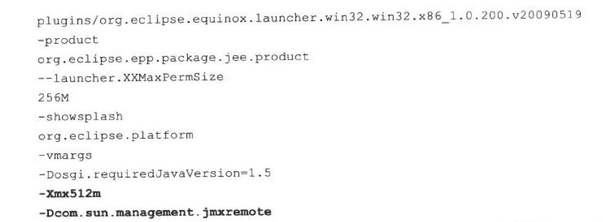
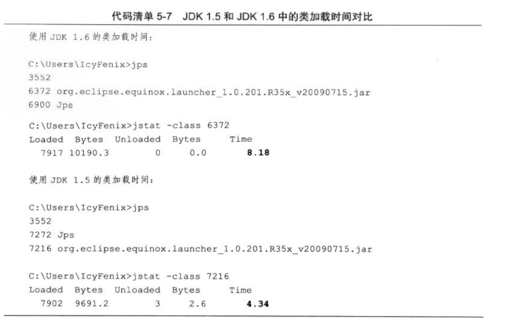
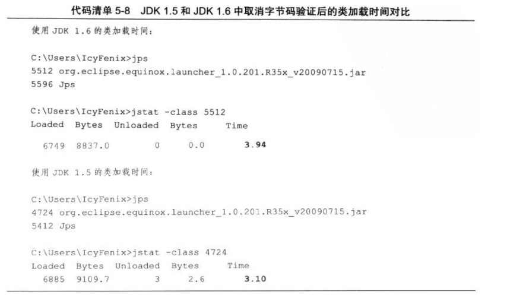
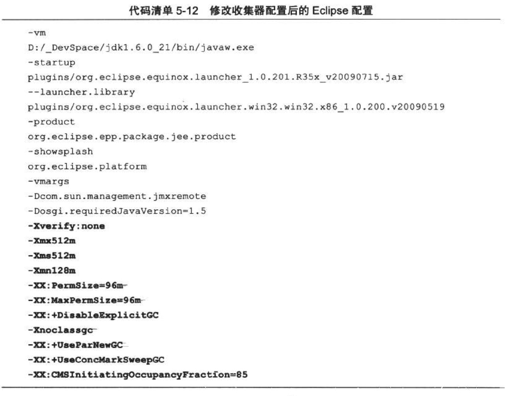

[TOC]

Java与C++之间有一堵由内存动态分配和垃圾收集技术所围成的“高墙”，墙外面的人想进去，墙里面的人却想出来。

# 概述

上文介绍了处理Java虚拟机内存问题的知识与工具，在处理实际项目的问题时，除了知识与工具外，经验同样是一个很重要的因素。因此本章将与读者分享几个比较有代表性的实际案例。考虑到虚拟机故障处理和调优主要面向各类服务端应用，而大部分Java程序员较少有机会直接接触生产环境的服务器，因此本章还准备了一个所有开发人员都能够进行“亲身实战”的练习，希望通过实践获得故障处理和调优的经验。

# 案例分析

本章中的案例大部分来源于《深入理解Java虚拟机》第二版作者处理过的一些问题，还有一小部分来源于网络上比较有特色和代表性的案例总结。出于对客户商业信息保护的目的，在不影响前后逻辑的前提下， 对实际环境和用户业务做了一些屏蔽和精简。

#### 高性能硬件上的程序部署策略

例如 ,一个15万PV/天左右的在线文档类型网站最近更换了硬件系统,新的硬件为4个CPU、16GB物理内存,操作系统为64位CentOS 5.4 , Resin作为Web服务器。整个服务器暂时没有部署别的应用,所有硬件资源都可以提供给这访问量并不算太大的网站使用。管理员为了尽量利用硬件资源选用了64位的JDK 1.5 ,并通过-Xmx和-Xms参数将Java堆固定在12GB。使用一段时间后发现使用效果并不理想,网站经常不定期出现长时间失去响应的情况。

监控服务器运行状况后发现网站失去响应是由GC停顿导致的,虚拟机运行在Server模式 ,默认使用吞吐量优先收集器,回收12GB的堆 ,一次Full GC的停顿时间高达14秒。并且由于程序设计的关系,访问文档时要把文档从磁盘提取到内存中,导致内存中出现很多由文档序列化产生的大对象,这些大对象很多都进入了老年代,没有在Minor GC中清理掉。这种情况下即使有12GB的堆 ,内存也很快被消耗殆尽,由此导致每隔十几分钟出现十几秒的停顿 ,令网站开发人员和管理员感到很沮丧。

这里先不延伸讨论程序代码问题,程序部署上的主要问题显然是过大的堆内存进行回收时带来的长时间的停顿。硬件升级前使用32位系统1.5GB的堆,用户只感觉到使用网站比较缓慢 ,但不会发生十分明显的停顿,因此才考虑升级硬件以提升程序效能,如果重新缩小给Java堆分配的内存,那么硬件上的投资就显得很浪费。

在高性能硬件上部署程序,目前主要有两种方式:

- 通过64位JDK来使用大内存。
- 使用若干个32位虚拟机建立逻辑集群来利用硬件资源。

此案例中的管理员采用了第一种部署方式。**对于用户交互性强、对停顿时间敏感的系统,可以给Java虚拟机分配超大堆的前提是有把握把应用程序的Full GC频率控制得足够低, 至少要低到不会影响用户使用**，譬如十几个小时乃至一天才出现一次Full GC ,这样可以通过在深夜执行定时任务的方式触发Full GC甚至自动重启应用服务器来保持内存可用空间在一个稳定的水平。

**控制Full GC频率的关键是看应用中绝大多数对象能否符合“朝生夕灭”的原则,即大多数对象的生存时间不应太长,尤其是不能有成批量的、长生存时间的大对象产生,这样才能保障老年代空间的稳定。**

在大多数网站形式的应用里,主要对象的生存周期都应该是请求级或者页面级的,会话级和全局级的长生命对象相对很少。只要代码写得合理,应当都能实现在超大堆中正常使用而没有Full GC，这样的话，使用超大堆内存时,网站响应速度才会比较有保证。除此之外, 如果计划使用64位JDK来管理大内存,还需要考虑下面可能面临的问题:

- 内存回收导致的长时间停顿。
- 现阶段 ,64位JDK的性能测试结果普遍低于32位JDK。
- 需要保证程序足够稳定,因为这种应用要是产生堆溢出几乎就无法产生堆转储快照(因为要产生十几GB乃至更大的Dump文件 ),哪怕产生了快照也几乎无法进行分析。
- 相同程序在64位JDK消耗的内存一般比32位JDK大 ,这是由于指针膨胀,以及数据类型对齐补白等因素导致的。

上面的问题听起来有点吓人,所以现阶段不少管理员还是选择第二种方式:使用若干个32位虚拟机建立逻辑集群来利用硬件资源。具体做法是在一台物理机器上启动多个应用服务器进程 ,每个服务器进程分配不同端口 ,然后在前端搭建一个负载均衡器 ,以反向代理的方式来分配访问请求。不需要太过在意均衡器转发所消耗的性能,即使使用64位JDK ,许多应用也不止有一台服务器,因此在许多应用中前端的均衡器总是要存在的。

考虑到在一台物理机器上建立逻辑集群的目的仅仅是为了尽可能利用硬件资源,并不需要关心状态保留、热转移之类的高可用性需求,也不需要保证每个虚拟机进程有绝对准确的均衡负载,因此使用无Session复制的亲合式集群是一个相当不错的选择。我们仅仅需要保障集群具备亲合性,也就是均衡器按一定的规则算法(一般根据SessionID分配)将一个固定的用户请求永远分配到固定的一个集群节点进行处理即可,这样程序开发阶段就基本不用为集群环境做什么特别的考虑了。

当然 ,很少有没有缺点的方案,如果计划使用逻辑集群的方式来部署程序,可能会遇到下面一些问题:

- 尽量避免节点竞争全局的资源,最典型的就是磁盘竞争,各个节点如果同时访问某个磁盘文件的话(尤其是并发写操作容易出现问题),很容易导致IO异常。
- 很难最高效率地利用某些资源池,譬如连接池,一般都是在各个节点建立自己独立的连接池 ,这样有可能导致一些节点池满了而另外一些节点仍有较多空余。尽管可以使用集中式的JNDI,但这个有一定复杂性并且可能带来额外的性能开销。
- 各个节点仍然不可避免地受到32位的内存限制,在32位Windows平台中每个进程只能使用2GB的内存 ,考虑到堆以外的内存开销,堆一般最多只能开到1.5GB。在某些Linux或UNIX 系统(如Solaris ) 中 ,可以提升到3GB乃至接近4GB的内存,但32位中仍然受最高4GB(2^32)内存的限制。
- 大量使用本地缓存(如大量使用HashMap作为K/V缓存 )的应用 ,在逻辑集群中会造成较大的内存浪费,因为每个逻辑节点上都有一份缓存,这时候可以考虑把本地缓存改为集中式缓存。

介绍完这两种部署方式,再重新回到这个案例之中,**最后的部署方案**调整为建立5个32 位JDK的**逻辑集群**,每个进程按2GB内存计算(其中堆固定为1.5GB ) ,占用了10GB内存。 另外建立一个Apache服务作为前端均衡代理访问门户。考虑到用户对响应速度比较关心,并且文档服务的主要压力集中在磁盘和内存访问,CPU资源敏感度较低,因此**改为CMS收集器进行垃圾回收**。部署方式调整后，服务再没有出现长时间停顿,速度比硬件升级前有较大提升。

#### 集群间同步导致的内存溢出

例如 ,有一个基于B/S的MIS系 统 ,硬件为两台2个CPU、8GB内存的HP小型机,服务器是WebLogic 9.2 ,每台机器启动了3个WebLogic实例 ,构成一个6个节点的亲合式集群。由于是亲合式集群,节点之间没有进行Session同步,但是有一些需求要实现部分数据在各个节点间共享。开始这些数据存放在数据库中,但由于读写频繁竞争很激烈,性能影响较大,后面使用JBossCache构建了 一个全局缓存。全局缓存启用后,服务正常使用了一段较长的时间, 但最近却不定期地出现了多次的内存溢出问题。

在内存溢出异常不出现的时候,服务内存回收状况一直正常,每次内存回收后都能恢复到一个稳定的可用空间,开始怀疑是程序某些不常用的代码路径中存在内存泄漏,但管理员反映最近程序并未更新、升级过,也没有进行什么特别操作。只好让服务带着-XX:+HeapDumpOnOutOfMemoryError参数运行了一段时间。在最近一次溢出之后,管理员发回了 heapdump文件 ,发现里面存在着大量的org.jgroups.protocols.pbcast.NAKACK对象。

JBossCache是基于自家的JGroups进行集群间的数据通信,JGroups使用协议栈的方式来实现收发数据包的各种所需特性自由组合,数据包接收和发送时要经过每层协议栈的up()和down()方法,其中的NAKACK栈用于保障各个包的有效顺序及重发。JBossCache协议栈如图5-1所示。


由于信息有传输失败需要重发的可能性,在确认所有注册在GMS ( Group Membership Service ) 的节点都收到正确的信息前,发送的信息必须在内存中保留。而此MIS的服务端中有一个负责安全校验的全局Filter , 每当接收到请求时,均会更新一次最后操作时间,并且将这个时间同步到所有的节点去,使得一个用户在一段时间内不能在多台机器上登录。在服务使用过程中,往往一个页面会产生数次乃至数十次的请求,因此这个过滤器导致集群各个节点之间网络交互非常频繁。当网络情况不能满足传输要求时,重发数据在内存中不断堆积,很快就产生了内存溢出。

这个案例中的问题,**既有JBossCache的缺陷,也有MIS系统实现方式上缺陷**。 JBossCache官方的maillist中讨论过很多次类似的内存溢出异常问题,据说后续版本也有了改进。而更重要的缺陷是这一类被集群共享的数据要**使用类似JBossCache这种集群缓存来同步**的话 ,可以允许读操作频繁,因为数据在本地内存有一份副本,读取的动作不会耗费多少资源 ,但**不应当有过于频繁的写操作**,那样会带来很大的网络同步的开销。

#### 堆外内存导致的溢出错误

例如 ,一个学校的小型项目:基于B/S的电子考试系统,为了实现客户端能实时地从服务器端接收考试数据 , 系统使用了逆向AJAX技术(也称为Comet或者Server Side Push) ,选用CometD 1.1.1作为服务端推送框架,服务器是Jetty 7.1 .4 ,硬件为一台普通PC机 , Core i5 CPU , 4GB内存,运行32位Windows操作系统。

测试期间发现服务端不定时拋出内存溢出异常,服务器不一定每次都会出现异常,但假如正式考试时崩溃一次,那估计整场电子考试都会乱套,网站管理员尝试过把堆开到最大, 而32位系统最多到1.6GB就基本无法再加大了,而且开大了基本没效果,拋出内存溢出异常好像还更加频繁了。**加入-XX:+HeapDumpOnOutOfMemoryError,居然也没有任何反应,拋出内存溢出异常时什么文件都没有产生**。无奈之下**只好挂着jstat并一直紧盯屏幕**,发现GC并不频 繁 ,Eden区、Survivor区、老年代以及永久代内存全部都表示“情绪稳定,压力不大”, 但就是照样不停地拋出内存溢出异常,管理员压力很大。最后 ,在内存溢出后从系统日志中找到异常堆栈,如代码清单5-1所示。

代码清单5 - 1 异常堆栈

```
[org.eclipse.jetty.util.log]handle failed java.lang.OutOfMemoryError:null 
	at sun.raise.Unsafe.allocateMemory (Native Method )
	at java.nio.DirectByteBuffer.<init> (DirectByteBuffer.java :99 )
	at java.nio.ByteBuffer.allocateDirect (ByteBuffer.java :288 )
	at org.eclipse.jetty.io.nio.DirectNIOBuffer.<init>
	...
```

大家知道操作系统对每个进程能管理的内存是有限制的,这台服务器使用的32位Windows平台的限制是2GB ,其中划了1.6GB给Java堆 ,而Direct Memory内存并不算入1.6GB的堆之内,因此它最大也只能在剩余的0.4GB空间中分出一部分。在此应用中导致溢出的关键是:垃圾收集进行时,**虚拟机虽然会对Direct Memory进行回收,但是Direct Memory却不能像新生代、老年代那样,发现空间不足了就通知收集器进行垃圾回收,它只能等待老年代满了后Full GC , 然后“顺便地”帮它清理掉内存的废弃对象。否则它只能一直等到拋出内存溢出异常时,先catch掉 ,再在catch块里面“大喊声:“System.gc()! ”。要是虚拟机还是不听 ( 譬如打开了-XX:+DisableExplicitGC开关),那就只能眼睁睁地看着堆中还有许多空闲内存 ,自己却不得不拋出内存溢出异常了**。而本案例中使用的CometD 1.1.1框架,正好有大量 的NIO操作需要使用到Direct Memory内存。

从实践经验的角度出发,**除了Java堆和永久代之外,我们注意到下面这些区域还会占用较多的内存,这里所有的内存总和受到操作系统进程最大内存的限制**。

- Direct Memory : 可通过-XX:MaxDirectMemorySize调整大小,内存不足时拋出OutOfMemoryError或者OutOfMemoryError : Direct buffer memory。
- 线程堆栈:可通过-Xss调整大小,内存不足时拋出StackOverflowError (纵向无法分配, 即无法分配新的栈帧)或者OutOfMemoryError : unable to create new native thread (横向无法分配 ,即无法建立新的线程)。
- Socket缓存区:每个Socket连接都Receive和Send两个缓存区,分别占大约37KB和25KB内存,连接多的话这块内存占用也比较可观。如果无法分配,则可能会拋出IOException : Too many open files异常。
- JNI代码 :如果代码中使用JNI调用本地库,那本地库使用的内存也不在堆中。
- 虚拟机和GC:虚拟机、GC的代码执行也要消耗一定的内存。

#### 外部命令导致系统缓慢

这是一个来自网络的案例:一个数字校园应用系统,运行在一台4个CPU的Solaris 10操作系统上,中间件为GlassFish服务器。系统在做大并发压力测试的时候,发现请求响应时间比较慢 ,通过操作系统的mpstat工具发现CPU使用率很高 ,并且系统占用绝大多数的CPU资源的程序并不是应用系统本身。这是个不正常的现象,通常情况下用户应用的CPU占用率应该占主要地位,才能说明系统是正常工作的。

通过Solaris 10的Dtrace脚本可以查看当前情况下哪些系统调用花费了最多的CPU资源 ,Dtrace运行后发现最消耗CPU资源的竟然是“fork”系统调用。众所周知,“fork”系统调用 是Linux用来产生新进程的,在**Java虚拟机中,用户编写的Java代码最多只有线程的概念,不应当有进程的产生**。

这是个非常异常的现象。通过本系统的开发人员,最终找到了答案:每个用户请求的处理都需要执行一个外部shell脚本来获得系统的一些信息。**执行这个shell脚本是通过Java的 Runtime.getRuntime().exec() 方法来调用的。这种调用方式可以达到目的,但是它在Java虚拟机中是非常消耗资源的操作,即使外部命令本身能很快执行完毕,频繁调用时创建进程的开销也非常可观。Java虚拟机执行这个命令的过程是:首先克隆一个和当前虚拟机拥有一样环境变量的进程,再用这个新的进程去执行外部命令,最后再退出这个进程。如果频繁执行这个操作,系统的消耗会很大,不仅是CPU, 内存负担也很重**。

用户根据建议去掉这个Shell脚本执行的语句,改为使用Java的API去获取这些信息后, 系统很快恢复了正常。

#### 服务器JVM进程崩溃

例如,一个基于B/S的MIS系统,硬件为两台2个CRJ、8GB内存的HP系统,服务器是WebLogic 9.2 。正常运行一段时间后,最近发现在运行期间频繁出现集群节点的虚拟机进程自动关闭的现象,留下了一个hs_err_pid###.log文件后 ,进程就消失了,两台物理机器里的每个节点都出现过进程崩溃的现象。从系统日志中可以看出, 每个节点的虚拟机进程在崩溃前不久,都发生过大量相同的异常,见代码清单5-2。

```
java.net.SocketException :Connection reset
at java.net.SocketInputStream.read(SocketInputStream.java:168)
at java.io.BufferedlnputStream. fill (BufferedlnputStream. java :218 )
at java.io.BufferedlnputStream.read(BufferedlnputStream.java:235)
at org.apache.axis.transport.http.HTTPSender.readHeadersFromSocket (HTTPSender.java :583 ) at org.apache,axis.transport.http.HTTPSender.invoke(HTTPSender.java:143)
...99 more1234567
```

这是一个远端断开连接的异常,通过系统管理员了解到系统最近与一个OA门户做了集成 ,在MIS系统工作流的待办事项变化时,要通过Web服务通知0A门户系统,把待办事项的变化同步到OA门户之中。通过SoapUI测试了一下同步待办事项的几个Web服务,发现调用后竟然需要长达3分钟才能返回,并且返回结果都是连接中断。

由于MS系统的用户多,待办事项变化很快,为了不被OA系统速度拖累,使用了异步的方式调用Web服务,但**由于两边服务速度的完全不对等,时间越长就累积了越多Web服务没有调用完成,导致在等待的线程和Socket连接越来越多,最终在超过虚拟机的承受能力后使得虚拟机进程崩溃**。解决方法:通知OA门户方修复无法使用的集成接口,并将异步调用改为生产者/消费者模式的消息队列实现后,系统恢复正常。

#### 不恰当数据结构导致内存占用过大

例如,有一个后台RPC服务器,使用64位虚拟机,内存配置为-Xms4g -Xmx8g -Xmn1g, 使用ParNew+CMS的收集器组合。平时对外服务的Minor GC时间约在30毫秒以内,完全可以接受。但业务上需要每10分钟加载一个约80MB的数据文件到内存进行数据分析,这些数据会在内存中形成超过100万个HashMap<Long,Long>Entry,在这段时间里面Minor GC就会造成超过500毫秒的停顿,对于这个停顿时间就接受不了了,具体情况如下面GC日志所示。


观察这个案例,发现平时的Minor GC时间很短,原因是新生代的绝大部分对象都是可清除的, 在Minor GC之后Eden和Survivor基本上处于完全空闲的状态。而在分析数据文件期间,800MB的Eden空间很快被填满从而引发GC ,但Minor GC之后,新生代中绝大部分对象依然是存活的。我们知道**ParNew收集器使用的是复制算法,这个算法的高效是建立在大部分对象都“朝生夕灭”的特性上的**,如果存活对象过多,把这些对象复制到Survivor并维持这些对象引用的正确就成为一个沉重的负担,因此导致GC暂停时间明显变长。

如果不修改程序,**仅从GC调优的角度去解决这个问题**,可以考虑将Survivor空间去掉(加入参数-XX : SurvivorRatio=65536、 -XX : MaxTenuringThreshold=0或者-XX :+AlwaysTenure ) , 让新生代中存活的对象在第一次Minor GC后立即进入老年代,等到Major GC的时候再清理它们。**这种措施可以治标,但也有很大副作用**,治本的方案需要修改程序 ,因为这里的问题产生的**根本原因是用HashMap<Long,Long> 结构来存储数据文件空间效率太低**。

下面具体分析一下空间效率。**在HashMap<Long,Long> 结构中,只有Key和Value所存放的两个长整型数据是有效数据,共16B ( 2x8B ) 。这两个长整型数据包装成java.lang.Long对象之后,就分别具有8B的MarkWord、8B的Klass指针 ,在加8B存储数据的long值。在这两个Long对贏组成Map.Entry之后 ,又多了 16B的对象头,然后一个8B的next字段和4B的int型的hash字段 ,为了对齐,还必须添加4B的空白填充,最后还有HashMap中对这个Entry的8B的引用 ,这样增加两个长整型数字,实际耗费的内存为 (Long(24B)x2)+Entry(32B)+HashMap Ref(8B)=88B,空间效率为16B/88B=18%,实在太低了。**

#### 由Windows虚拟内存导致的长时间停顿

例如 ,有一个带心跳检测功能的GUI桌面程序,每15秒会发送一次心跳检测信号,如果对方30秒以内都没有信号返回,那就认为和对方程序的连接已经断开。程序上线后发现心跳检测有误报的概率,查询日志发现误报的原因是程序会偶尔出现间隔约一分钟左右的时间完全无日志输出,处于停顿状态。

因为是桌面程序,所需的内存并不大(-Xmx 256m), 所以开始并没有想到是GC导致的程序停顿,但是加入参数-XX:+PrintGCApplicationStoppedTime -XX:+PrintGCDateStamps - Xloggc : gclog.log后 ,从GC日志文件中确认了停顿确实是由GC导致的,大部分GC时间都控制在100毫秒以内,但偶尔就会出现一次接近1分钟的GC。


从GC日志中找到长时间停顿的具体日志信息(添加了-XX:+PrintReferenceGC参数), 找到的日志片段如下所示。从日志中可以看出,真正执行GC动作的时间不是很长,但从准备开始GC ,到真正开始GC之间所消耗的时间却占了绝大部分。


除GC日志之外,还观察到这个GUI程序内存变化的一个特点,当它最小化的时候,资源管理中显示的占用内存大幅度减小,但是虚拟内存则没有变化,因此怀疑程序在最小化时它的工作内存被自动交换到磁盘的页面文件之中了,这样发生GC时就有可能因为恢复页面文件的操作而导致不正常的GC停顿。

在MSDN上查证后确认了这种猜想,因此,在Java的GUI程序中要避免这种现象,可以加入参数“-Dsun.awt.keepWorkingSetOnMinimize=true”来解决。这个参数在许多AWT的程序上都有应用,例如JDK自带的Visual VM,用于保证程序在恢复最小化时能够立即响应。在这个案例中加入该参数后,问题得到解决。

# 实战:Eclipse运行速度调优

很多Java程序员都有这样的一个观念：系统调优的工作都是针对服务端而言的，规模越大的系统，就越需要专业的调优运维团队参与。这个观点不能说不对，上面的例子确实都是服务端运维、调优的例子，但服务端应用需要调优，并不说明其他应用就不需要了，作为一个普通的开发人员，前面讲的各种虚拟机的原理和最佳实践方法距离我们并不遥远，开发者身边很多场景都可以使用上面这些知识，下面通过一个普通程序员日常工作中可以随时接触到的开发工具开始这次实战。

#### 调优前的程序运行状态

Eclipse作为日常工作中的主要IDE工具 ,由于安装的插件比较大(如 Klocwork、 ClearCase LT等 )、代码也很多,启动Eclipse直到所有项目编译完成需要四五分钟。下面对Eclipse进行“动刀”调优。

机器的Eclipse运行平台是32位Windows 7系统,虚拟机为HotSpot VM 1.5 b64。硬件为ThinkPad X201 , Intel i5 CPU, 4GB物理内存。在初始的配置文件eclipse.ini中,除了指定JDK的路径、设置最大堆为512MB以及开启了JMX管理 (需要在VisualVM中收集原始数据) 外,未做其他任何改动,原始配置内容如代码清单5-3所示。





为了要与调优后的结果进行量化对比,调优开始前笔者先做了一次初始数据测试。测试用例很简单,就是收集从Eclipse启动开始,直到所有插件加载完成为止的总耗时以及运行状态数据 ,虚拟机的运行数据通过VisualVM及其扩展插件VisualGC进行采集。测试过程中反复启动数次Eclipse直到测试结果稳定后,取最后一次运行的结果作为数据样本(为了避免操作系统未能及时进行磁盘缓存而产生的影响),数据样本如图5-2所示。


Eclipse启动的总耗时没有办法从监控工具中直接获得,因为VisualVM不可能知道Eclipse运行到什么阶段算是启动完成。为了测试的准确性,笔者写了一个简单的Eclipse插件 ,用于统计Eclipse的启动耗时。由于代码很简单,并且本书不是Eclipse RCP开发的教程,所以只列出代码清单5-4供读者参考,不再延伸讲解。


上述代码打包成jar后放到Eclipse的plugins目录,反复启动几次后,插件显示的平均时间稳定在15秒左右,如图5-3所示。


根据VisualGC和Eclipse插件收集到的信息,总结原始配置下的测试结果如下。

- 整个启动过程平均耗时约15秒。

- 最后一次启动的数据样本中,垃圾收集总耗时4.149秒 ,其中 :

  - Full GC被触发了19次,共耗时3.166秒。
- Minor GC被触发了378次 ,共耗时0.983秒。
  
- 加载类9115个 ,耗时4.114秒。

- JIT编译时间为1.999秒。

- 虚拟机512MB的堆内存被分配为40MB的新生代(31.5的Eden空间和两个4MB的Surviver空间)以及472MB的老年代。

客观地说,由于机器硬件还不错(以2010年普通PC机的标准来衡量),15秒的启动时间其实还在可接受范围以内,但是从VisualGC中反映的数据来看,**主要问题是非用户程序时间**(图5-2中的Compile Time、 Class Load Time、 GC Time ) 非常之高,占了整个启动过程耗时的一半以上(这里存在少许夸张成分,因为如JIT编译等动作是在后台线程完成的, 用户程序在此期间也正常执行,所以并没有占用了一半以上的绝对时间)。虚拟机后台占用太多时间也直接导致Eclipse在启动后的使用过程中经常有不时停顿的感觉,所以进行调优有较大的价值。

#### 升级JDK 1.6的性能变化及兼容问题

对Eclipse进行调优的第一步就是先把虚拟机的版本进行升级,希望能先从虚拟机版本身上得到一些“免费的”性能提升。

每次JDK的大版本发布时,开发商肯定都会宣称虚拟机的运行速度比上一版本有了很大的提高 ,这虽然是个广告性质的宣言,经常被人从升级列表或者技术白皮书中直接忽略过去 ,但从国内外的第三方评测数据来看,版本升级至少某些方面确实带来了一定的性能改善(**也有版本升级性能倒退的案例，受程序、第三方兼容包以及中间件的限制**),以下是一个第三方网站对JDK 1.5、1.6、1.7三个版本做的性能评测,分别测试了以下4 个用例:

- 生成500万个的字符串。
- 500万次ArrayList< String >数据插入,使用第一点生成的数据。
- 生成500万个HashMap< String,Integer > , 每个键-值对通过并发线程计算,测试并发能力。
- 打印500万个ArrayList< String >中的值到文件,并重读回内存。

三个版本的JDK分别运行这3个用例的测试程序,测试结果如图5-4所示。


从这4个用例的测试结果来看, JDK 1.6比JDK 1.5有大约15%的性能提升,尽管对JDK仅测试这4个用例并不能说明什么问题,需要通过测试数据来量化描述一个JDK比旧版提升了多少是很难做到非常科学和准确的(要做稍微靠谱一点的测试,可以使用SPEQjvm200, 来完成 ,或者把相应版本的TCK中数万个测试用例的性能数据对比一下可能更有说服力), 但我还是选择相信这次“软广告”性质的测试,把JDK版本升级到1.6 Update 21。

这次升级到JDK 1.6之 后 ,性能有什么变化先暂且不谈,在使用几分钟之后,发生了内存溢出,如图5-5所示。


这次内存溢出完全出乎笔者的意料之外:决定对Eclipse做调优是因为速度慢,但开发环境一直都很稳定,至少没有出现过内存溢出的问题,而这次升级除了eclipse.ini中的JVM路径改变了之外,还未进行任何运行参数的调整,进到Eclipse主界面之后随便打开了几个文件就拋出内存溢出异常了,难道JDK1.6Update21有哪个API出现了严重的泄漏问题吗?

事实上 ,并不是JDK 1.6出现了什么问题,根据前面章节中介绍的相关原理和工具,我们要查明这个异常的原因并且解决它一点也不困难。打开VisualVM ,监视页签中的内存曲线部分如图5-6和图5-7所示。


在Java堆中监视曲线中,“堆大小”的曲线与“使用的堆”的曲线一直都有很大的间隔距离 ,每当两条曲线开始有互相靠近的趋势时,“最大堆”的曲线就会快速向上转向,而“使用的堆”的曲线会向下转向。“最大堆”的曲线向上是虚拟机内部在进行堆扩容,运行参数中并没有指定最小堆( -Xms ) 的值与最大堆( -Xmx ) 相等,所以堆容量一开始并没有扩展到最大值,而是根据使用情况进行伸缩扩展。“使用的堆”的曲线向下是因为虚拟机内部触发了一次垃圾收集,一些废弃对象的空间被回收后,内存用量相应减少,从图形上看,Java堆运作是完全正常的。但永久代的监视曲线就有问题了,“PermGen大小”的曲线与“使用的PermGen”的曲线几乎完全重合在一起,这说明永久代中没有可回收的资源,所以 “使用的PermGen” 的曲线不会向下发展,永久代中也没有空间可以扩展,所以“PermGen大小”的曲线不能向上扩展。这次内存溢出很明显是永久代导致的内存溢出。

再注意到图5-7中永久代的最大容量: “67 , 108 , 864个字节” ,也就是64MB ,这恰好是JDK在未使用-XX : MaxPermSize参数明确指定永久代最大容量时的默认值,无论JDK 1.5还是JDK 1.6,这个默认值都是64MB。对于Eclipse这种规模的Java程序来说,64MB的永久代内存空间显然是不够的,溢出很正常,那为何在JDK 1.5中没有发生过溢出呢?

在VisualVM的“概述-JVM参数”页签中,分别检查使用JDK 1.5和JDK 1.6运行Eclipse时的 JVM参数,发现使用JDK 1.6时,只有以下3个JVM参数,如代码清单5-5所示。


而使用JDK 1.5运行时 ,就有4条JVM参数 ,其中多出来的一条正好就是设置永久代最大容量的-XX : MaxPermSize=256M,如代码清单5-6所示。


为什么会这样呢?笔者从Eclipse的Bug List网站上找到了答案:使用JDK 1.5时之所以有永久代容量这个参数,是因为在eclipse.ini中存在“--launcher.XXMaxPermSize 256M”这项设置 ,当launcher——也就是Windows下的可执行程序eclipse.exe,检测到假如是Eclipse运行在 Sun公司的虚拟机上的话,就会把参数值转化为-XX : MaxPermSize传递给虚拟机进程,因为三大商用虚拟机中只有Sun系列的虚拟机才有永久代的概念,也就是只有HotSpot虚拟机需要设置这个参数,JRockit虚拟机和IBMJ9虚拟机都不需要设置。

在2009年4月20日 ,Oracle公司正式完成了对Sun公司的收购,此后无论是网页还是具体程序产品,提供商都从Sun变为了Oracle , 而eclipse.exe就是根据程序提供商判断是否为Sun的虚拟机,当JDK 1.6 Update 21 中java.exe、javaw.exe的“Company”属性从“Sun Microsystems Inc.”变为“Oracle Corporation”之后, Eclipse就完全不认识这个虚拟机了,因此没有把最大永久代的参数传递过去。

了解原因之后,解决方法就简单了,launcher不认识就只好由人来告诉它,即在 eclipse.ini中明确指定-XX: MaxPermSize=256M这个参数就可以了。

#### 编译时间和类加载时间的优化

从Eclipse启动时间上来看,升级到JDK 1.6所带来的性能提升是……嗯?基本上没有提升?多次测试的平均值与JDK 1.5的差距完全在实验误差范围之内。

Sun JDK 1.6性能白皮书描述的众多相对于JDK 1.5的提升不至于全部是广告,虽然总启动时间没有减少,但在查看运行细节的时候,却发现了一件很值得注意的事情:在JDK 1.6中启动完Eclipse所消耗的类加载时间比JDK 1.5长了接近一倍,不要看反了,这里写的是JDK 1.6的类加载比JDK 1.5慢一倍,测试结果如代码清单5-7所示,反复测试多次仍然是相似的结果。



在本例中,类加载时间上的差距并不能作为一个具有普遍性的测试结果去说明JDK 1.6 的类加载必然比JDK 1.5慢 ,笔者测试了自己机器上的Tomcat和GlassFish启动过程,并未没有出现类似的差距。在国内最大的Java社区中,笔者发起过关于此问题的讨论 ,从参与者反馈的测试结果来看,此问题只在一部分机器上存在,而且JDK 1.6的各个Update版之间也存在很大差异。

多次试验后,笔者发现在机器上两个JDK进行类加载时,字节码验证部分耗时差距尤其严重。考虑到实际情况:Eclipse使用者甚多,它的编译代码我们可以认为是可靠的,不需要在加载的时候再进行字节码验证,因此**通过参数-Xverify : none禁止掉字节码验证**过程也可作为一项优化措施。加入这个参数后,两个版本的JDK类加载速度都有所提高,JDK 1.6的类加载速度仍然比JDK 1.5慢 ,但是两者的耗时已经接近了许多,测试数据如代码清单5-8所示。关于类与类加载的话题,譬如刚刚提到的字节码验证是怎么回事,后面规划了两个章节进行详细讲解,在此不再延伸讨论。




在取消字节码验证之后,JDK 1.5的平均启动下降到了13秒,而JDK 1.6的测试数据平均比JDK 1.5快1秒,下降到平均12秒左右,如图5-8所示。在类加载时间仍然落后的情况下,依然可以看到JDK 1.6在性能上比JDK 1.5稍有优势,说明至少在Eclipse启动这个测试用例上, 升级JDK版本确实能带来一些“免费的”性能提升。


前面说过,除了类加载时间以外,在VisualGC的监视曲线中显示了两项很大的非用户程序耗时:编译时间( Compile Time ) 和垃圾收集时间( GC Time )。垃圾收集时间读者应该非常清楚了,而**编译时间是什么呢?编译时间是指虚拟机的JIT编译器( Just In Time Compiler ) 编译热点代码( Hot Spot Code )的耗时**。我们知道Java语言为了实现跨平台的特性,Java代码编译出来后形成的Class文件中存储的是字节码( ByteCode ) ,虚拟机通过解释方式执行字节码命令,比起C/C++编译成本地二进制代码来说,速度要慢不少。**为了解决程序解释执行的速度问题, JDK 1.2以后,虚拟机内置了两个运行时编译器 ,如果一段Java方法被调用次数达到一定程度,就会被判定为热代码交给JIT编译器即时编译为本地代码,提高运行速度(这就是HotSpot虚拟机名字的由来 )**。甚至有可能在运行期动态编译比C/C++的编译期静态译编出来的代码更优秀,因为运行期可以收集很多编译器无法知道的信息,甚至可以采用一些很激进的优化手段,在优化条件不成立的时候再逆优化退回来。所以Java程序只要代码没有问题(主要是泄漏问题,如内存泄漏、连接泄漏),随着代码被编译得越来越彻底,运行速度应当是越运行越快的。**Java的运行期编译最大的缺点就是它进行编译需要消耗程序正常的运行时间,这也就是上面所说 的“编译时间”**。

虛拟机提供了一个参数**-Xint禁止编译器运作**,强制虚拟机对字节码采用纯解释方式执行。如果读者想使用这个参数省下Eclipse启动中那2秒的编译时间获得一个“更好看”的成绩的话,那恐怕要失望了**,加上这个参数之后,虽然编译时间确实下降到0 , 但Eclipse启动的总时间剧增到27秒**。看来这个参数现在最大的作用似乎就是让用户怀念一下JDK 1.2之前那令人心酸和心碎的运行速度。

与解释执行相对应的另一方面,虚拟机还有力度更强的编译器:**当虚拟机运行在-client 模式的时候,使用的是一个代号为C1的轻量级编译器,另外还有一个代号为C2的相对重量级的编译器能提供更多的优化措施,如果使用-server模夫的虚拟机启动Eclipse将会使用到C2 编译器 ,这时从VisualGC可以看到启动过程中虚拟机使用了超过15秒的时间去进行代码编译。如果读者的工作习惯是长时间不关闭Eclipse的话 ,C2编译器所消耗的额外编译时间最终还是会在运行速度的提升之中赚回来,这样使用-server模式也是一个不错的选择**。不过至少在本次实战中,我们还是继续选用-cllent虚拟机来运行Eclipse。

#### 调整内存设置控制垃圾收集频率

**三大块非用户程序时间中,还剩下GC时间没有调整,而GC时间却又是其中最重要的一块 ,并不只是因为它是耗时最长的一块,更因为它是一个稳定持续的过程。由于我们做的测试是在测程序的启动时间,所以类加载和编译时间在这项测试中的影响力被大幅度放大了。 在绝大多数的应用中,不可能出现持续不断的类被加载和卸载。在程序运行一段时间后,热点方法被不断编译,新的热点方法数量也总会下降,但是垃圾收集则是随着程序运行而不断运作的 ,所以它对性能的影响才显得尤为重要。**

在Eclipse启动的原始数据样本中,短短15秒 ,类共发生了19次Full GC和378次Minor GC ,一共397次GC共造成了超过4秒的停顿,也就是超过1/4的时间都是在做垃圾收集,这个运行数据看起来实在太糟糕了。

首先来解决新生代中的Minor GC ,虽然GC的总时间只有不到1秒 ,但却发生了378次之多。从VisualGC的线程监视中看到,Eclipse启动期间一共发起了超过70条线程 ,同时在运行的线程数超过25条 ,**每当发生一次垃圾收集动作,所有用户线程(严格的说不包括执行native代码线程，因为native代码一般不会改变Java对象的引用关系)都必须跑到最近的一个安全点(SafePoint)然后挂起线程等待垃圾回收**。这样过于频繁的GC就会导致很多没有必要的安全点检测、线程挂起及恢复操作。

新生代GC频繁发生,很明显是由于虚拟机分配给新生代的空间太小而导致的,Eden区加上一个Survivor区还不到35MB。因此很有必要使用-Xmn参数调整新生代的大小。

再来看一看那19次Full GC,看起来19次并“不多”(相对于378次Minor GC来说),但总耗时为3.166秒 ,占了GC时间的绝大部分,降低GC时间的主要目标就要降低这部分时间。从 VisualGC的曲线图上可能看得不够精确,这次直接从GC日志中分析一下这些Full GC是如何 产生的,代码清单5-9中是启动最开始的2.5秒内发生的10次Full GC记录。


括号中加粗的数字代表老年代的容量,**这组GC日志显示了 10次Full GC发生的原因全部都是老年代空间耗尽,每发生一次Full GC都伴随着一次老年代空间扩容**:1536KB-> 1664KB->2684KB……42056KB-> 46828KB,10次GC以后老年代容量从起始的1536KB扩大到46828KB,当15秒后Eclipse启动完成时,老年代容量扩大到了103428KB,代码编译开始后 ,老年代容量到达顶峰473MB,整个Java堆到达最大容量512MB。

日志还显示有些时候内存回收状况很不理想,空间扩容成为获取可用内存的最主要手段 ,譬如语句“Tenured : 25092K- >24656K ( 25108K ) ,0.1112429 secs”,代表老年代当前容量为25108KB,内存使用到25092KB的时候发生Full GC,花费0.11秒把内存使用降低到24656KB,只回收了不到500KB的内存,这次GC基本没有什么回收效果,仅仅做了扩容,扩容过程相比起回收过程可以看做是基本不需要花费时间的,所以说这0.11秒几乎是白白浪费了。

**由上述分析可以得出结论:Eclipse启动时, Full GC大多数是由于老年代容量扩展而导致的 ,由永久代空间扩展而导致的也有一部分。**为了避免这些扩展所带来的性能浪费,我们可以把-Xms和-XX:PermSize参数值设置为-Xmx和-XX : MaxPermSize参数值一样,这样就强制虚拟机在启动的时候就把老年代和永久代的容量固定下来,避免运行时自动扩展。

根据分析,优化计划确定为:把新生代容量提升到128MB,避免新生代频繁GC ;把Java堆、永久代的容量分别固定为512MB和96MB,避免内存扩展。这几个数值都是根据机器硬件、Eclipse插件和工程数量来决定的,实践的时候应根据VisualGC中收集到的实际数据进行设置。改动后的eclipse.ini配置如代码清单5-10所示。


现在这个配置之下,GC次数已经大幅度降低,图5-9是Eclipse启动后1分钟的监视曲线, 只发生了8次Minor GC和4次Full GC , 总耗时为1.928秒。


这个结果已经算是基本正常,但是还存在一点瑕疵:从Old Gen的曲线上看,老年代直接固定在384MB ,而内存使用量只有66MB,并且一直很平滑,完全不应该发生Full GC才对,那4次Full GC是怎么来的?使用jstat-gccause查询一下最近一次GC的原因,见代码清单5-11。


从LGCC ( Last GC Cause ) 中看到,原来是代码调用System.gc() 显式触发的GC ,在内存设置调整后,这种显式GC已不符合们的期望,因此在eclipse.ini中加入参数**-XX:+DisableExplicitGC屏蔽掉System.gc()**。 再次测试发现启动期间的Full GC已经完全没有了,只有6次Minor GC,耗时417毫秒,与调优前4.149秒的测试样本相比,正好是十分之一。进行GC调优后Eclipse的启动时间下降非常明显,比整个GC时间降低的绝对值还大,现在启动只需要7秒多,如图5-10所示。


#### 选择收集器降低延迟

现在Eclipse启动已经比较迅速了,但我们的调优实战还没有结束,毕竟Eclipse是拿来写程序的,不是拿来测试启动速度的。我们不妨再在Eclipse中测试一个非常常用但又比较耗时的操作:代码编译。图5-11是当前配置下Eclipse进行代码编译时的运行数据,从图中可以看出 ,新生代每次回收耗时约65毫秒,老年代每次回收耗时约725毫秒。对于用户来说,新生代GC的耗时还好,65毫秒在使用中无法察觉到,而老年代每次GC停顿接近1秒钟 ,虽然比较长时间才会出现一次,但停顿还是显得太长了一些。


再注意看一下编译期间的CPU资源使用状况。图5-12是Eclipse在编译期间的CPU使用率曲线图,整个编译过程中平均只使用了不到30%的CPU资源 ,垃圾收集的CPU使用率曲线更是几乎与坐标横轴紧贴在一起,这说明CPU资源还有很多可利用的余地。


**列举GC停顿时间、CPU资源富余的目的,都是为了接下来替换掉Client模式的虚拟机中默认的新生代、老年代串行收集器做铺垫。**

Eclipse应当算是与使用者交互非常频繁的应用程序,由于代码太多,习惯在做全量编译或者清理动作的时候,使用“Run in Backgroup”功能一边编译一边继续工作。很容易想到CMS是最符合这类场景的收集器。因此尝试在 eclipse.ini 中再加入这两个参数-XX : +UseConcMarkSweepGC、 -XX : 
+UseParNewGC ( ParNew收集器是使用CMS收集器后的默认新生代收集器,写上仅是为了配置更加清晰),要求虚拟机在新生代和老年代分别使用ParNew和CMS收集器进行垃圾回收。指定收集器之后,再次测试的结果如图5-13所示 ,与原来使用串行收集器对比,新生代停顿从每次65毫秒下降到了每次53毫秒 ,而老年代的停顿时间更是从725毫秒大幅下降到了36毫秒。


当然 ,CMS的停顿阶段只是收集过程中的一小部分,并不是真的把垃圾收集时间从725 毫秒变成36毫秒了。在GC日志中可以看到CMS与程序并发的时间约为400毫秒,这样收集器的运作结果就比较令人满意了。

到此 ,对于虚拟机内存的调优基本就结束了,这次实战可以看做是一次简化的服务端调优过程,因为服务端调优有可能还会存在于更多方面,如数据库、资源池、磁盘I/O等 ,但对于虚拟机内存部分的优化,与这次实战中的思路没有什么太大差别。即使实际工作中接触不到服务器,根据自己工作环境做一些试验,总结几个参数让自己日常工作环境速度有较大幅度提升也是很划算的。最终eclipse.ini的配置如代码清单5-12所示。



# 本章小结

Java虚拟机的内存管理与垃圾收集是虚拟机结构体系中最重要的组成部分，对程序的性能和稳定性存非常大的影响，在第2—5章中，从理论知识、异常现象、代码、 工具、案例、实战等几个方面对其进行了讲解。

本书关于虚拟机内存管理部分到此为止就结朿了，后面将幵始介级Class文件与虚拟机执行子系统方面的知识。