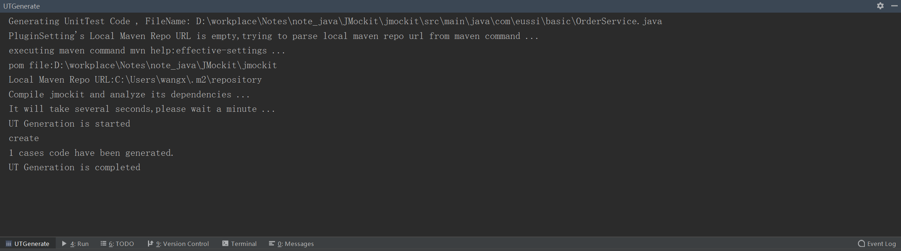

[TOC]

# JMockit是什么

JMockit是一款Java类/接口/对象的Mock工具，目前广泛应用于Java应用程序的单元测试中。是用以帮助开发人员编写测试程序的一组工具和API，该项目完全基于 Java5 SE的java.lang.instrument包开发，内部使用ASM库来修改Java的Bytecode。

jmockit**全称Mocking with Jmockit**

Java Mock工具很多，比如easyMock,Mockito等等。但JMockit的API易用，丰富，写出来的Mock程序代码完全面向对象。此外，JMockit还提供了注解，支持泛型的Mock API用于对类/对象的属性，方法(支持static,private,final,native)，构造函数，初始代码块(含静态初始代码块)灵活Mock。

JMockit是一款功能强大，API易用，不可或缺的Java Mock工具。

# 配置

## maven pom.xml配置

```
<dependency>
	<groupId>org.jmockit</groupId>
	<artifactId>jmockit</artifactId>
	<version>1.37</version>
	<scope>test</scope>
</dependency>
```

## JUnit4.x及以下用户特别注意事项

如果通过mvn test来运行你的测试程序 , 请确保JMockit的依赖定义出现在JUnit的依赖之前。 

```
<!-- 先声明jmockit的依赖 -->
<dependency>
	<groupId>org.jmockit</groupId>
	<artifactId>jmockit</artifactId>
	<version>1.37</version>
	<scope>test</scope>
</dependency>

<!-- 再声明junit的依赖 -->
<dependency>
	<groupId>junit</groupId>
	<artifactId>junit</artifactId>
	<version>4.11</version>
	<scope>test</scope>
</dependency>
```

## JMockit Coverage配置

如果需要使用JMockit的代码覆盖率功能，需要在Maven pom.xml中如下定义

```
<plugin>
	<artifactId>maven-surefire-plugin</artifactId>
	<configuration>
		<argLine>-javaagent:"${settings.localRepository}/org/jmockit/jmockit/1.37/jmockit-1.37.jar=coverage"</argLine>
		<disableXmlReport>false</disableXmlReport>
		<systemPropertyVariables>
			<coverage-output>html</coverage-output>
			<coverage-outputDir>${project.build.directory}/codecoverage-output</coverage-outputDir>
			<coverage-metrics>all</coverage-metrics>
		</systemPropertyVariables>
	</configuration>
</plugin>
```

# 程序结构

1. 通过一个例子来看JMockit的程序结构

```
//JMockit的程序结构
public class ProgramConstructureTest {

    // 这是一个测试属性
    @Mocked
    HelloJMockit helloJMockit;

    @Test
    public void test1() {
        // 录制(Record)
        new Expectations() {
            {
                helloJMockit.sayHello();
                // 期待上述调用的返回是"hello,david"，而不是返回"hello,JMockit"
                result = "hello,david";
            }
        };
        // 重放(Replay)
        String msg = helloJMockit.sayHello();
        Assert.assertTrue(msg.equals("hello,david"));
        // 验证(Verification)
        new Verifications() {
            {
                helloJMockit.sayHello();

                times = 1;
            }
        };
    }

    @Test
    public void test2(@Mocked HelloJMockit helloJMockit /* 这是一个测试参数 */) {
        // 录制(Record)
        new Expectations() {
            {
                helloJMockit.sayHello();
                // 期待上述调用的返回是"hello,david"，而不是返回"hello,JMockit"
                result = "hello,david";
            }
        };
        // 重放(Replay)
        String msg = helloJMockit.sayHello();
        Assert.assertTrue(msg.equals("hello,david"));
        // 验证(Verification)
        new Verifications() {
            {
                helloJMockit.sayHello();
                // 验证helloJMockit.sayHello()这个方法调用了1次
                times = 1;
            }
        };
    }
}
```

JMockit的程序结构包含了测试属性或测试参数，测试方法，测试方法体中又包含录制代码块，重放测试逻辑，验证代码块。 

2. 测试属性&测试参数

a) 测试属性：即测试类的一个属性。它作用于测试类的所有测试方法。

在JMockit中，我们可以用JMockit的注解API来修饰它。这些API有@Mocked,@Tested,@Injectable,@Capturing。在上述例子中，我们用@Mocked修饰了测试属性HelloJMockit  helloJMockit，表示helloJMockit这个测试属性，它的实例化，属性赋值，方法调用的返回值全部由JMockit来接管，接管后，helloJMockit的行为与HelloJMockit类定义的不一样了，而是由录制脚本来定义了。@Mocked修饰后的helloJMockit，JMockit对它做了什么， 会在后续详细讲述。


b) 测试参数：即测试方法的参数。它仅作用于当前测试方法。

给测试方法加参数，原本在JUnit中是不允许的，但是如果参数加了JMockit的注解API(@Mocked,@Tested,@Injectable,@Capturing)，则是允许的。


测试参数与测试属性的不同，主要是作用域的不同。

3. Record-Replay-Verification

Record-Replay-Verification 是JMockit测试程序的主要结构。

- Record: 即先录制某类/对象的某个方法调用，在当输入什么时，返回什么。
- Replay: 即重放测试逻辑。
- Verification: 重放后的验证。比如验证某个方法有没有被调用，调用多少次。

其实，Record-Replay-Verification与JUnit程序的AAA(Arrange-Action-Assert)结构是一样的。Record对应Arrange，先准备一些测试数据，测试依赖。Replay对应Action，即执行测试逻辑。Verification对应Assert，即做测试验证。

# API

## @Mocked

1. 当@Mocked修饰一个类时

```
//@Mocked注解用途
public class MockedClassTest {
	// 加上了JMockit的API @Mocked, JMockit会帮我们实例化这个对象，不用担心它为null
	@Mocked
	private Person person;

	// 当@Mocked作用于class
	@Test
	public void testMockedClass() {
		// 静态方法不起作用了,返回了null
		Assert.assertNull(Person.tellType());
		// 非静态方法（返回类型为String）也不起作用了，返回了null
		Assert.assertNull(person.getName());
		// 自已new一个，也同样如此，方法都被mock了
		Person newPerson = new Person();
		newPerson.setName("Jenny");
		Assert.assertNull(newPerson.getName());
	}
}
```

2. 当@Mocked修饰一个接口/抽象类时

```
//@Mocked注解用途
public class MockedClassTest {
	// 加上了JMockit的API @Mocked, JMockit会帮我们实例化这个对象，不用担心它为null
	@Mocked
	private Person person;

	// 当@Mocked作用于class
	@Test
	public void testMockedClass() {
		// 静态方法不起作用了,返回了null
		Assert.assertNull(Person.tellType());
		// 非静态方法（返回类型为String）也不起作用了，返回了null
		Assert.assertNull(person.getName());
		Assert.assertNull(person.getAddress().getCity());
		// 自已new一个，也同样如此，方法都被mock了
		Person newPerson = new Person();
		newPerson.setName("Jenny");
		Assert.assertNull(newPerson.getName());
	}
}
```

3. @Mocked功能总结

@Mocked修饰的类/接口，是告诉JMockit，帮我**生成一个Mocked对象，这个对象方法（包含静态方法)返回默认值**。

即**如果返回类型为原始类型(short,int,float,double,long)就返回0，如果返回类型为String就返回null，如果返回类型是其它引用类型，则返回这个引用类型的Mocked对象**（这一点，是个递归的定义，参考person.getAddress().getCity()）。

4. 什么测试场景，我们要使用@Mocked

当我们的测试程序依赖某个接口时，用@Mocked非常适合了。只需要@Mocked一个注解，JMockit就能帮我们生成这个接口的实例。 

比如在分布式系统中，我们的测试程序依赖某个接口的实例是在远程服务器端时，我们在本地构建是非常困难的，此时就交给@Mocked。又比如，需要一个包含很多方法的接口实现类，类是动态生成的，如果实现该接口，需要实现大量方法，此时用@Mocked也是很方便。

## @Injectable与@Mocked

1. @Injectable与@Mocked的不同

```
//@Mocked与@Injectable的不同
public class MockedAndInjectable {

	@Test
	public void testMocked(@Mocked Person person) {
		// 静态方法不起作用了,返回了null
		Assert.assertNull(Person.tellType());
		// 非静态方法（返回类型为String）也不起作用了，返回了null
		Assert.assertNull(person.getName());
		// 自已new一个，也同样如此，方法都被mock了
		Person newPerson = new Person();
		newPerson.setName("Jenny");
		Assert.assertNull(newPerson.getName());
	}

	@Test
	public void testInjectable(@Injectable Person person) {
		// 静态方法不mock
		Assert.assertNotNull(Person.tellType());
		// 非静态方法（返回类型为String）也不起作用了，返回了null,但仅仅限于Person这个对象
		Assert.assertNull(person.getName());
		// 自已new一个，并不受影响
		Person newPerson = new Person();
		newPerson.setName("Jenny");
		Assert.assertEquals("Jenny", newPerson.getName());
	}
}
```

@Injectable 也是告诉 JMockit生成一个Mocked对象，但@Injectable只是针对其修饰的实例，而@Mocked是针对其修饰类的所有实例。

此外，@Injectable对类的静态方法，构造函数没有影响。因为它只影响某一个实例。

2. @Tested & @Injectable通常搭配使用

为便于演示，我们以电商网站下订单的场景为例：在买家下订单时，电商网站后台程序需要校验买家的身份（是否合法，例如是否在黑名单中），若下订单没有问题还要发邮件给买家。

```
// 邮件服务类，用于发邮件
public interface MailService {

	/**
	 * 发送邮件
	 * 
	 * @param userId
	 *            邮件接受人id
	 * @param content
	 *            邮件内容
	 * @return 发送成功了，就返回true,否则返回false
	 */
	public boolean sendMail(long userId, String content);
}

// 用户身份校验  
public interface UserCheckService {

	/**
	 * 校验某个用户是否是合法用户
	 * 
	 * @param userId
	 *            用户ID
	 * @return 合法的就返回true,否则返回false 
	 */
	public boolean check(long userId);
}

//订单服务类 ,用于下订单 
public class OrderService {
	// 邮件服务类，用于向某用户发邮件。
	MailService mailService;
	// 用户身份校验类，用于校验某个用户是不是合法用户
	@Resource
	UserCheckService userCheckService;

	// 构造函数
	public OrderService(MailService mailService) {
		this.mailService = mailService;
	}

	/**
	 * 下订单
	 * 
	 * @param buyerId
	 *            买家ID
	 * @param itemId
	 *            商品id
	 * @return 返回 下订单是否成功
	 */
	public boolean submitOrder(long buyerId, long itemId) {
		// 先校验用户身份
		if (!userCheckService.check(buyerId)) {
			// 用户身份不合法
			return false;
		}
		// 下单逻辑代码，
		// 省略...
		// 下单完成，给买家发邮件
		if (!this.mailService.sendMail(buyerId, "下单成功")) {
			// 邮件发送成功
			return false;
		}
		return true;
	}
}
```

假设现在我们需要测试OrderService类的submitOrder方法，可是OrderService依赖MailService,UserCheckService类，在测试过程中，我们并不想真正连结邮件服务器，也不想连结校验用户身份的服务器校验用户身份，此时@Tested与@Injectable就派上用场了。

```
//@Tested与@Injectable搭配使用
public class TestedAndInjectable {
	// @Tested修饰的类，表示是我们要测试对象,在这里表示，我想测试订单服务类。JMockit也会帮我们实例化这个测试对象
	@Tested
	private OrderService orderService;
	//测试用户ID
	private long testUserId = 123456L;
	//测试商品id
	private long testItemId = 456789L;

	// 测试注入方式
	@Test
	public void testSubmitOrder(@Injectable MailService mailService, @Injectable UserCheckService userCheckService) {
		new Expectations() {
			{
				// 当向testUserId发邮件时，假设都发成功了
				mailService.sendMail(testUserId, anyString);
				result = true;
				// 当检验testUserId的身份时，假设该用户都是合法的
				userCheckService.check(testUserId);
				result = true;
			}
		};
		//JMockit帮我们实例化了mailService了，并通过OrderService的构造函数，注入到orderService对象中。
		//JMockit帮我们实例化了userCheckService了，并通过OrderService的属性，注入到orderService对象中。 
		Assert.assertTrue(orderService.submitOrder(testUserId, testItemId));
	}
}
```

3. @Tested & @Injectable功能总结

@Injectable 也表示一个Mocked对象，相比@Mocked，只不过只影响类的一个实例。而@Mocked默认是影响类的所有实例。

@Tested表示被测试对象。**如果该对象没有赋值，JMockit会去实例化它，若@Tested的构造函数有参数，则JMockit通过在测试属性&测试参数中查找@Injectable修饰的Mocked对象注入@Tested对象的构造函数来实例化，不然，则用无参构造函数来实例化。除了构造函数的注入，JMockit还会通过属性查找的方式，把@Injectable对象注入到@Tested对象中**。

**注入的匹配规则：先类型，再名称(构造函数参数名，类的属性名)。若找到多个可以注入的@Injectable，则选择最优先定义的@Injectable对象。**

当然，我们的测试程序要尽量避免这种情况出现。因为给哪个测试属性/测试参数加@Injectable，是人为控制的。

4. 什么测试场景，我们要使用@Tested & @Injectable 

显然，当我们需要**手工管理被测试类的依赖时,就需要用到@Tested & @Injectable**。两者搭配起来用，JMockit就能帮我们轻松搞定被测试类及其依赖注入细节。

## @Capturing

1. @Capturing主要用于子类/实现类的Mock

@Capturing平时较少用到，但某些场景下，非用它不可。举个例子：通常我们的系统中，都有权限校验。我们通常用AOP来做权限校验，可是AOP生成的类是哪个，连类名都不知道，还怎么Mock?  AOP生成的类是动态生成的。可是我们在单元测试时，不希望程序卡在权限校验上（除非是为了测试权限的测试程序），这种情况下用@Capturing。

```
//@Capturing注解用途
public class CapturingTest {
	// 测试用户ID
	long testUserId = 123456l;
	// 权限检验类，可能是人工写的
	IPrivilege privilegeManager1 = new IPrivilege() {
		@Override
		public boolean isAllow(long userId) {
			if (userId == testUserId) {
				return false;
			}
			return true;
		}
	};
	// 权限检验类，可能是JDK动态代理生成。我们通常AOP来做权限校验。
	IPrivilege privilegeManager2 = (IPrivilege) Proxy.newProxyInstance(IPrivilege.class.getClassLoader(),
			new Class[] { IPrivilege.class }, new InvocationHandler() {
				@Override
				public Object invoke(Object proxy, Method method, Object[] args) {
					if ((long) args[0] == testUserId) {
						return false;
					}
					return true;
				}
			});

	// 有Cautring情形
	@Test
	public void testCaputring(@Capturing IPrivilege privilegeManager) {
		// 加上了JMockit的API @Capturing,
		// JMockit会帮我们实例化这个对象，它除了具有@Mocked的特点，还能影响它的子类/实现类
		new Expectations() {
			{
				// 对IPrivilege的所有实现类录制，假设测试用户有权限
				privilegeManager.isAllow(testUserId);
				result = true;
			}
		};
		// 不管权限校验的实现类是哪个，这个测试用户都有权限
		Assert.assertTrue(privilegeManager1.isAllow(testUserId));
		Assert.assertTrue(privilegeManager2.isAllow(testUserId));
	}
	// 没有Cautring情形
	@Test
	public void testWithoutCaputring() {
		// 不管权限校验的实现类是哪个，这个测试用户没有权限
		Assert.assertTrue(!privilegeManager1.isAllow(testUserId));
		Assert.assertTrue(!privilegeManager2.isAllow(testUserId));
	}
}
```

2. 什么测试场景用@Capturing 

当只知道父类或接口时，但**需要控制它所有子类的行为时**，子类可能有多个实现（可能有人工写的，也可能是AOP代理自动生成时），用@Capturing（注意加粗字体）。

## Expectations

通过上面的例子，我们已经了解了Expectations的作用主要是用于录制。即录制类/对象的调用，返回值是什么。

录制脚本规范

```
new Expectations() {
    // 这是一个Expectations匿名内部类
    {
        //这是这个内部类的初始化代码块，我们在这里写录制脚本，脚本的格式要遵循下面的约定
        //方法调用(可是类的静态方法调用，也可以是对象的非静态方法调用)
        //result赋值要紧跟在方法调用后面
        //...其它准备录制脚本的代码
        //方法调用
        //result赋值
    }
};
 
还可以再写new一个Expectations，只要出现在重放阶段之前均有效。
new Expectations() {
      
    {
         //...录制脚本
    }
};
```

Expectations主要有两种使用方式。

1. 通过引用外部类的Mock对象(@Injectabe,@Mocked,@Capturing)来录制

```
//Expectations对外部类的mock对象进行录制
public class ExpectationsTest {
    @Mocked
    Calendar cal;

    @Test
    public void testRecordOutside() {
        new Expectations() {
            {
                // 对cal.get方法进行录制，并匹配参数 Calendar.YEAR
                cal.get(Calendar.YEAR);
                result = 2016;// 年份不再返回当前小时。而是返回2016年
                // 对cal.get方法进行录制，并匹配参数 Calendar.HOUR_OF_DAY
                cal.get(Calendar.HOUR_OF_DAY);
                result = 7;// 小时不再返回当前小时。而是返回早上7点钟
            }
        };
        Assert.assertTrue(cal.get(Calendar.YEAR) == 2016);
        Assert.assertTrue(cal.get(Calendar.HOUR_OF_DAY) == 7);
        // 因为没有录制过，所以这里月份返回默认值 0
        Assert.assertTrue(cal.get(Calendar.DAY_OF_MONTH) == 0);
    }
}
```

在这个例子中，在Expectations匿名内部类的初始代码块中，可以对外部类的任意成员变量，方法进行调用。

2. 通过构建函数注入类/对象来录制

在上面的例子中，我们通过引用外部类的Mock对象(@Injectabe,@Mocked,@Capturing)来录制，可是无论是@Injectabe,@Mocked,@Capturing哪种Mock对象，都是对类的方法都mock了，可是有时候，我们只希望JMockit只mock类/对象的某一个方法？

```
//通过Expectations对其构造函数mock对象进行录制
public class ExpectationsConstructorTest2 {

    // 把类传入Expectations的构造函数
    @Test
    public void testRecordConstrutctor1() {
        Calendar cal = Calendar.getInstance();
        // 把待Mock的类传入Expectations的构造函数，可以达到只mock类的部分行为的目的
        new Expectations(Calendar.class) {
            {
                // 只对get方法并且参数为Calendar.HOUR_OF_DAY进行录制
                cal.get(Calendar.HOUR_OF_DAY);
                result = 7;// 小时永远返回早上7点钟
            }
        };
        Calendar now = Calendar.getInstance();
        // 因为下面的调用mock过了，小时永远返回7点钟了
        Assert.assertTrue(now.get(Calendar.HOUR_OF_DAY) == 7);
        // 因为下面的调用没有mock过，所以方法的行为不受mock影响，
        Assert.assertTrue(now.get(Calendar.DAY_OF_MONTH) == (new Date()).getDate());
    }

    // 把对象传入Expectations的构造函数
    @Test
    public void testRecordConstrutctor2() {
        Calendar cal = Calendar.getInstance();
        // 把待Mock的对象传入Expectations的构造函数，可以达到只mock类的部分行为的目的，但只对这个对象影响
        new Expectations(cal) {
            {
                // 只对get方法并且参数为Calendar.HOUR_OF_DAY进行录制
                cal.get(Calendar.HOUR_OF_DAY);
                result = 7;// 小时永远返回早上7点钟
            }
        };

        // 因为下面的调用mock过了，小时永远返回7点钟了
        Assert.assertTrue(cal.get(Calendar.HOUR_OF_DAY) == 7);
        // 因为下面的调用没有mock过，所以方法的行为不受mock影响，
        Assert.assertTrue(cal.get(Calendar.DAY_OF_MONTH) == (new Date()).getDate());

        // now是另一个对象，上面录制只对cal对象的影响，所以now的方法行为没有任何变化
        Calendar now = Calendar.getInstance();
        // 不受mock影响
        Assert.assertTrue(now.get(Calendar.HOUR_OF_DAY) == (new Date()).getHours());
        // 不受mock影响
        Assert.assertTrue(now.get(Calendar.DAY_OF_MONTH) == (new Date()).getDate());
    }
}
```

通过Expectations构造函数，传入具体的一个实例或者class类，实现只对该类的一个实例生效或者所有实例生效。

## MockUp & @Mock

MockUp & @Mock提供的Mock方式，Mock方式最直接

```
//Mockup & @Mock的Mock方式
public class MockUpTest {

    @Test
    public void testMockUp() {
        // 对Java自带类Calendar的get方法进行定制
        // 只需要把Calendar类传入MockUp类的构造函数即可
        new MockUp<Calendar>(Calendar.class) {
            // 想Mock哪个方法，就给哪个方法加上@Mock， 没有@Mock的方法，不受影响
            @Mock
            public int get(int unit) {
                if (unit == Calendar.YEAR) {
                    return 2017;
                }
                if (unit == Calendar.MONDAY) {
                    return 12;
                }
                if (unit == Calendar.DAY_OF_MONTH) {
                    return 25;
                }
                if (unit == Calendar.HOUR_OF_DAY) {
                    return 7;
                }
                return 0;
            }
        };
        // 从此Calendar的get方法，就沿用你定制过的逻辑，而不是它原先的逻辑。
        Calendar cal = Calendar.getInstance(Locale.FRANCE);
        Assert.assertTrue(cal.get(Calendar.YEAR) == 2017);
        Assert.assertTrue(cal.get(Calendar.MONDAY) == 12);
        Assert.assertTrue(cal.get(Calendar.DAY_OF_MONTH) == 25);
        Assert.assertTrue(cal.get(Calendar.HOUR_OF_DAY) == 7);
        // Calendar的其它方法，不受影响
        Assert.assertTrue((cal.getFirstDayOfWeek() == Calendar.MONDAY));
    }
}
```

MockUp & @Mock能帮我们解决大部分的Mock场景，其使用方式最直接。

比如下面的场景是MockUp & @Mock做不到的。

1. 一个类有多个实例。只对其中某1个实例进行mock。 
   最新版的JMockit已经让MockUp不再支持对实例的Mock了。1.19之前的老版本仍支持。
2. AOP动态生成类的Mock。
3. 对类的所有方法都需要Mock时，书写MockUp的代码量太大。
   比如web程序中，经常需要对HttpSession进行Mock。若用MockUp你要写大量的代码，可是用@Mocked就一行代码就可以搞定。

MockUp & @Mock的确是好东西，在实际Mock场景中，我们需要灵活运用JMockit其它的Mock API。让我们的Mock程序简单，高效。

MockUp & @Mock比较适合于一个项目中，用于对一些通用类的Mock，以减少大量重复的new Exceptations{{}}代码。

## Verifications

Verifications是用于做验证。验证Mock对象（即@Moked/@Injectable@Capturing修饰的或传入Expectation构造函数的对象)有没有调用过某方法，调用了多少次。与Exceptations的写法相似。如下：

```
new Verifications() {
    // 这是一个Verifications匿名内部类
    {
          // 这个是内部类的初始化代码块，我们在这里写验证脚本，脚本的格式要遵循下面的约定
        //方法调用(可是类的静态方法调用，也可以是对象的非静态方法调用)
        //times/minTimes/maxTimes 表示调用次数的限定要求。赋值要紧跟在方法调用后面，也可以不写（表示只要调用过就行，不限次数）
        //...其它准备验证脚本的代码
        //方法调用
        //times/minTimes/maxTimes 赋值
    }
};
  
还可以再写new一个Verifications，只要出现在重放阶段之后均有效。
new Verifications() {
       
    {
         //...验证脚本
    }
};
```

例子：

```
//Verification的使用
public class VerificationTest {
    @Test
    public void testVerification() {
        // 录制阶段
        Calendar cal = Calendar.getInstance();
        new Expectations(Calendar.class) {
            {
                // 对cal.get方法进行录制，并匹配参数 Calendar.YEAR
                cal.get(Calendar.YEAR);
                result = 2016;// 年份不再返回当前小时。而是返回2016年
                cal.get(Calendar.HOUR_OF_DAY);
                result = 7;// 小时不再返回当前小时。而是返回早上7点钟
            }
        };
        // 重放阶段
        Calendar now = Calendar.getInstance();
        Assert.assertTrue(now.get(Calendar.YEAR) == 2016);
        Assert.assertTrue(now.get(Calendar.HOUR_OF_DAY) == 7);
        // 验证阶段
        new Verifications() {
            {
                Calendar.getInstance();
                // 限定上面的方法只调用了1次，当然也可以不限定
                times = 1;
                cal.get(anyInt);
                // 限定上面的方法只调用了2次，当然也可以不限定
                times = 2;
            }
        };
    }
}
```

通常，在实际测试程序中，更倾向于通过JUnit/TestNG/SpringTest的Assert类对测试结果的验证，  对类的某个方法有没调用，调用多少次的测试场景并不是太多。因此在验证阶段，我们完全可以用JUnit/TestNG/SpringTest的Assert类取代new Verifications() {{}验证代码块。

除非，你的测试程序关心类的某个方法有没有调用，调用多少次，你可以使用new Verifications() {{}}验证代码块。

如果你还关心方法的调用顺序，你可以使用new VerificationsInOrder() {{}}。这里不做详细的介绍了。

# 常见用法

## Mock类

一个普通的类，这个类有static,final,native,private方法。以及一个非static/final/native/private的普通public 方法。

```
//一个普通类
public class AnOrdinaryClass {

    // 静态方法
    public static int staticMethod() {
        return 1;
    }

    // 普通方法
    public int ordinaryMethod() {
        return 2;
    }

    // final方法
    public final int finalMethod() {
        return 3;
    }

    // native方法,返回4
//    public native int navtiveMethod();

    // private方法
    private int privateMethod() {
        return 5;
    }

    // 调用private方法
    public int callPrivateMethod() {
        return privateMethod();
    }
}
```

1. 用Expectations来Mock。

```
//用Expectations来mock类
public class ClassMockingByExpectationsTest {

    @Test
    public void testClassMockingByExpectation() {
        final AnOrdinaryClass instanceToRecord = new AnOrdinaryClass();

        new Expectations(AnOrdinaryClass.class) {
            {
                // mock静态方法
                AnOrdinaryClass.staticMethod();
                result = 10;
                // mock普通方法
                instanceToRecord.ordinaryMethod();
                result = 20;
                // mock final方法
                instanceToRecord.finalMethod();
                result = 30;
                // native, private方法无法用Expectations来Mock
            }
        };
        AnOrdinaryClass instance = new AnOrdinaryClass();
        Assert.assertTrue(AnOrdinaryClass.staticMethod() == 10);
        Assert.assertTrue(instance.ordinaryMethod() == 20);
        Assert.assertTrue(instance.finalMethod() == 30);
        // 用Expectations无法mock native方法
//        Assert.assertTrue(instance.navtiveMethod() == 4);
        // 用Expectations无法mock private方法
        Assert.assertTrue(instance.callPrivateMethod() == 5);
    }

    @BeforeClass
    // 加载AnOrdinaryClass类的native方法的native实现
    public static void loadNative() throws Throwable {
//        JNITools.loadNative();
    }
}
```

2. 用MockUp来Mock类

```
//用MockUp来mock类
public class ClassMockingByMockUpTest {
    // AnOrdinaryClass的MockUp类，继承MockUp即可
    public static class AnOrdinaryClassMockUp extends MockUp<AnOrdinaryClass> {
        // Mock静态方法
        @Mock
        public static int staticMethod() {
            return 10;
        }

        // Mock普通方法
        @Mock
        public int ordinaryMethod() {
            return 20;
        }

        @Mock
        // Mock final方法
        public final int finalMethod() {
            return 30;
        }

        // Mock native方法
        @Mock
        public int navtiveMethod() {
            return 40;
        }

        // Mock private方法
        @Mock
        private int privateMethod() {
            return 50;
        }
    }

    @Test
    public void testClassMockingByMockUp() {
        new AnOrdinaryClassMockUp();
        AnOrdinaryClass instance = new AnOrdinaryClass();
        // 静态方法被mock了
        Assert.assertTrue(AnOrdinaryClass.staticMethod() == 10);
        // 普通方法被mock了
        Assert.assertTrue(instance.ordinaryMethod() == 20);
        // final方法被mock了
        Assert.assertTrue(instance.finalMethod() == 30);
        // native方法被mock了
//        Assert.assertTrue(instance.navtiveMethod() == 40);
        // private方法被mock了
        Assert.assertTrue(instance.callPrivateMethod() == 50);
    }

    @BeforeClass
    // 加载AnOrdinaryClass类的native方法的native实现
    public static void loadNative() throws Throwable {
//        JNITools.loadNative();
    }
}
```

## Mock实例

Mock实例的用法基本一样。只需要把Expectations的构造函数参数换成实例即可。

用Expectations来Mock类与用Expectations来Mock实例的唯一不同就在于，前者影响类的所有实例，而后者只影响某一个实例。

```
//mock实例
public class InstanceMockingByExpectationsTest {
    @Test
    public void testInstanceMockingByExpectation() {
        final AnOrdinaryClass instance = new AnOrdinaryClass();
        // 直接把实例传给Expectations的构造函数即可Mock这个实例
        new Expectations(instance) {
            {
                // 尽管这里也可以Mock静态方法，但不推荐在这里写。静态方法的Mock应该是针对类的
                // mock普通方法
                instance.ordinaryMethod();
                result = 20;
                // mock final方法
                instance.finalMethod();
                result = 30;
                // native, private方法无法用Expectations来Mock
            }
        };
        Assert.assertTrue(AnOrdinaryClass.staticMethod() == 0);
        Assert.assertTrue(instance.ordinaryMethod() == 20);
        Assert.assertTrue(instance.finalMethod() == 30);
        // 用Expectations无法mock native方法
//        Assert.assertTrue(instance.navtiveMethod() == 4);
        // 用Expectations无法mock private方法
        Assert.assertTrue(instance.callPrivateMethod() == 5);
    }

    @BeforeClass
    // 加载AnOrdinaryClass类的native方法的native实现
    public static void loadNative() throws Throwable {
//        JNITools.loadNative();
    }
}
```

## Mock接口

一个普通接口的代码。

```
//一个普通的接口
public interface AnOrdinaryInterface {
    // 方法1
    public int method1();

    // 方法2
    public int method2();
}
```

1. 用Expectations来Mock

```
//用Expectations来mock接口
public class InterfaceMockingByExpectationsTest {

    // 通过@Injectable，让JMockit帮我们生成这个接口的实例，
    // 一般来说，接口是给类来依赖的，我们给待测试的类加上@Tested，就可以让JMockit做依赖注入。
    @Injectable
    AnOrdinaryInterface anOrdinaryInterface;

    @Test
    public void testInterfaceMockingByExpectation() {
        // 录制
        new Expectations() {
            {
                anOrdinaryInterface.method1();
                result = 10;
                anOrdinaryInterface.method2();
                result = 20;
            }
        };
        Assert.assertTrue(anOrdinaryInterface.method1() == 10);
        Assert.assertTrue(anOrdinaryInterface.method2() == 20);
    }
}
```

2. 用MockUp来Mock

```
//用MockUp来mock接口
public class InterfaceMockingByMockUpTest {

    @Test
    public void testInterfaceMockingByMockUp() {
        // 手工通过MockUp创建这个接口的实例
        AnOrdinaryInterface anOrdinaryInterface = new MockUp<AnOrdinaryInterface>(AnOrdinaryInterface.class) {
            // 对方法Mock
            @Mock
            public int method1() {
                return 10;
            }

            @Mock
            public int method2() {
                return 20;
            }
        }.getMockInstance();

        Assert.assertTrue(anOrdinaryInterface.method1() == 10);
        Assert.assertTrue(anOrdinaryInterface.method2() == 20);
    }
}
```

## 用JMockit做代码覆盖率

说到代码覆盖率，你肯定会想到Jacoco， 其实JMockit相比Jacoco，做代码覆盖率，一样很强大。如果你关心代码的路径覆盖率，JMockit有，而Jacoco没有。

那我们该如何配置JMockit做覆盖率呢？很简单，只需要在pom.xml给surefire(即mvn test背后的maven插件)配置一些参数即可。

在pom.xml中给插件surefire增加一些参数即可。

```
<plugin>
	<artifactId>maven-surefire-plugin</artifactId>
	<version>2.20</version>
	<configuration>
		<disableXmlReport>true</disableXmlReport>
		<argLine>-Dcoverage-metrics=all</argLine>
	</configuration>
</plugin>
```

执行mvn test后，去target/coverage-report目录下看覆盖率，用浏览器打开index.html

JMockit给我们提供的行覆盖率，路径覆盖率，数据覆盖率。

行覆盖率是从代码行的维度进行统计，哪些行被测试到了，不做详细介绍。

数据覆盖率是指一个类的哪些非静态属性被修改过了，这个不常用，指导意义也不大。也不做详细介绍。

重点介绍一下，JMockit的路径覆盖率和Jacoco的分支覆盖率，这2个是非常容易混淆的概念。

咱们先拿几个简单的类来做测试，并分别看其JMockit的路径覆盖率结果，Jacoco的分支覆盖率结果。

比如要测试这个简单的类，

```
//打招呼的接口
public interface ISayHello {
	// 性别：男
	int MALE = 0;
	// 性别：女
	int FEMALE = 1;

	/**
	 * 打招呼
	 * 
	 * @param who    向谁说
	 * @param gender 对方的性别
	 * @return 返回打招呼的内容
	 */
	String sayHello(String who, int gender);

	/**
	 * 向多个人打招呼
	 * 
	 * @param who    向谁说
	 * @param gender 对方的性别
	 * @return 返回向多个人打招呼的内容
	 */
	List<String> sayHello(String[] who, int[] gender);
}
```

```
public class SayHello implements ISayHello {
	public String sayHello(String who, int gender) {
		// 性别校验
		if (gender != FEMALE) {
			if (gender != MALE) {
				throw new IllegalArgumentException("illegal gender");
			}
		}
		// 根据不同性别，返回不同打招呼的内容
		switch (gender) {
		case FEMALE:
			return "hello Mrs " + who; 
		case MALE:
			return "hello Mr " + who;
		default:
			return "hello  " + who;
		}
	}

	public List<String> sayHello(String[] who, int[] gender) {
		// 参数校验
		if (who == null || gender == null) {
			return null;
		}
		if (who.length != gender.length) {
			throw new IllegalArgumentException();
		}
		//把向每个人打招呼的内容，保存到result中。
		List<String> result = new ArrayList<String>();
		for (int i = 0; i < gender.length; i++) {
			result.add(this.sayHello(who[i], gender[i]));
		}
		return result;
	}
}
```

上面2个类，一个是接口，另一个是实现该接口的类。 类的功能十分简单，就是向别人打招呼。 假设现在我们要测试SayHello这个类。

测试代码如下：

```
//代码覆盖率测试，观察覆盖率的计算方式,去target/coverage-report目录下，查看SayHello这个类的覆盖率
public class CodeCoverageTest {
    ISayHello sayHello = new SayHello();

    @Rule
    public ExpectedException thrown = ExpectedException.none();

    //测试 sayHello(String who, int gender);
    @Test
    public void testSayHello1() {
        Assert.assertTrue(sayHello.sayHello("david", ISayHello.MALE).equals("hello Mr david"));
        Assert.assertTrue(sayHello.sayHello("lucy", ISayHello.FEMALE).equals("hello Mrs lucy"));
        thrown.expect(IllegalArgumentException.class);
        sayHello.sayHello("david", 3);
    }
    //测试 sayHello(String[] who, int[] gender)
    @Test
    public void testSayHello2() {
        String[] who = new String[] { "david", "lucy" };
        int[] gender = new int[] { ISayHello.MALE, ISayHello.FEMALE };
        List<String> result = sayHello.sayHello(who, gender);
        Assert.assertTrue(result.get(0).equals("hello Mr david"));
        Assert.assertTrue(result.get(1).equals("hello Mrs lucy"));
    }
}
```

测试代码功能也十分简单，用几种常用的入参做了测试。 测试运行后(mvn test或idea/eclipse运行测试)，就在target/coverage-report目录下，生成了覆盖的结果，从结果中，打开SayHello类的覆盖率结果。


可以用Jacoco来做覆盖率的统计，查看其分支覆盖率测试结果，进行对比。

# 高级用法

## Mock构造函数&初始化代码块

有时候，有些编写不良好的类的构造函数，初始代码块，静态代码块存在大量的初始化逻辑，初始化会报错。

比如，有些类初始化的时候就去连结DB，连不上就报错，影响我们的测试程序的运行。

此时，我们需要把这些初始化逻辑Mock掉。用我们的Mock逻辑替代，见如下的例子：

```
//一个包含初始代码块的普通类
public class AnOrdinaryClassWithBlock {
    private int i;
    public static int j;

    // 初始代码块
    {
        i = 1;
    }
    // 静态初始代码块
    static {
        j = 2;
    }
    // 构造函数
    public AnOrdinaryClassWithBlock(int i) {
        this.i = i;
    }
    public int getI() {
        return i;
    }
    public void setI(int i) {
        this.i = i;
    }
}
```

```
//Mock构造函数&初始代码块
public class ConstructorAndBlockMockingTest {
    // AnOrdinaryClassWithBlock的MockUp类，继承MockUp即可
    public static class AnOrdinaryClassWithBlockMockUp extends MockUp<AnOrdinaryClassWithBlock> {
        // Mock构造函数和初始代码块, 函数名$init就代表类的构造函数
        @Mock
        public void $init(int i) {
        }

        // Mock静态初始代码块,, 函数名$init就代表类的静态代码块
        @Mock
        public void $clinit() {
        }
    }

    @Test
    public void testClassMockingByMockUp() {
        new AnOrdinaryClassWithBlockMockUp();
        AnOrdinaryClassWithBlock instance = new AnOrdinaryClassWithBlock(10);
        // 静态初始代码块被mock了
        Assert.assertTrue(AnOrdinaryClassWithBlock.j == 0);
        // 构造函数和初始代码块被mock
        Assert.assertTrue(instance.getI() == 0);
    }
}
```

## Mock一类多实例

@Mocked把类的所有的实例都Mock了。有时候我们希望一个类不同的实例有不同的Mock逻辑。

下面列举3种方法。还是以如何Mock类中的提到的AnOrdinaryClass为例。

```
//一个类多个实例的Mock
public class OneClassManyInstanceMockingTest {
    // Mock方法一: 把实例传入Expectations的构造函数。适用场景： 只Mock实例的部分方法，对实例的类的其它实例不产生影响
    @Test
    public void testMocking1() {
        AnOrdinaryClass instance1 = new AnOrdinaryClass();
        AnOrdinaryClass instance2 = new AnOrdinaryClass();
        // 直接把实例传给Expectations的构造函数即可Mock这个实例
        new Expectations(instance1, instance2) {
            {
                instance1.ordinaryMethod();
                result = 20;
                instance2.ordinaryMethod();
                result = 200;
            }
        };
        AnOrdinaryClass instance3 = new AnOrdinaryClass();
        // instance1的ordinaryMethod被Mock了
        Assert.assertTrue(instance1.ordinaryMethod() == 20);
        // instance2的ordinaryMethod被Mock了
        Assert.assertTrue(instance2.ordinaryMethod() == 200);
        // instance3不受影响。
        Assert.assertTrue(instance3.ordinaryMethod() == 2);
    }
    // Mock方法二: 用@Mocked。适用场景： 类的所有实例都需要Mock，但不同实例也能保留不同的Mock逻辑
    @Test
    public void testMocking2(@Mocked AnOrdinaryClass instance1, @Mocked AnOrdinaryClass instance2) {
        new Expectations() {
            {
                instance1.ordinaryMethod();
                result = 20;
                instance2.ordinaryMethod();
                result = 200;
            }
        };
        AnOrdinaryClass instance3 = new AnOrdinaryClass();
        // instance1的ordinaryMethod被Mock了
        Assert.assertTrue(instance1.ordinaryMethod() == 20);
        // instance2的ordinaryMethod被Mock了
        Assert.assertTrue(instance2.ordinaryMethod() == 200);
        // instance3受@Mock的影响。@Mock会把类的所有方法都Mock，返回类型为基本数据类型的返回0
        Assert.assertTrue(instance3.ordinaryMethod() == 0);
    }
    // Mock方法三: 用@Injectable。适用场景： 不是类的所有实例都需要Mock，不同实例也能保留不同的Mock逻辑
    @Test
    public void testMocking3(@Injectable AnOrdinaryClass instance1, @Injectable AnOrdinaryClass instance2) {
        new Expectations() {
            {
                instance1.ordinaryMethod();
                result = 20;
                instance2.ordinaryMethod();
                result = 200;
            }
        };
        AnOrdinaryClass instance3 = new AnOrdinaryClass();
        // instance1的ordinaryMethod被Mock了
        Assert.assertTrue(instance1.ordinaryMethod() == 20);
        // instance2的ordinaryMethod被Mock了
        Assert.assertTrue(instance2.ordinaryMethod() == 200);
        // instance3不受@Injectable的影响。因为@Injectable只影响某个实例
        Assert.assertTrue(instance3.ordinaryMethod() == 2);
    }
}
```

## Mock泛型（类型变量）

在JMockit基础知识中，我们学过可以用@Capturing用于对某个类或接口未来的实例进行Mock。

这里也可以利用MockUp的泛型(类型变量)Mock功能，一样可以达到某个类或接口未来的实例进行Mock的效果。只不过，我们可以在MockUp中手工写Mock方法更直接的Mock方式。

以如何Mock接口中的AnOrdinaryInterface为例：

```
//Mock泛型
public class GenericMockUpTest {
    @Test
    public <T extends AnOrdinaryInterface> void testMockUp() {
        // 通过传给MockUp一个泛型类型变量，MockUp可以对这个类型变量的上限进行Mock，以后所有这个上限的方法调用，就会走Mock后的逻辑
        new MockUp<T>() {
            @Mock
            public int method1() {
                return 10;
            }
            @Mock
            public int method2() {
                return 20;
            }
        };
        // 自定义一个AnOrdinaryInterface的实现
        AnOrdinaryInterface instance1 = new AnOrdinaryInterface() {
            @Override
            public int method1() {
                return 1;
            }
            @Override
            public int method2() {
                return 1;
            }
        };
        // 再定义一个AnOrdinaryInterface的实现
        AnOrdinaryInterface instance2 = new AnOrdinaryInterface() {
            @Override
            public int method1() {
                return 2;
            }
            @Override
            public int method2() {
                return 2;
            }
        };
        // 发现自定义的实现没有被作用，而是被Mock逻辑替代了
        Assert.assertTrue(instance1.method1() == 10);
        Assert.assertTrue(instance2.method1() == 10);
        Assert.assertTrue(instance1.method2() == 20);
        Assert.assertTrue(instance2.method2() == 20);
    }

    // 其实用@Capturing也是一样的效果
    @Test
    public <T extends AnOrdinaryInterface> void sameEffect(@Capturing AnOrdinaryInterface instance) {
        new Expectations() {
            {
                instance.method1();
                result = 10;
                instance.method2();
                result = 20;
            }
        };
        // 自定义一个AnOrdinaryInterface的实现
        AnOrdinaryInterface instance1 = new AnOrdinaryInterface() {
            @Override
            public int method1() {
                return 1;
            }
            @Override
            public int method2() {
                return 1;
            }
        };
        // 再定义一个AnOrdinaryInterface的实现
        AnOrdinaryInterface instance2 = new AnOrdinaryInterface() {
            @Override
            public int method1() {
                return 2;
            }
            @Override
            public int method2() {

                return 2;
            }
        };
        // 发现自定义的实现没有被作用，而是被Mock逻辑替代了
        Assert.assertTrue(instance1.method1() == 10);
        Assert.assertTrue(instance2.method1() == 10);
        Assert.assertTrue(instance1.method2() == 20);
        Assert.assertTrue(instance2.method2() == 20);
    }
}
```

## Mock方法中调用老方法

通过前面对MockUp介绍 ，使用，我们发现MockUp确实很强大。使用@Mock方法太直接了。

可是有时候 ，你只希望@Mock的方法当入参数满足特定条件下才走Mock逻辑，其它条件走老的逻辑。

看下面的例子：

```
//Mock方法中还可以调用老方法
public class InvocationMockUpTest {
    @Test
    public void testMockUp() {
        // 对Java自带类Calendar的get方法进行定制
        new MockUp<Calendar>(Calendar.class) {
            // 申明参数invocation，表示老方法的调用
            @Mock
            public int get(Invocation invocation, int unit) {
                // 只希望时间是早上7点
                if (unit == Calendar.HOUR_OF_DAY) {
                    return 7;
                }
                // 其它时间（年份，月份，日，分，秒均不变)
                return invocation.proceed(unit);
            }
        };
        Calendar now = Calendar.getInstance();
        // 只有小时变成Mock方法
        Assert.assertTrue(now.get(Calendar.HOUR_OF_DAY) == 7);
        // 其它的还是走老的方法
        Assert.assertTrue(now.get(Calendar.MONTH) == (new Date()).getMonth());
        Assert.assertTrue(now.get(Calendar.DAY_OF_MONTH) == (new Date()).getDate());
    }
}
```

## 同一方法调用返回时序结果

我们需要对同一方法调用时，返回结果为一个时序结果：即同一个方法的调用，返回值不同。

比如，应用程序中有通过tcp/http连结外部网络操作，写单元测试时，不希望应用程序真正连结外部网络（因为可能会连结失败），因此需要对外部网络的tcp/http数据流返回数据进行mock。

```
//同一方法返回时序结果
public class ReturnSequenceResultInOneMethodTest {
    // 一个类所有实例的某个方法，返回时序结果。
    // 适用场景：每次调用，期望返回的数据不一样。比如从tcp数据流中拿数据
    @Test
    public void testIfMethodOfClass() {
        AnOrdinaryClass instance = new AnOrdinaryClass();
        new Expectations(AnOrdinaryClass.class) {
            {
                instance.ordinaryMethod();
                // 对类AnOrdinaryClass所有实例调用ordinaryMethod方法时，依次返回1，2，3，4，5
                result = new int[] { 1, 2, 3, 4, 5 };
            }
        };
        AnOrdinaryClass instance1 = new AnOrdinaryClass();
        Assert.assertTrue(instance1.ordinaryMethod() == 1);
        Assert.assertTrue(instance1.ordinaryMethod() == 2);
        Assert.assertTrue(instance1.ordinaryMethod() == 3);
        Assert.assertTrue(instance1.ordinaryMethod() == 4);
        Assert.assertTrue(instance1.ordinaryMethod() == 5);
        // 因为在上面录制脚本中，只录制了5个结果，当大于5时，就以最后一次结果为准
        Assert.assertTrue(instance1.ordinaryMethod() == 5);
        Assert.assertTrue(instance1.ordinaryMethod() == 5);
    }

    // 与上述不一样的地方，仅仅是对某一个实例的返回值进行录制
    @Test
    public void testIfMethodOfIntance() {
        AnOrdinaryClass instance = new AnOrdinaryClass();
        new Expectations(instance) {
            {
                instance.ordinaryMethod();
                // 对实例instance调用ordinaryMethod方法时，依次返回1，2，3，4，5
                result = new int[] { 1, 2, 3, 4, 5 };
            }
        };
        // 只影响了instance这个实例
        Assert.assertTrue(instance.ordinaryMethod() == 1);
        Assert.assertTrue(instance.ordinaryMethod() == 2);
        Assert.assertTrue(instance.ordinaryMethod() == 3);
        Assert.assertTrue(instance.ordinaryMethod() == 4);
        Assert.assertTrue(instance.ordinaryMethod() == 5);
        // 因为在上面录制脚本中，只录制了5个结果，当大于5时，就以最后一次结果为准
        Assert.assertTrue(instance.ordinaryMethod() == 5);
        Assert.assertTrue(instance.ordinaryMethod() == 5);

        // 类AnOrdinaryClass的其它实例并不会受到影响
        AnOrdinaryClass instance1 = new AnOrdinaryClass();
        // ordinaryMethod这个方法本来就返回2
        Assert.assertTrue(instance1.ordinaryMethod() == 2);
        Assert.assertTrue(instance1.ordinaryMethod() == 2);
    }

    // 下面以对tcp数据流返回数据为例子，进行mock
    @Test
    public void testInputStreamSequence() {
        try {
            // 依据地址创建URL
            URL url = new URL("http://jmockit.cn");
            // 获得urlConnecion
            URLConnection connection = url.openConnection();
            // 打开连接
            connection.connect();
            InputStream in = connection.getInputStream();
            //现在对jmockit.cn服务器返回的数据进行mock
            new Expectations(in) {
                {
                    in.read();
                    // -1表示流数据结束了
                    result = new int[] { 1, 2, 3, 4, 5, -1 };
                }
            };
            // 读取jmockit.cn服务器返回的内容，如果没有上面的mock,返回将是实际的内容
            Assert.assertTrue(in.read() == 1);
            Assert.assertTrue(in.read() == 2);
            Assert.assertTrue(in.read() == 3);
            Assert.assertTrue(in.read() == 4);
            Assert.assertTrue(in.read() == 5);
            Assert.assertTrue(in.read() == -1);
            in.close();
        } catch (Exception e) {
            e.printStackTrace();
        }
    }
}
```

## 定时返回结果

在上文new Expectations{{}}代码中，返回的结果都比较简单。就是一个单一的对象。可是有时，这个返回的结果，可能是需要经历一些业务逻辑计算后，才知道返回什么的，此时，我们就需要定制返回结果了。

测试时，如果想根据入参，返回结果的内容：

```
// 定制返回结果
public class DeletgateResultTest {
    @SuppressWarnings("rawtypes")
    @Test
    public void testDelegate() {
        new Expectations(SayHello.class) {
            {
                SayHello instance = new SayHello();
                instance.sayHello(anyString, anyInt);
                result = new Delegate() {
                    // 当调用sayHello(anyString, anyInt)时，返回的结果就会匹配delegate方法，
                    // 方法名可以自定义，当入参和返回要与sayHello(anyString, anyInt)匹配上
                    @SuppressWarnings("unused")
                    String delegate(Invocation inv, String who, int gender) {
                        // 如果是向动物鹦鹉Polly问好，就说hello,Polly
                        if ("Polly".equals(who)) {
                            return "hello,Polly";
                        }
                        // 其它的入参，还是走原有的方法调用
                        return inv.proceed(who, gender);
                    }
                };

            }
        };

        SayHello instance = new SayHello();
        Assert.assertTrue(instance.sayHello("david", ISayHello.MALE).equals("hello Mr david"));
        Assert.assertTrue(instance.sayHello("lucy", ISayHello.FEMALE).equals("hello Mrs lucy"));
        Assert.assertTrue(instance.sayHello("Polly", ISayHello.FEMALE).equals("hello,Polly"));
    }
}
```

## 在Mock时做AOP

在学习MockUp([API:MockUp](http://www.jmockit.cn/showArticle.htm?channel=2&id=9)时))时， MockUp可以自定义方法体，覆盖类原有的方法。 JMockit给我们提供了一个特别的方法，用于拦截所有方法，可以让我们在基于被Mock的方法做AOP。 比如我们想测试每个方法的时间性能。

```
//通过在mock时做AOP测试方法的时间性能
public class MethodCostPerformanceTest {

    // 测试SayHello类每个方法的时间性能
    @Test
    public void testSayHelloCostPerformance() {
        // 把方法的调用时间记录到costMap中。key是方法名称，value是平均调用时间
        Map<String, Long> costMap = new HashMap<String, Long>();
        new MockUp<SayHello>() {
            @Mock
            public Object $advice(Invocation invocation) {
                long a = System.currentTimeMillis();
                Object result = invocation.proceed();
                long cost = System.currentTimeMillis() - a;
                // 把某方法的平均调用时间记录下来
                String methodName = invocation.getInvokedMember().getName();
                Long preCost = costMap.get(methodName);
                if (preCost == null) {
                    costMap.put(methodName, cost);
                } else {
                    costMap.put(methodName, (preCost + cost) / 2);
                }
                return result;
            }
        };
        SayHello sayHello = new SayHello();
        sayHello.sayHello("david", ISayHello.MALE);
        sayHello.sayHello("lucy", ISayHello.FEMALE);
        for (Iterator<String> iterator = costMap.keySet().iterator(); iterator.hasNext();) {
            String methodName = (String) iterator.next();
            // 期望每个方法的调用时间不超过20ms
            Assert.assertTrue(costMap.get(methodName) < 20);
        }
    }

}
```

## 级联Mock

```
public interface ReturnInnerInterface {
    int getNumber();

    String getString(String str);
}

public interface ReturnInterface {
    ReturnInnerInterface getReturnInnerInterface();

    int getNumber();
}

//级联Mock:对Mock对象的方法返回再进行Mock
public class CascadingMockTest {

    @Test
    public void testCascading() {
        //下面以Mock  EntityManager.createNativeQuery的返回对象为例
        ReturnInterface returnInterface = new MockUp<ReturnInterface>() {
            @Mock
            public ReturnInnerInterface getReturnInnerInterface() {
                return new ReturnInnerInterface() {
                    @Override
                    public int getNumber() {
                        return 33;
                    }

                    @Override
                    public String getString(String str) {
                        return null;
                    }
                };
            }
        }.getMockInstance();
        //可以发现，我们成功地对entityManager.createNativeQuery方法返回值进行了Mock
        Assert.assertTrue(returnInterface.getReturnInnerInterface().getNumber() == 33);
    }
}
```

# JMockit原理剖析

## JMockit架构


通过上面的架构图，我们可以看到JMockit有如下核心组件

1. JVM Attach

   JMockit使用了JDK6动态添加代理功能。目的是为了运行JMockit启动程序做准备。 JMockit提供了不同OS的hotSpot  JVM的Attach支持： BsdVirtualMachine, LinuxVirtualMachine,SolarisVirtualMachine,WindowsVirtualMachine。

   JMockit启动程序：主要功能是集成测试框架(JUnit/TestNG)，完成对JMockit类转换器织入。

2. 测试框架集成

   提供了JUnit4/5, TestNG的支持。 

   **a) ** 对JUnit4的集成方法：

   改写JUnit4的核心类

   org.junit.runner.Runner，

   org.junit.runners.model.FrameworkMethod, 

   org.junit.runners.model.TestRunnerDecorator,org.junit.runners.model.RunNotifier。

   改写的目的是为了让测试程序在运行测试方法前，完成Mock 注解API(@Mocked,@Injectable,@Capturing)修饰的测试属性&测试参数的类做相关字节码的织入。

   详见可以见JMockit源代码中Runner类，FakeFrameworkMethod类，JUnit4TestRunnerDecorator类，RunNotifierDecorator类。

   **b)**  对JUnit5/TestNG的集成方法: 

   由于JUnit5/TestNG支持ServiceLoader的扩展体系，JMockit通过配置/META-INF/services/org.junit.platform.engine.TestEngine,/META-INF/services/org.testng.ITestNGListener完成对JUnit5/TestNG的集成。

   集成的目的同样是为了让测试程序在运行测试方法前，完成Mock 注解API(@Mocked,@Injectable,@Capturing)修饰的测试属性&测试参数的类做相关字节码的织入。

3. 字节码处理
   通过ASM，在类的某个方法中加入某段逻辑以达到Mock的目的；生成某个类的子类以支持抽象类的Mock；生成某个接口的实例类以支持接口的Mock。通过ASM, 这些都变得不那么复杂了。

4. 类转换器
   类转换器是JMockit的核心。Mock的核心就是JMockit不同的类转换器在起作用。

   **a)** 录制(ExpectationsTransformer)

   用于对new Expectations(){{}},new Verifications(){{}},匿名类进行重定义。用于支持测试程序中的录制，重放，校验。

   **b)** 伪类(ClassLoadingBridgeFields)
   伪类，即new MockUp<T> {}的匿名类或 extends MockUp<T>的子类。
   用于伪类的@Mock方法提供支持。 通过识别伪类@Mock方法，在对应的方法体中织入一段分支，用于走伪类的@Mock方法逻辑。

   **c)** 覆盖率(CodeCoverage)
   用于支持JMockit Coverage功能。 通过在类的方法体行加埋点。即可以完成行覆盖率，路径覆盖率的计算。

   **d)** 类缓存（CachedClassfiles）

   这个没有什么好说的，对类进行了重定义，当然要求一个测试方法结束后，能复原类的原有字节码，于是需要一个Cache了。 

   **e)** 对象捕捉(CaptureTransformer)

    用于支持JMockit的withCapture()功能，即捕捉某次测试中，某个类的某个方法的入参是什么，并记录下来。通常用于在验证代码块中，某个方法的入参是否符合期望。

5. Mock API

   

@Mocked, @Tested ,@Injectable, @Capturing, MockUp, @Mock ,Expectations,  Verifications这些API，通过前面基础知识，常见用法等的学习，这些API已经耳熟能详了吧。 基本能满足大部分的Mock场景了。

## JMockit启动过程	

打开JMockit的jar包，在jar包 META-INF/MANIFEST.MF文件中定义了JMockit的启动类Startup。

MANIFEST.MF

```
Manifest-Version: 1.0
Premain-Class: mockit.internal.startup.Startup
Implementation-Version: 1.37
Built-By: 
Agent-Class: mockit.internal.startup.Startup
Can-Redefine-Classes: true
Can-Retransform-Classes: true
Created-By: Apache Maven 3.5.0
Build-Jdk: 1.8.0_144
Main-Class: mockit.coverage.CodeCoverage
```

1.启动过程


2.初始化过程


## Exepectations录制原理

Exepectations的使用频率太高了，我们用它来录制调用以及调用返回结果。可是它背后是怎么工作的呢。

以如何对类Mock中提到测试ClassMockingByExpectationsTest为例，在这个测试程序中，我们AnOrdinaryClass进行了Mock，那JMockit到底对AnOrdinaryClass重定义后的类是什么样子呢？ 通过一些反编译工具，我们抓取到的反编译代码如下：

```
public class AnOrdinaryClass {
    public AnOrdinaryClass() {
        if (RecordAndReplayExecution.recordOrReplay(this, 1, "cn/jmockit/demos/AnOrdinaryClass", "<init>()V", (String)null, 1, (Object[])null) == Void.class) {
            TestRun.lineExecuted(0, 4);
        }
    }
 
    public static int staticMethod() {
        Object var10000 = RecordAndReplayExecution.recordOrReplay((Object)null, 9, "cn/jmockit/demos/AnOrdinaryClass", "staticMethod()I", (String)null, 1, (Object[])null);
        if (var10000 != Void.class) {
            return (Integer)var10000;
        } else {
            TestRun.lineExecuted(0, 7);
            return 1;
        }
    }
 
    public int ordinaryMethod() {
        Object var10000 = RecordAndReplayExecution.recordOrReplay(this, 1, "cn/jmockit/demos/AnOrdinaryClass", "ordinaryMethod()I", (String)null, 1, (Object[])null);
        if (var10000 != Void.class) {
            return (Integer)var10000;
        } else {
            TestRun.lineExecuted(0, 12);
            return 2;
        }
    }
 
    public final int finalMethod() {
        Object var10000 = RecordAndReplayExecution.recordOrReplay(this, 17, "cn/jmockit/demos/AnOrdinaryClass", "finalMethod()I", (String)null, 1, (Object[])null);
        if (var10000 != Void.class) {
            return (Integer)var10000;
        } else {
            TestRun.lineExecuted(0, 17);
            return 3;
        }
    }
 
    public native int navtiveMethod();
 
    private int privateMethod() {
        TestRun.lineExecuted(0, 25);
        return 5;
    }
 
    public int callPrivateMethod() {
        Object var10000 = RecordAndReplayExecution.recordOrReplay(this, 1, "cn/jmockit/demos/AnOrdinaryClass", "callPrivateMethod()I", (String)null, 1, (Object[])null);
        if (var10000 != Void.class) {
            return (Integer)var10000;
        } else {
            TestRun.lineExecuted(0, 30);
            return this.privateMethod();
        }
    }
}
```

我们发现，每一个方法除了native，方法的第一行都置入一行调用：RecordAndReplayExecution.recordOrReplay。

因此，录制和重放的奥秘就封装在这个方法RecordAndReplayExecution.recordOrReplay中。下面我们重点分析下RecordAndReplayExecution.recordOrReplay这个方法到底做了什么事情。

方法定义如下，感兴趣的同学，也可以下载JMockit的源代码，找到RecordAndReplayExecution.recordOrReplay这个方法

```
/**
 *  
 * @param mock:即Expectation/Verfication脚本中是Mock对象/类，
 * @param classDesc：即Expectation/Verfication脚本中是Mock对象/类的描述
 * @param mockDesc： 即录制/重放/验证的方法的描述   
   @executionModeOrdinal: ExecutionMode.Regular(如果是mocked) ExecutionMode.PerInstance(如果是Injectable)
   @param args 即录制/重放/验证的方法的入参
 */
public static Object recordOrReplay(@Nullable Object mock, int mockAccess, @Nonnull String classDesc, 
@Nonnull String mockDesc, 
@Nullable String genericSignature, int executionModeOrdinal, @Nullable Object[] args) throws Throwable {
```


通过不同测试阶段RecordPhase（录制阶段），ReplayPhase（重放阶段），BaseVerificationPhase（校验阶段）对调用的记录，执行，验证，一环扣一环地，就实现了JMockit录制，回放，验证的程序逻辑。

RecordAndReplayExecution.recordOrReplay的代码多看看。对JMockit程序会有更清楚的认识。

## MockUp的Mock原理

同Exepectations一样，MockUp的使用频率也十分高。 我们可以借鉴分析Exepectations录制原理一样，分析MockUp是如何Mock的。

以类的Mock中提到的测试程序ClassMockingByMockUpTest为例，我们看看MockUp对AnOrdinaryClass类重定义后是什么样子呢？通过一些反编译工具，我们抓取到的反编译代码如下：

```
public class AnOrdinaryClass {
    public AnOrdinaryClass() {
        TestRun.lineExecuted(0, 4);
        super();
    }
 
  public static int staticMethod() {
        if (mockit.internal.state.TestRun.updateFakeState("cn/jmockit/demos/usual/ClassMockingByMockUpTest$AnOrdinaryClassMockUp", -1)) {
            return AnOrdinaryClassMockUp.staticMethod();
        } else {
            TestRun.lineExecuted(0, 7);
            return 1;
        }
    }
     
     
     public int ordinaryMethod() {
        if (mockit.internal.state.TestRun.updateFakeState("cn/jmockit/demos/usual/ClassMockingByMockUpTest$AnOrdinaryClassMockUp", -1)) {
            return ((AnOrdinaryClassMockUp)mockit.internal.state.TestRun.getFake("cn/jmockit/demos/usual/ClassMockingByMockUpTest$AnOrdinaryClassMockUp")).ordinaryMethod();
        } else {
            TestRun.lineExecuted(0, 12);
            return 2;
        }
    }
     
 
    public final int finalMethod() {
        if (mockit.internal.state.TestRun.updateFakeState("cn/jmockit/demos/usual/ClassMockingByMockUpTest$AnOrdinaryClassMockUp", -1)) {
            return ((AnOrdinaryClassMockUp)mockit.internal.state.TestRun.getFake("cn/jmockit/demos/usual/ClassMockingByMockUpTest$AnOrdinaryClassMockUp")).finalMethod();
        } else {
            TestRun.lineExecuted(0, 17);
            return 3;
        }
    }
 
   public int navtiveMethod() {
        mockit.internal.state.TestRun.updateFakeState("cn/jmockit/demos/usual/ClassMockingByMockUpTest$AnOrdinaryClassMockUp", -1);
        return ((AnOrdinaryClassMockUp)mockit.internal.state.TestRun.getFake("cn/jmockit/demos/usual/ClassMockingByMockUpTest$AnOrdinaryClassMockUp")).navtiveMethod();
    } 
    
    private int privateMethod() {
        if (mockit.internal.state.TestRun.updateFakeState("cn/jmockit/demos/usual/ClassMockingByMockUpTest$AnOrdinaryClassMockUp", -1)) {
            return (Integer)NegativeArraySizeException.$FMB.invoke(this, (Method)null, new Object[]{"cn/jmockit/demos/usual/ClassMockingByMockUpTest$AnOrdinaryClassMockUp", "cn/jmockit/demos/AnOrdinaryClass", 2, "privateMethod", "()I", -1});
        } else {
            TestRun.lineExecuted(0, 25);
            return 5;
        }
    }
     public int callPrivateMethod() {
        TestRun.lineExecuted(0, 30);
        return this.privateMethod();
    }
}
```

通过上面的代码，我们可以看到，JMockit在AnOrdinaryClass的每个方法（只要是经@Mock修饰过的）中插入了一个分支，这个分支就是走MockUp类(即new MockUp{{}}匿名类或extends MockUp的子类)的mock方法，因此就达到了Mock的目的。 这与Exepectations的Mock手法完一不同，但有异曲同工之妙。

## 各Mock注解的Mock逻辑

JMockit提供了很多Mock注解，例如@Mocked, @Injectable,@Tested,@Mock, @Capturing， 那这些注解背后的Mock逻辑是什么呢？

在搞清楚这个问题之前，我们得首先明白，Mock本质是对java字节码的修改（或重定义)。 那我们先看看java字节码里面有什么。拿一个简单的类来说

```
//一个包含初始代码块的普通类
public class AnOrdinaryClassWithBlock {
    private int i;
    public static int j;

    // 初始代码块
    {
        i = 1;
    }
    // 静态初始代码块
    static {
        j = 2;
    }
    // 构造函数
    public AnOrdinaryClassWithBlock(int i) {
        this.i = i;
    }
    public int getI() {
        return i;
    }
    public void setI(int i) {
        this.i = i;
    }
}
```

编译成.class文件后，字节码内容如下：

```
public class cn/jmockit/demos/AnOrdinaryClassWithBlock {
     <ClassVersion=52>
     <SourceFile=AnOrdinaryClassWithBlock.java>
 
     private int i;
     public static int j;
 
     static  { // <clinit> //()V
         L1 {
             iconst_2
             putstatic cn/jmockit/demos/AnOrdinaryClassWithBlock.j:int
         }
         L2 {
             return
         }
     }
 
     public AnOrdinaryClassWithBlock(int arg0) { // <init> //(I)V
         <localVar:index=0 , name=this , desc=Lcn/jmockit/demos/AnOrdinaryClassWithBlock;, sig=null, start=L1, end=L2>
         <localVar:index=1 , name=i , desc=I, sig=null, start=L1, end=L2>
 
         L1 {
             aload0 // reference to self
             invokespecial java/lang/Object.<init>()V
         }
         L3 {
             aload0 // reference to self
             iconst_1
             putfield cn/jmockit/demos/AnOrdinaryClassWithBlock.i:int
         }
         L4 {
             aload0 // reference to self
             iload1
             putfield cn/jmockit/demos/AnOrdinaryClassWithBlock.i:int
         }
         L5 {
             return
         }
         L2 {
         }
     }
 
     public getI() { //()I
         <localVar:index=0 , name=this , desc=Lcn/jmockit/demos/AnOrdinaryClassWithBlock;, sig=null, start=L1, end=L2>
 
         L1 {
             aload0 // reference to self
             getfield cn/jmockit/demos/AnOrdinaryClassWithBlock.i:int
             ireturn
         }
         L2 {
         }
     }
 
     public setI(int arg0) { //(I)V
         <localVar:index=0 , name=this , desc=Lcn/jmockit/demos/AnOrdinaryClassWithBlock;, sig=null, start=L1, end=L2>
         <localVar:index=1 , name=i , desc=I, sig=null, start=L1, end=L2>
 
         L1 {
             aload0 // reference to self
             iload1
             putfield cn/jmockit/demos/AnOrdinaryClassWithBlock.i:int
         }
         L3 {
             return
         }
         L2 {
         }
     }
}
```

可以看到， 静态代码块以及静态变量的初始化代码，是放进了clinit方法里， 代码块以及成员变量初始化是放到init(即构造函数）方法里，此外类还有其它方法，未初始化的类的静态变量，成员变量。 

JMockit对java字节码的修改，最终就是对方法的修改，注入JMockit自己的代码。下面，我们总结一下，各个注解的Mock逻辑。

| **Mock注解** | **Mock范围**        | **Mock逻辑**                                                 | **用途**                                                     |
| ------------ | ------------------- | ------------------------------------------------------------ | ------------------------------------------------------------ |
| @Mocked      | 类/接口             | 默认除了clinit方法外，其它所有方法都被Mock。如果注解的stubOutClassInitialization=true, 则clinit也会被mock. Mock后 方法返回原始类型的就返回默认值，比如int就返回0. 方法返回String的就返回null， 方法返回其它引用的，就返回另一个@Mocked的对象（递归的定义） | 把类的所有对象，所有方法都Mock                               |
| @Injectable  | 对象                | 除clinit方法外，其它方法都会被Mock。init虽没有被Mock，但init并不会调用。即@Injectable修饰的对象的构建不会调用init方法。  Mock后与@Mocked相同 | 对某一个对象进行Mock                                         |
| @Tested      | 不Mock              |                                                              | 与@Injectable搭配使用。 @Tested表示待测试的对象，该对象由JMockit自动帮你创建。 |
| @Mock        | 方法                | @Mock修饰的方法，代替原方法。                                |                                                              |
| @Capturing   | 类/接口及其所有子类 | 是@Mocked的加强版，还作用于其所有子类                        | 用于Mock子类                                                 |

# UT自动生成插件

IDEA中有一款插件，UT-Generator，可以方便的生成使用JMockit的单元测试代码

## 特性

- 自动生成被测类所有声明方法的测试代码

- 自动生成被测类依赖的Mock代码，并与测试代码分离

- 支持增量（新增类和方法）生成

- 不会覆盖已有测试代码

- 简单易用，生成速度快

- 配置灵活多变

## 安装

IDEA: File -> Setting -> Plugins -> 搜索UT-Generator -> 安装后重启

添加插件配置，如图：


## 使用

生成代码时注意添加依赖

```
        <!-- 先声明jmockit的依赖 -->
        <dependency>
            <groupId>org.jmockit</groupId>
            <artifactId>jmockit</artifactId>
            <version>1.37</version>
            <scope>test</scope>
        </dependency>
        <!-- 再声明junit的依赖 -->
        <dependency>
            <groupId>junit</groupId>
            <artifactId>junit</artifactId>
            <version>4.11</version>
            <scope>test</scope>
        </dependency>
```

测试类如下：

```
// 邮件服务类，用于发邮件
public interface MailService {

	/**
	 * 发送邮件
	 * 
	 * @param userId
	 *            邮件接受人id
	 * @param content
	 *            邮件内容
	 * @return 发送成功了，就返回true,否则返回false
	 */
	public boolean sendMail(long userId, String content);
}
```

```
// 用户身份校验  
public interface UserCheckService {

	/**
	 * 校验某个用户是否是合法用户
	 * 
	 * @param userId
	 *            用户ID
	 * @return 合法的就返回true,否则返回false 
	 */
	public boolean check(long userId);
}
```

```
//订单服务类 ,用于下订单 
public class OrderService {
	// 邮件服务类，用于向某用户发邮件。
	MailService mailService;
	// 用户身份校验类，用于校验某个用户是不是合法用户
	@Resource
	UserCheckService userCheckService;

	// 构造函数
	public OrderService(MailService mailService) {
		this.mailService = mailService;
	}

	/**
	 * 下订单
	 * 
	 * @param buyerId
	 *            买家ID
	 * @param itemId
	 *            商品id
	 * @return 返回 下订单是否成功
	 */
	public boolean submitOrder(long buyerId, long itemId) {
		// 先校验用户身份
		if (!userCheckService.check(buyerId)) {
			// 用户身份不合法
			return false;
		}
		// 下单逻辑代码，
		// 省略...
		// 下单完成，给买家发邮件
		if (!this.mailService.sendMail(buyerId, "下单成功")) {
			// 邮件发送成功
			return false;
		}
		return true;
	}
}
```

## 生成UT

 生成前保证代码能够正常编译通过，在Project或Module的任意目录或文件上右击，选中Generate UT，如下点击了上面展示的类文件：



此时生成两个类：

```
/**
 * Generated by UTGenerator Plugin on 2020/10/18 14:40.
 */
public class OrderServiceAutoMock {

    //Mock constructor of test class OrderService, should be called before instantiation.
    static class ConstructorMock {
        static void mockMailService() {
            new MockUp<OrderService>() {
                @Mock
                public void $init(MailService mailService) {

                }
            };
        }

    }

    /**
     * Creates a new instance of a given class, with any instance fields left uninitialized,
     * if the given class is abstract or an interface, then a concrete class is created, with
     * empty implementations for its methods.
     */
    static <T> T getMockInstance(Class<? extends T> clazz) {
        return Deencapsulation.newUninitializedInstance(clazz);
    }

    //Sets the value of a non-accessible field on a given object.
    static void setField(Object objectWithField, String fieldName, Object fieldValue) {
        Deencapsulation.setField(objectWithField, fieldName, fieldValue);
    }

    //Sets the value of a non-accessible static field on a given class.
    static void setStaticField(Class<?> classWithStaticField, String fieldName, Object fieldValue) throws Exception {
        Field field = classWithStaticField.getDeclaredField(fieldName);
        field.setAccessible(true);
        if (Modifier.isFinal(field.getModifiers())) {
            Field modifiersField = Field.class.getDeclaredField("modifiers");
            modifiersField.setAccessible(true);
            modifiersField.setInt(field, field.getModifiers() & ~Modifier.FINAL);
        }
        field.set(null, fieldValue);
    }

    //Gets the value of a non-accessible field from a given object.
    static <T> T getField(Object objectWithField, String fieldName) {
        return Deencapsulation.getField(objectWithField, fieldName);
    }

    //Gets the value of a non-accessible static field defined in a given class.
    static <T> T getStaticField(Class<?> classWithStaticField, String fieldName) {
        return Deencapsulation.getField(classWithStaticField, fieldName);
    }

    /**
     * Dependency mock code of test method {@link OrderService#submitOrder}
     */
    static class SubmitOrderMock {
        static <T extends UserCheckService> void mockUserCheckService(final Map<Integer, Boolean> checkMockValue) {
            new MockUp<T>() {
                int checkCount = 0;
                boolean lastCheckMockValue;

                @Mock
                public boolean check(long param0) {
                    boolean result = lastCheckMockValue;
                    if (checkMockValue.containsKey(checkCount)) {
                        result = checkMockValue.get(checkCount);
                        lastCheckMockValue = result;
                    }
                    checkCount++;
                    return result;
                }

            };
        }

        static <T extends MailService> void mockMailService(final Map<Integer, Boolean> sendMailMockValue) {
            new MockUp<T>() {
                int sendMailCount = 0;
                boolean lastSendMailMockValue;

                @Mock
                public boolean sendMail(long param0, String param1) {
                    boolean result = lastSendMailMockValue;
                    if (sendMailMockValue.containsKey(sendMailCount)) {
                        result = sendMailMockValue.get(sendMailCount);
                        lastSendMailMockValue = result;
                    }
                    sendMailCount++;
                    return result;
                }

            };
        }

    }

}
```

```
/**
 * Generated by UTGenerator Plugin on 2020/10/18 14:40.
 */
@RunWith(JMockit.class)
public class OrderServiceAutoTest extends OrderServiceAutoMock {

    @BeforeClass
    public static void setUpClass() {
        //operation before all tests
    }

    @AfterClass
    public static void tearDownClass() {
        //operation after all tests
    }

    //test class instance, can be reused
    private OrderService testInstance;

    @Before
    public void setUp() {
        //operation before each test
        MailService mailService = null;
        testInstance = new OrderService(mailService);
    }

    @After
    public void tearDown() {
        //operation after each test
    }

    @Test
    public void testSubmitOrder() {
        //TODO: review the generated mock code, modify the given mock values
        //mock all dependencies of method OrderService#submitOrder
        //mock class UserCheckService
        boolean z = false;
        Map<Integer, Boolean> checkMockValue = new HashMap<>();
        checkMockValue.put(0, z);
        SubmitOrderMock.mockUserCheckService(checkMockValue);

        //mock class MailService
        boolean z1 = false;
        Map<Integer, Boolean> sendMailMockValue = new HashMap<>();
        sendMailMockValue.put(0, z1);
        SubmitOrderMock.mockMailService(sendMailMockValue);

        //TODO: review the generated test code, modify the given method call arguments and assert clause
        //prepare arguments and call the test method
        long buyerId = 0L;
        long itemId = 0L;

        boolean actualResult = testInstance.submitOrder(buyerId, itemId);
        assertFalse(actualResult);
    }

}
```

前者是Mock代码，后者是测试代码，通过之前的介绍，看懂代码不是问题。

需要注意的是，插件并不是十分的智能，单元测试会出现空指针，类型转换等方面的异常，代码的覆盖率也可能会很低，所以需要在手动调整，达到自己的测试目的。

如上生成的代码，会报如下错误：

```
java.lang.NullPointerException
	at com.eussi.basic.OrderService.submitOrder(OrderService.java:29)
	at com.eussi.basic.OrderServiceAutoTest.testSubmitOrder(OrderServiceAutoTest.java:61)

```

可以手动修改OrderServiceAutoTest成如下代码，使单元测试通过：

```
/**
 * Generated by UTGenerator Plugin on 2020/10/18 14:40.
 */
@RunWith(JMockit.class)
public class OrderServiceAutoTest extends OrderServiceAutoMock {

    @BeforeClass
    public static void setUpClass() {
        //operation before all tests
    }

    @AfterClass
    public static void tearDownClass() {
        //operation after all tests
    }

    //test class instance, can be reused
    @Tested
    private OrderService testInstance;
    @Injectable
    MailService mailService;
    @Injectable
    UserCheckService userCheckService;


    @Before
    public void setUp() {
        //operation before each test
        testInstance = new OrderService(mailService);
    }

    @After
    public void tearDown() {
        //operation after each test
    }

    @Test
    public void testSubmitOrder() {
        //TODO: review the generated mock code, modify the given mock values
        //mock all dependencies of method OrderService#submitOrder
        //mock class UserCheckService
        boolean z = false;
        Map<Integer, Boolean> checkMockValue = new HashMap<>();
        checkMockValue.put(0, z);
        SubmitOrderMock.mockUserCheckService(checkMockValue);

        //mock class MailService
        boolean z1 = false;
        Map<Integer, Boolean> sendMailMockValue = new HashMap<>();
        sendMailMockValue.put(0, z1);
        SubmitOrderMock.mockMailService(sendMailMockValue);

        //TODO: review the generated test code, modify the given method call arguments and assert clause
        //prepare arguments and call the test method
        long buyerId = 0L;
        long itemId = 0L;

        boolean actualResult = testInstance.submitOrder(buyerId, itemId);
        assertFalse(actualResult);
    }

}
```

# 相关代码

[src code](jmockit)

