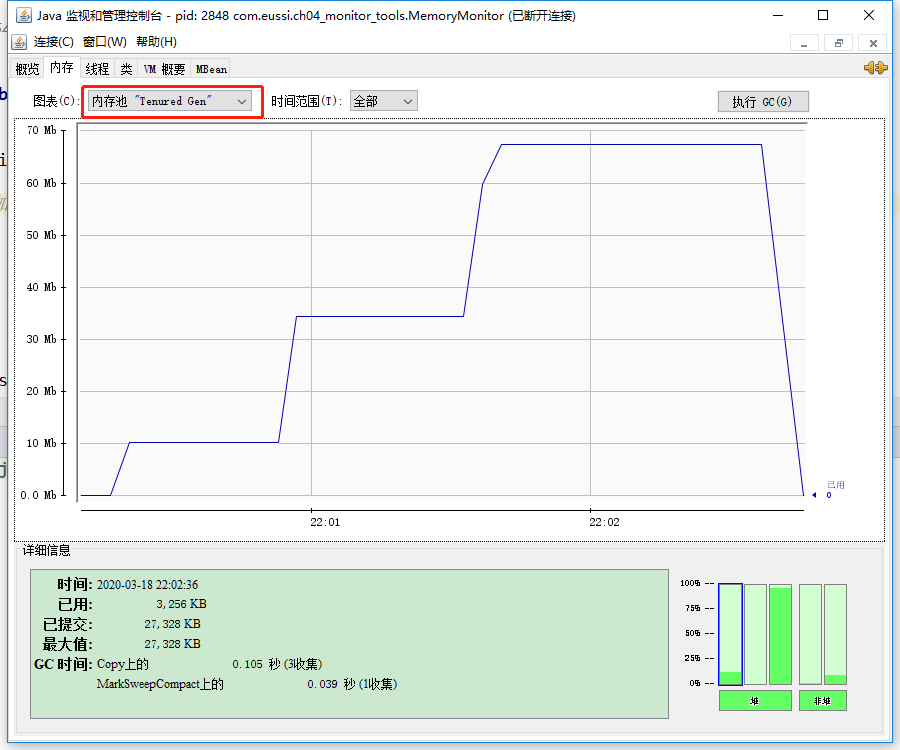
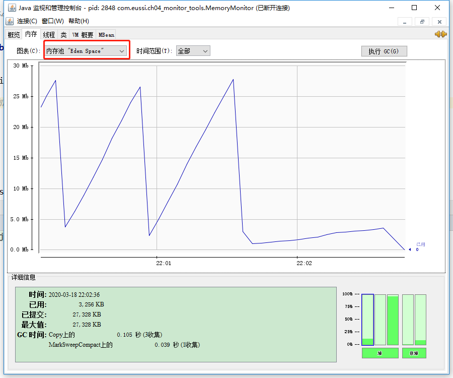
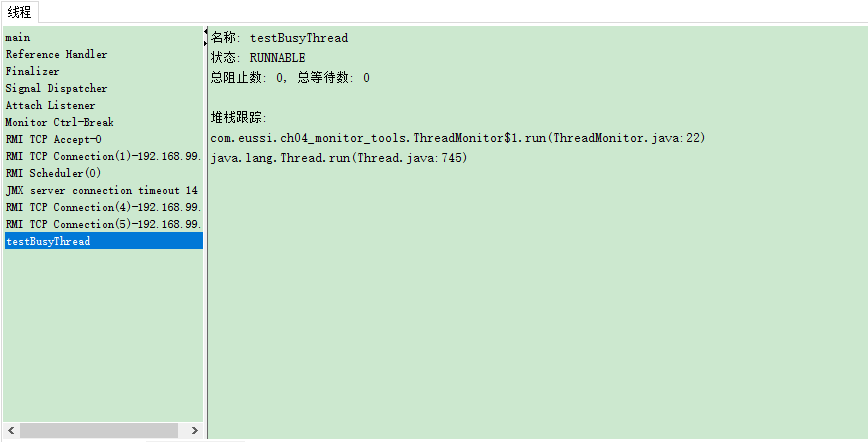
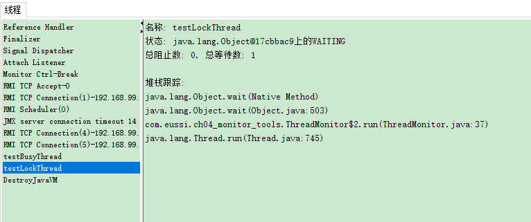
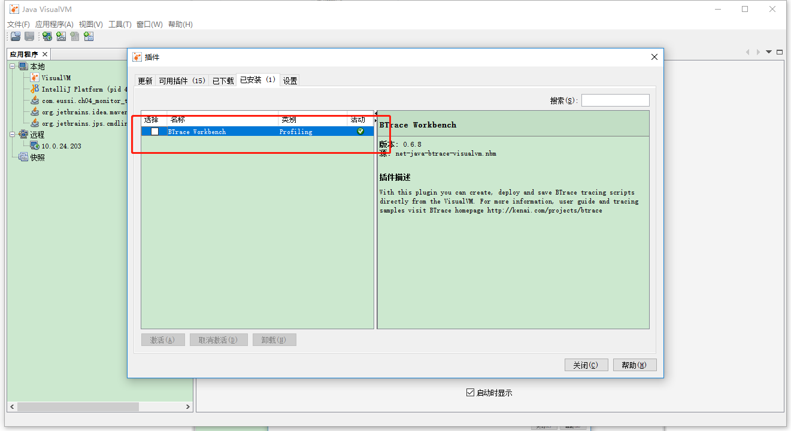

[TOC]

Java与C++之间有一堵由内存动态分配和垃圾收集技术所围成的“高墙”，墙外面的人想进去，墙里面的人却想出来。

# 概述

经过前面对于虚拟机内存分配与回收技术各方面的介绍，相信已经建立了一套比较完整的理论基础。理论总是作为指导实践的工具，能把这些知识应用到实际工作中才是我们的最终目的。接下来的两章，我们将从实践的角度去了解虚拟机内存管理的世界。

给一个**系统定位问题**的时候，**知识、经验是关键基础，数据是依据，工具是运用知识处理数据的手段**。这里说的数据包括：运行日志、异常堆栈、GC日志、线程快照 (threaddump/javacore文件）、堆转储快照（heapdump/hprof文件）等。经常使用适当的虚拟机监控和分析的工具可以加快我们分析数据、定位解决问题的速度，但在学习工具前，也应当意识到工具永远都是知识技能的一层包装，没有什么工具是“秘密武器”，不可能学会了就能包治百病。

# JDK的命令行工具

Java开发人员肯定都知道JDK的bin目录中有“java.exe”、“javac.exe”这两个命令行工具，但并非所有程序员都了解过JDK的bin目录之中其他命令行程序的作用。每逢JDK更新版本之时，bin目录下命令行工具的数量和功能总会不知不觉地增加和增强。Java 1.7.0_79 bin目录的内容如下所示。

```
appletviewer.exe    java-rmi.exe  jrunscript.exe    pack200.exe
apt.exe             javaw.exe     jsadebugd.exe     policytool.exe
extcheck.exe        javaws.exe    jstack.exe        rmic.exe
idlj.exe            jcmd.exe      jstat.exe         rmid.exe
jabswitch.exe       jconsole.exe  jstatd.exe        rmiregistry.exe
jar.exe             jdb.exe       jvisualvm.exe     schemagen.exe
jarsigner.exe       jhat.exe      keytool.exe       serialver.exe
java.exe            jinfo.exe     kinit.exe         servertool.exe
javac.exe           jli.dll       klist.exe         tnameserv.exe
javadoc.exe         jmap.exe      ktab.exe          unpack200.exe
javafxpackager.exe  jmc.exe       msvcr100.dll      wsgen.exe
javah.exe           jmc.ini       native2ascii.exe  wsimport.exe
javap.exe           jps.exe       orbd.exe          xjc.exe

```

在本章中，将介绍这些工具的其中一部分，主要包括用于监视虚拟机和故障处理的工具。这些故障处理工具:被Sun公司作为“礼物”附赠给JDK的使用者，并在软件的使用说明中把它们声明为“没有技术支持并且是实验性质的”（unsupported and experimental) 的产 品，但**事实上，这些工具都非常稳定而且功能强大，能在处理应用程序性能问题、定位故障时发挥很大的作用**。

说起JDK的工具，可能会注意到这些工具的程序体积都异常小巧。 假如以前没注意到，现在不妨看看，几乎所有工具的体积基本上都稳定在16KB左右。并非JDK开发团队刻意把它们制作得如此精炼来炫耀编程水平，而是因为这些命令行工具大多数是jdk/lib/tools.jar类库的一层薄包装而已，它们主要的功能代码是在tools类库中实现的。上图与下图两张图片对比一下就可以看得很清楚(tools.jar/sun/tools/目录下)。


假如使用的是Linux版本的JDK，还会发现这些工具中很多甚至就是由Shell脚本直接写成的，可以用vim直接打开它们。
JDK开发团队选择采用Java代码来实现这些监控工具是有特别用意的:当应用程序部署到生产环境后，无论是直接接触物理服务器还是远程Telnet到服务器上都可能会受到限制。 借助tools.jar类库里面的接口，我们可以直接在应用程序中实现功能强大的监控分析功能。

> tools.jar中的类库不属于Java的标准API,如果引人这个类库，就意味着用户的程序只能运行于Sun Hotspot (或一些从Sun公司购买了JDK的源码License的虚拟机，如IBMJ9、BEAJRockit)上面，或者在部署程序时需要一起部署tools.jar。 

需要特别说明的是，**下面介绍的工具全部基于Windows平台下的JDK 1.6 Update 21（但是展示会使用1.7.0_79）**， 如果JDK版本、操作系统不同，工具所支持的功能可能会有较大差别。大部分工具在JDK 1.5中就已经提供，但为了避免运行环境带来的差异和兼容性问题，建议使用JDK 1.6来 验证本章介绍的内容，因为JDK 1.6的工具可以正常兼容运行于JDK 1.5的虚拟机之上的程 序，反之则不一定。下表中说明了 JDK主要命令行监控工具的用途。

> 注意如果读者在工作中需要监控运行于**JDK 1.5的虚拟机之上**的程序，在程序启动时请**添加参数‘‘-Dcom.sun.management.jmxremote”开启JMX管理功能**，否则由于部分工具都是基于JMX (包括后面介绍的可视化工具），它们都将会无法使用，如果**被监控程序运行于JDK 1.6的虚拟机之上，那JMX管理默认是开启的**，虚拟机启动时无须再添加任何参数。

Sun JDK监控和故障处理工具列表

| 名称   | 主要作用                                                     |
| ------ | ------------------------------------------------------------ |
| jps    | JVM Process Status Tool,显示指定系统内所有的HotSpot虚拟机进程 |
| jstat  | JVM Statistics Monitoring Tool,用于收集HotSpot虚拟机各方面的运行数据 |
| jinfo  | Configuration Info for Java，显示虚拟机配置信息              |
| jmap   | Memory Map for Java，生成虚拟机的内存转储快照（heapdump文件） |
| jhat   | JVM Heap Dump Brower,用于分析heap dump文件，它会建立一个HTTP/HTML服务器，让用户可以在浏览器上查看分析结果 |
| jstack | Stack Trace for Java。显示虚拟机的线程快照                   |

##  jps:虚拟机进程状况工具

JDK的很多小工具的名字都参考了UNIX命令的命名方式，jps (JVM Process Status Tool)是其中的典型。除了名字像UNIX的ps命令之外，它的功能也和ps命令类似：**可以列出正在运行的虚拟机进程，并显示虚拟机执行主类（Main Class, main()函数所在的类）名称以及这些进程的本地虚拟机唯一ID (Local Virtual Machine Identifier, LVMID)**。虽然功能比较单一，但它是**使用频率最高的JDK命令行工具**，因为其他的JDK工具大多需耍输人它査询到的LVMID来确定要监控的是哪一个虚拟机进程。对于本地虚拟机进程来说，**LVMID与操作系统的进程ID (Process Identifier, PID)是一致的**，使用Windows的任务管理器或者UNIX的ps命令也可以查询到虚拟机进程的LVMID,但如果同时启动了多个虚拟机进程， 无法根据进程名称定位时，那就只能依赖jps命令显示主类的功能才能区分了。

jps命令格式

```
jps [ options ] [ hostid ]
```

jps可以**通过RMI协议查询开启了RMI服务的远程虚拟机进程状态**，hostid为RMI注册表中注册的主机名。jps的其他常用选项见表：

| 选项 | 作用                                               |
| ---- | -------------------------------------------------- |
| -q   | 只输出LVMID，省略主类的名称                        |
| -m   | 输出虚拟机进程启动时传递给主类main()函数的参数     |
| -l   | 输出主类的全名，如果进程执行的是jar包，输出jar路径 |
| -v   | 输出虚拟机进程启动时jvm参数                        |

更多可以在Linux系统下使用**man jps**查询命令使用方式

## jstat:虚拟机统计信息监视工具

jstat (JVM Statistics Monitoring Tool)是用于**监视虚拟机各种运行状态信息的命令行工具**。它可以显示**本地或者远程（需要远程主机提供RMI支持，SUN提供的jstatd工具可以很方便的建立远程RMI服务器）**虚拟机进程中的类装载、内存、垃圾收集、JIT编译等运行数据，在**没有GUI图形界面，只提供了纯文本控制台环境的服务器**上，它将是运行期**定位虚拟机性能问题的首选工具**。

 jstat命令格式为：

```
jstat [ option vmid [interval[s|ms] [count]] ]
```

对于命令格式中的VMID与LVMID需要特别说明一下：如果是本地虚拟机进程, VMID与LVMID是一致的，如果是远程虚拟机进程，那VMID的格式应当是：

```
[protocol:][//]lvmid[@hostname[:port]/servername]
```

参数interval和count代表査询间隔和次数，如果省略这两个参数，说明只査询一次。 假设需要每250毫秒查询一次进程2764垃圾收集状况，一共査询20次，那命令应当是：

```
jstat -gc 2764 250 20
```


选项option代表着用户希望査询的虚拟机信息，**主要分为3类：类装载、垃圾收集、运行期编译状况**，具体选项及作用请参考下表的描述：

| 选项 | 作用                                               |
| ---- | -------------------------------------------------- |
| -class | 监视类装载、卸载数量、总空间以及类装载所耗费的时间  |
| -gc | 监视Java堆状况,包括Eden区、两个survivor区、老年代、永久代等的容量、已用空间、GC时间合计等信息  |
| -gccapacity | 监视内容基本与-gc相同，但输出主要关注java堆各个区域使用到的最大最小空间  |
| -gcutil | 监视内容基本与-gc相同,但输出主要关注已使用空间占总空间的百分比  |
| -gccause | 与-gcutil功能一样，但是会额外输出导致上一次GC产生的原因  |
| -gcnew | 监视新生代GC状况  |
| -gcnewcapacity | 监视内容与-gcnew基本相同，输出主要关注使用到的最大、最小空间  |
| -gcold | 监视老年代GC状况  |
| -gcoldcapacity | 监视内容与-gcold基本相同，输出主要关注使用到的最大、最小空间  |
| -gcpermcapacity | 输出永久代使用到的最大、最小空间（jdk1.8 以后无法使用）  |
| -compiler | 输出JIT编译器编译过的方法、耗时等信息  |
| -printcompilation | 输出已经被JIT编译的方法  |

jstat监视选项众多，囿于版面原因无法逐一演示，这里仅举监视一台刚刚启动的 GlassFish v3服务器的内存状况的例子来演示如何査看监视结果。监视参数与输出结果如代码清单所示(书中例子，使用jdk1.6.0_21):

```
$ jstat -gcutil 2764
SO		SI		E		0		P		YGC	YGCT 	FGC FGCT	GCT
0.00	0.00	6.20	41.42	47.20	16	0.105	3	0.472	0.577
```

查询结果表明：这台服务器的新生代Eden区（E,表示Eden)使用了 6.2%的空间，两个Survivor区（S0、S1，表示Survivor0、Survivor1)里面都是空的，老年代（O，表示Old) 和永久代（P，表示Permanent)则分別使用了 41.42%和47.20%的空间。程序运行以来共发生 Minor GC(YGC，表示 Young GC)16次，总耗时 0.105 秒，发生 FullGC(FGC，表示 Full GC) 3次，Full GC总耗时（FGCT,表示Full GC Time)为0.472秒，所有GC总耗时 (GCT，表示 GCTime)为 0.577 秒。

使用jstat工具在纯文本状态下监视虚拟机状态的变化，确实不如后面将会提到的 VisualVM等可视化的监视工具直接以图表展现那样直观。但许多服务器管理员都习惯了在文本控制台中工作，直接在控制台中使用jstat命令依然是一种常用的监控方式。

下面是各个列名的含义，如下表：


| 列名 | 描述  | 列名 | 描述                             |
| ---- | ---------------- | ---------------- | ------------ |
| S0C	| Survivor0的当前容量  | NGCMX	| 新生代最大容量  |
| S1C	| Survivor1的当前容量  | NGC	| 新生代当前容量  |
| S0U	| Survivor0的使用量    | OGCMN	| 老年代最小容量  |
| S1U	| Survivor1的使用量    | OGCMX	| 老年代最大容量  |
| EC	| Eden区的当前容量     | OGC	| 老年代当前容量  |
| EU	| Eden区的使用量       | PGCMN	| 方法区最小容量  |
| OC	| old区的当前容量      | PGCMX	| 方法区最大容量  |
| OU	| old区的使用量        | PGC	| 方法区当前容量  |
| PC	| 方法区的当前容量     | PC	| 方法区的当前容量 |
| PU	| 方法区的使用量       | PU	| 方法区使用量 |
| YGC	| Young GC次数         | LGCC	| 上一次GC发生的原因 |
| YGCT	| Young GC累积耗时     | GCC	| 当前GC发生的原因 |
| FGC	| Full GC次数          | TT	| 存活阀值，如果对象在新生代移动次数超过此阀值，则会被移到老年代 |
| FGCT	| Full GC累积耗时      | MTT	| 最大存活阀值，如果对象在新生代移动次数超过此阀值，则会被移到老年代 |
| GCT	| GC总的累积耗时       | DSS	| survivor区的理想容量 |
| NGCMN	| 新生代最小容量       |         |                 |

##  jinfo: Java配置信息工具

jinfo (Configuration Info for Java)的作用是**实时地査看和调整虚拟机各项参数**。使用**jps命令的-v参数可以查看虚拟机启动时显式指定的参数列表**，但如果**想知道未被显示指定的参数**的系统默认值，除了去找资料外，就只能**使用jinfo的-flag选项进行査询**了（如果只限于**JDK 1.6或以上版本**的话，使用**java -XX:+PrintFlagsFinal査看参数默认值**也是一个很好的选择），**jinfo还可以使用-sysprops选项把虚拟机进程的System.getProperties()的内容打印**出来。这个命令在JDK 1.5时期已经随着Linux版的JDK发布，当时只提供了信息査询的功能，**JDK 1.6之后**，jinfo在Windows和Linux平台都有提供，并且**加入了运行期修改参数的能力**，可以使用-flag [+|-]name或者-flag  name=value修改一部分运行期可写的虚拟机参数值。JDK 1.6中,jinfo对于**Windows平台功能仍然有较大限制**，只提供了最基本的-flag选项。

> java -Xss256k -XX:+PrintFlagsFinal -version | grep ThreadStackSize 可验证Xss改变的参数值
>
> 运行结果：
>
>    intx CompilerThreadStackSize                   = 0                                  	 {pd product}
>    intx ThreadStackSize                          		:= 256                                   {pd product}
>    intx VMThreadStackSize                         	= 1024                                 {pd product}

jinfo命令格式：

```
jinfo [ option ] pid
```

常用选项如下表：

| 列名             | 描述                       |
| ---------------- | -------------------------- |
| no option        | 输出全部的参数和系统属性   |
| -flag  name      | 输出对应名称的参数         |
| -flag [+\|-]name | 开启或者关闭对应名称的参数 |
| -flag name=value | 设定对应名称的参数         |
| -flags           | 输出全部的参数             |
| -sysprops        | 输出系统属性               |

##  jmap: Java内存映像工具

jmap (Memory Map for Java)命令**用于生成堆转储快照（一般称为heapdump或dump 文件）**。如果**不使用jmap**命令，要想**获取Java堆转储快照**，还有一些**比较“暴力”的手段**：譬如在第2章中用过的**-XX:+HeapDumpOnOutOfMemoryError**参数，可以让虚拟机在OOM异常出现之后自动生成dump文件，通过**-XX:+HeapDumpOnCtrlBreak**参数则可以使用 [Ctrl]+[Break]键让虚拟机生成dump文件，又或者在Linux系统下通过**Kill -3命令**发送进程 退出信号“吓唬”一下虚拟机，也能拿到dump文件。

jmap的作用并不仅仅是为了获取dump文件，它**还可以査询finalize执行队列、Java堆 和永久代的详细信息**，如空间使用率、当前用的是哪种收集器等。

和jinfo命令一样，jmap有不少功能**在Windows平台下都是受限**的，除了生成dump文件的-dump选项和用于查看每个类的实例、空间占用统计的-histo选项在所有操作系统都提供之外，其余选项都只能在Linux/Solaris下使用。 

jmap命令格式：

```
jmap [ option ] vmid
```

常用选项如下表

| 选项           | 作用                                                         |
| -------------- | ------------------------------------------------------------ |
| -dump          | 生成Java堆转储快照。格式为：-dump:[live, ]format=b,file=< filename >,其中live子参数说明是否只dump存活的对象 |
| -finalizerinfo | 显示在F-Queue中等待Finalizer线程执行finalize方法的对象。只在Linux/Solaris平台下有效 |
| -heap          | 显示Java堆详细信息，如使用哪种回收器、参数配置、分代状况等。只在Linux/Solaris平台下有效 |
| -histo         | 显示堆中对象统计信息，包括类、实例数量、合计容量             |
| -permstat      | 以ClassLoader为统计口径显示永久代内存状态、只在Linux/Solaris平台下有效 |
| -F             | 当虚拟机进程对-dump选项没有响应时，可使用这个选项强制生成dump快照。只在Linux/Solaris平台下有效 |
| -clstats       | -clstats是-permstat的替代方案，**在JDK8之前，-permstat用来打印类加载器的数据**  打印Java堆内存的永久保存区域的类加载器的智能统计信息。对于每个类加载器而言，它的名称、活跃度、地址、父类加载器、它所加载的类的数量和大小都会被打印。此外，包含的字符串数量和大小也会被打印。 |

##  jhat:虚拟机堆转储快照分析工具

Sun JDK提供jhat (JVM Heap Analysis Tool)命令**与jmap搭配使用，来分析jmap生成的堆转储快照**。jhat内置了一个微型的HTTP/HTML服务器，生成dump文件的分析结果后，可以在浏览器中查看。不过实事求是地说，在实际工作中，**除非手上真的没有别的工具可用**，否则一般都不会去直接使用jhat命令来分析dump文件，主要原因有二：一是**一般不会在部署应用程序的服务器上直接分析dump文件**，即使可以这样做，也会尽量将dump文件复制到其他机器上进行分析(用于分析的机器一般也是服务器，由于加载dump快照文件需要比生成dump更大的内存，所以一般在64位 JDK、大内存的服务器上进行)，因为分析工作是一个耗时而且消耗硬件资源的过程，既然都要在其他机器进行，就没有必要受到命令行工具的限制了；另一个原因是**jhat的分析功能相对来说比较简陋**，后文将会介绍到的VisualVM，以及专业用于分析dump文件的Eclipse Memory Analyzer、IBM HeapAnalyzer(IBM HeapAnalyzer用于分析IBM J9虚拟机生成的映像文件，各个虚拟机产生的映像文件格式并不一致，所以分析工具也不能通用)等工具，都能实现比jhat更强大更专业的分析功能。 

使用方式：

1. 导出堆

 ```
jmap -dump:format=b,file=a.log pid
 ```

除了使用jmap命令，还可以通过以下方式：

> 1. 使用 jconsole 选项通过 HotSpotDiagnosticMXBean 从运行时获得堆转储（生成dump文件）
>
> 2. 虚拟机启动时如果指定了 -XX:+HeapDumpOnOutOfMemoryError 选项, 则在抛出 OutOfMemoryError 时, 会自动执行堆转储。
>
> 3. 通过-XX:+HeapDumpOnCtrlBreak参数则可以使用 [Ctrl]+[Break]键让虚拟机生成dump文件
>
> 4. 使用 hprof 命令

 

2. 分析堆文件

```
jhat -J-Xmx512M a.log
```

> 说明：有时dump出来的堆很大，在启动时会报堆空间不足的错误，可加参数：jhat -J-Xmx512m < heap dump file >。这个内存大小可根据自己电脑进行设置。

3. 查看html

访问地址：http://ip:7000/

对于jhat启动后显示的html页面中功能：

1. 显示出堆中所包含的所有的类
2. 从根集能引用到的对象
3. 显示平台包括的所有类的实例数量
4. 堆实例的分布表
5. 执行对象查询语句（语法可点击界面的“OQL help”）

分析结果默认是**以包为单位进行分组显示**，分析内存泄漏问题主要会使用到其中的 “Heap Histogram”（与jmap -histo功能一样）与OQL页签的功能，前者可以找到内存中总容量最大的对象，后者是标准的对象査询语言，使用类似SQL的语法对内存中的对象进行査询统计。

## jstack: Java堆栈跟踪工具

jstack (Stack Trace for Java)命令**用于生成虚拟机当前时刻的线程快照**（一般称为 threaddump或者javacore文件）。**线程快照就是当前虚拟机内每一条线程正在执行的方法堆栈的集合**，生成线程快照的**主要目的是定位线程出现长时间停顿的原因**，如线程间死锁、死循环、请求外部资源导致的长时间等待等都是导致线程长时间停顿的常见原因。线程出现停顿的时候通过jstack来査看各个线程的调用堆栈，就可以知道没有响应的线程到底在后台做些什么事情，或者等待什么资源。

jstack命令格式：

```
jstack [ option ] vmid
```

常用选项说明：

| 选项 | 作用                                         |
| ---- | -------------------------------------------- |
| -F   | 当正常输出的请求不被响应时，强制输出线程堆栈 |
| -l   | 除堆栈外，显示关于锁的附加信息               |
| -m   | 如果调用到本地方法的话，可以显示C/C++堆栈    |

在JDK 1.5中，java.lang.Thread类新增了一个**getAllStackTraces()**方法用于获取虚拟机 中所有线程的StackTraceElement对象。使用这个方法可以通过简单的几行代码就完成jstack的大部分功能，在实际项目中不妨调用这个方法做个管理员页面，可以随时使用浏览器来査看线程堆栈，下面代码清单未做成前端页面展示，只是在后台打印：

```
package com.eussi.ch04_monitor_tools;

import java.util.Map;

/**
 * 功能类似于jstack命令
 * @author wangxueming
 */
public class GetStackInfo {
    public static void main(String[] args) {
        for(Map.Entry<Thread, StackTraceElement[]> stackTrace : Thread.getAllStackTraces().entrySet()) {
            Thread thread = stackTrace.getKey();
            StackTraceElement[] stack = stackTrace.getValue();
//            if(thread.equals(Thread.currentThread()))
//                continue;
            System.out.println("\n线程：" + thread.getName() + "\n");
            for(StackTraceElement element : stack) {
                System.out.println("\t" + element + "\n");
            }
        }
    }
}
```

运行结果：

```
线程：Reference Handler

	java.lang.Object.wait(Native Method)

	java.lang.Object.wait(Object.java:503)

	java.lang.ref.Reference$ReferenceHandler.run(Reference.java:133)


线程：Finalizer

	java.lang.Object.wait(Native Method)

	java.lang.ref.ReferenceQueue.remove(ReferenceQueue.java:135)

	java.lang.ref.ReferenceQueue.remove(ReferenceQueue.java:151)

	java.lang.ref.Finalizer$FinalizerThread.run(Finalizer.java:209)


线程：Attach Listener


线程：Monitor Ctrl-Break


线程：Signal Dispatcher


线程：main

	java.lang.Thread.dumpThreads(Native Method)

	java.lang.Thread.getAllStackTraces(Thread.java:1640)

	com.eussi.ch04_monitor_tools.GetStackInfo.main(GetStackInfo.java:15)

```

##  HSDIS: JIT生成代码反汇编

在Java虚拟机规范中，详细描述了虚拟机指令集中每条指令的执行过程、执行前后对操作数栈、局部变量表的影响等细节。这些细节描述与Sun的早期虚拟机（Sun Classic VM)高度吻合，但**随着技术的发展，高性能虚拟机真正的细节实现方式已经渐渐与虚拟机规范所描述的内容产生了越来越大的差距**，虚拟机**规范中的描述逐渐成了虚拟机实现的“概念模型”**——即实现只能保证规范描述等效。基于这个原因，我们分析程序的执行语义问题 (虚拟机做了什么）吋，在字节码层面上分析完全可行，但分析程序的执行行为问题（虚拟机是怎样做的、性能如何）时，在字节码层面上分析就没有什么意义了，需要通过其他方式解决。

分析程序如何执行，通过软件调试工具（GDB、Windbg等）来断点调试是最常见的手段，但是这样的调试方式在Java虚拟机中会遇到很大困难，因为大量执行代码是通过JIT编译器动态生成到CodeBuffer中的，没有很简单来处理这种混合模式的调试(不过相信虚拟机开发团队内部肯定是有内部工具的)。因此，不得不通过一些特别的手段来解决问题， 基于这种背景，本节的主角一HSDIS插件就正式登场了。

HSPIS是一个Sun官方推荐的HotSpot虚拟机JIT编译代码的反汇编插件，它包含在HotSpot虚拟机的源码之中，但没有提供编译后的程序。在Project Kenai的网站也可以下载到单独的源码。它的作用是让HotSpot的-XX:+PrintAssembly指令调用它来把动态生成的本地代码还原为汇编代码输出，同时还生成了大量非常有价值的注释，这样我们就可以通过输出的代码来分析问题。可以根据自己的操作系统和CPU类型从Project Kenai的网站上下载编译好的插件，直接放到JDK_HOME/jre/bin/client和JDK_HOME/jre/bin/server目录中即可。如果没有找到所需操作系统（譬如Windows的就没有） 的成品，那就得自己使用源码编译一下。

还需要注意的是，如果使用的是Debug或者FastDebug版的HotSpot，那可以直接通过-XX:+PrintAssembly指令使用插件；如果使用的是Product版的HotSpot，那还要额外加入一个-XX:+UnlockDiagnosticVMOptions参数。以代码清单中的简单测试代码为例演示一下这个插件的使用。

```
package com.eussi.ch04_monitor_tools;

/**
 * VM Args: -XX:+PrintAssembly -Xcomp -XX:CompileCommand=dontinline,*Bar.sum -XX:CompileCommand=compileonly,*Bar.sum
 *
 * @author wangxueming
 */
public class Bar {
    int a = 1;
    static int b = 2;

    public int sum(int c) {
        return a + b + c;
    }

    public static void main(String[] args) {
        new Bar().sum(3);
    }
}
```

编译上面代码，并用一下命令执行：

```
java -XX:+PrintAssembly -Xcomp -XX:CompileCommand=dontinline,*Bar.sum -XX:CompileCommand=compileonly,*Bar.sum com.eussi.ch04_monitor_tools.Bar
```

其中，参数-Xcomp（在新版本的hotspot版本中被移除了，如果无法使用这个参数，请加个循环预热代码，触发JIT编译）是让虚拟机以编译模式执行代码，这样代码可以“偷懒”，不需要执行足够次数来预热都能触发JIT编译。两个-XX:CompileCommand意思是让编译器不要内联sum()并且只编译sum()，-XX:+PrintAssembly就是输出反汇编内容。如果一切顺利的话，屏幕上出现类似下面代码清单所示的内容（未下载debug版本问题，故未运行，采用书中结果）：

```
[Disassembling for mach='i386'] 
[Entry Point]
[Constants]
# {method} 'sum' '(I)I' in 'test/Bar' 
# this: 	ecx 		= 'test/Bar' 
# parm0: 	edx 		= int 
# 			[sp+0x20] (sp of caller) 
…… 
0x01cac407: cmp 	0x4(%ecx),%eax 
0x01cac40a: jne 	0x01c6b050 			; {runtime_call} 
[Verified Entry Point] 
0x01cac410: mov 	%eax,-0x8000(%esp) 
0x01cac417: push 	%ebp 
0x01cac418: sub 	$0x18,%esp 			;*aload_0 
										; - test.Bar::sum@0 (line 8) 
;; block B0 [0, 10] 

0x01cac41b: mov 	0x8(%ecx),%eax 		;*getfield a 
										; - test.Bar::sum@1 (line 8) 
0x01cac41e: mov 	$0x3d2fad8,%esi 	; {oop(a 
'java/lang/Class' = 'test/Bar')} 
0x01cac423: mov 	0x68(%esi),%esi 	;*getstatic b 
										; - test.Bar::sum@4 (line 8) 
0x01cac426: add 	%esi,%eax 
0x01cac428: add 	%edx,%eax 
0x01cac42a: add 	$0x18,%esp 
0x01cac42d: pop 	%ebp 
0x01cac42e: test 	%eax,0x2b0100 		; {poll_return} 
0x01cac434: ret
```

代码并不多，一句一句来看：

1. mov %eax,-0x8000(%esp)：检查栈溢。
2. push %ebp：保存上一栈帧基址。
3. sub $0x18,%esp：给新帧分配空间。
4. mov 0x8(%ecx),%eax：取实例变量a，这里0x8(%ecx)就是ecx+0x8的意思，前面“[Constants]”节中提示了“this:ecx = 'test/Bar'”，即ecx寄存器中放的就是this对象的地址。偏移0x8是越过this对象的对象头，之后就是实例变量a的内存位置。这次是访问“Java堆”中的数据。
5. mov $0x3d2fad8,%esi：取test.Bar在方法区的指针。
6. mov 0x68(%esi),%esi：取类变量b，这次是访问“方法区”中的数据。
7. add %esi,%eax 、add %edx,%eax：做2次加法，求a+b+c的值，前面的代码把a放在eax中，把b放在esi中，而c在[Constants]中提示了，“parm0:edx = int”，说明c在edx中。
8. add $0x18,%esp：撤销栈帧。
9. pop %ebp：恢复上一栈帧。
10. test %eax,0x2b0100：轮询方法返回处的SafePoint
11. ret：方法返回。

从汇编代码中可见，访问Java堆、栈和方法区中的数据，都是直接访问某个内存地址或者寄存器，之间并没有看见有什么隔阂。HotSpot虚拟机本身是一个运行在物理机器上的程序，Java堆、栈、方法区都在Java虚拟机进程的内存中分配。在JIT编译之后，Native Code面向的是HotSpot这个进程的内存，说变量a还在Java Heap中，应当理解为a的位置还在原来的那个内存位置上，但是Native Code是不理会Java Heap之类的概念的，因为那并不是同一个层次的概念。

#  JDK的可视化工具

JDK中除了提供大量的命令行工具外，还有两个功能强大的可视化工具：**JConsole和 VisualVM**，这两个工具是JDK的**正式成员**，没有被贴上“unsupported and experimental”的标签。

其中**JConsole是在JDK 1.5时期就已经提供的虚拟机监控工具，而VisualVM在JDK 1.6 Update7中才首次发布，现在已经成为Sun(Oracle)主力推动的多合一故障处理工具，并且已经从JDK中分离出来成为可以独立发展的开源项目**。

为了避免本节的讲解成为对软件说明文档的简单翻译，准备了一些代码样例，都是特意编写的“反面教材”。后面将会使用这两款工具去监控、分析这几段代码存在的问题，算是本节简单的实战分析。可以把在可视化工具观察到的数据、现象，与前面两章中讲解的理论知识互相印证。

## JConsble: Java监视与管理控制台

JConsole (Java Monitoring and Management Console)是一种基于JMX的可视化监视、 管理工具。它管理部分的功能是针对JMXMBean进行管理，由于MBean可以使用代码、中间件服务器的管理控制台或者所有符合JMX规范的软件进行访问，所以本节将会着重介绍 JConsole监视部分的功能。

###  JConsole

通过JDK/bin目录下的“jconsole.exe”启动JConsole后，将自动搜索出本机运行的所有虚拟机进程，不需要用户自己再使用jps来査询了。双击选择其中一个进程即可开始监控，也可以使用“远程进程”功能来连接远程服务器，对远程虚拟机进行监控。

双击选择一个进程，进入 JConsole主界面，可以看到主界面里共包括**“概述”、“内存”、“线程”、“类”、“VM摘要”、“MBean”**6个页签。

“概述”页签显示的是整个虚拟机主要运行数据的概览，其中包括“堆内存使用情况”、 “线程”、“类”、“CPU使用情况” 4种信息的曲线图，这些曲线图是后面“内存”、“线程”、 “类”页签的信息汇总，具体内容将在后面介绍。
### 内存监控

**“内存”页签相当于可视化的jstat命令**，用于监视受收集器管理的虚拟机内存（Java堆 和永久代）的变化趋势。我们通过运行下面代码清单中的代码来体验一下它的监视功能。运行时设置的虚拟机参数为：-Xms100m -Xmx100m -XX:+UseSerialGC，这段代码的作用是以 64KB/50毫秒的速度往Java堆中填充数据，一共填充1000次，使用JConsole的“内存”页签进行监视，观察曲线和柱状指示图的变化。

```
package com.eussi.ch04_monitor_tools;

import java.util.ArrayList;
import java.util.List;

/**
 * 测试内存监控
 * VM Args: -Xms100m -Xmx100m -XX:+UseSerialGC
 *
 * @author wangxueming
 */
public class MemoryMonitor {
    /**
     * 内存占位符对象，一个OOMObject大约占64KB
     */
    static class OOMbject {
        public byte[] placeholder = new byte[64 * 1024];
    }
    public static void fillHeap(int num) throws InterruptedException {
        List<OOMbject> list = new ArrayList<OOMbject>();
        for(int i=0; i<num; i++) {
            //稍作延时，另监视曲线的变化更加明显
            Thread.sleep(100);
            list.add(new OOMbject());
        }
        System.gc();
        Thread.sleep(60000);//等待一段时间，观察平稳阶段
    }

    public static void main(String[] args) throws Exception{
        fillHeap(1000);
    }
}
```

程序运行后，在“内存”页签中可以看到内存池Eden区的运行趋势呈现折线状，如下图所示。而监视范围扩大至整个堆后，会发现曲线是一条向上增长的平滑曲线。并且从柱状图可以看出，在1000次循环执行结束，运行了 System.gc()后，虽然整个新生代 Eden和Survivor()都基本被清空了，但是代表老年代的柱状图仍然保持峰值状态，说明被填充进堆中的数据在System.gc()方法执行之后仍然存活。分析到此为止，现提两个小问题思考一下，答案稍后给出。

1. 虚拟机启动参数只限制了 Java堆为100MB，没有指定-Xnm参数，能否从监控图中估计出新生代有多大？
2. 为何执行了 System.gc()之后，下图中代表老年代的柱状图仍然显示峰值状态，代码需要如何调整才能让System.gc()回收掉填充到堆中的对象？







- 问题1答案：上图显示Eden空间为27328K,因为没有设置-XX:SurvivorRatio参数，所以Eden与Survivor空间比例为默认值8: 1,整个新生代空间大约为27328KB/(8/10)=34160KB（默认的，**新生代 ( Young ) 与老年代 ( Old ) 的比例的值为 1:2** ( 该值可以通过参数 –XX:NewRatio 来指定 )，即：新生代 ( Young ) = 1/3 的堆空间大小。）。
-  问题2答案：执行完System.gc()之后，空间未能回收是因为List< OOMObject > list对象仍然存活，fillHeap()方法仍然没有退出，因此list对象在System.gc()执行时仍然处于作用域之内(准确地说，只有在虚拟机使用解释器执行的时候，“在作用域之内”才能保证它不会被回收，因为这里的回收还涉及局部变量表Slot复用、即时编译器介入时机等问题，具体可参考第8章中关于局部变置表内存回收的例子)。如果把System.gc()移动到fillHeap()方法外调用就可以回收掉全部内存。

### 线程监控

如果上面的“内存”页签相当于可视化的jstat命令的话，**“线程”页签的功能相当于可视化的jstack命令**，遇到线程停顿时可以使用这个页签进行监控分析。前面讲解jstack命令的时候提到过线程长时间停顿的主要原因主要有：等待外部资源（数据库连接、网络资源、设备资源等）、死循环、锁等待（活锁和死锁）。通过下面代码清单分别演示一下这几种情况。

```
package com.eussi.ch04_monitor_tools;

import java.io.BufferedReader;
import java.io.InputStreamReader;
import java.util.ArrayList;
import java.util.List;

/**
 * 测试线程监控
 *
 * @author wangxueming
 */
public class ThreadMonitor {
    /**
     * 线程死循环演示
     */
    public static void createBusyThread() {
        Thread thread = new Thread(new Runnable() {
            @Override
            public void run() {
                while(true);
            }
        }, "testBusyThread");
        thread.start();
    }

    /**
     * 线程锁等待演示
     */
    public static void createLockThread(final Object lock) {
        Thread thread = new Thread(new Runnable() {
            @Override
            public void run() {
                synchronized(lock) {
                    try {
                        lock.wait();
                    } catch (InterruptedException e) {
                        e.printStackTrace();
                    }
                }
            }
        }, "testLockThread");
        thread.start();
    }

    public static void main(String[] args) throws Exception{
        BufferedReader br = new BufferedReader(new InputStreamReader(System.in));
        br.readLine();
        createBusyThread();
        br.readLine();
        Object obj = new Object();
        createLockThread(obj);
    }
}
```

程序运行后，首先在“线程”页签中选择main线程，如下图所示。堆栈追踪显示BufferedReader在readBytes方法中等待System.in的键盘输人，这时线程为Runnable状态，**Runnable状态的线程会被分配运行时间**，但readBytes方法**检査到流没有更新时会立刻归还执行令牌**，这种等待只消耗很小的CPU资源。


接着监控testBusyThread线程，如下图所示，testBusyThread线程一直在执行空循环，从堆栈追踪中看到一直在MonitoringTest.java代码的41行停留，41行为：while (true)。这时候线程为Runnable状态，而且**没有归还线程执行令牌的动作，会在空循环上用尽全部执行时间直到线程切换**，这种等待会消耗较多的CPU资源。



下图所示testLockThread线程在等待着lock对象的notify()或notifyAll()方法的出现，线程这时候处于WAITING状态，在被唤醒前不会被分配执行时间。



testLockThread线程正在处于正常的活锁等待，只要lock对象的notify()或notifyAll()方法被调用，这个线程便能激活以继续执行。下面代码清单演示了一个无法再被激活的死锁等待。

```
package com.eussi.ch04_monitor_tools;

/**
 * 测试死锁监控
 *
 * @author wangxueming
 */
public class DeadLockMonitor {
    /**
     * 线程死锁等待演示
     */
    static class SynAddRunnable implements Runnable {
        int a, b;

        public SynAddRunnable(int a, int b) {
            this.a = a;
            this.b = b;
        }

        @Override
        public void run() {
            synchronized (Integer.valueOf(a)) {
                synchronized (Integer.valueOf(b)) {
                    System.out.println(a + b);
                }
            }
        }
    }
    public static void main(String[] args) {
        for(int i=0; i<100; i++) {
            new Thread(new SynAddRunnable(1,2)).start();
            new Thread(new SynAddRunnable(2,1)).start();
        }
    }
}
```

这段代码开了200个线程去分别计算1+2以及2+1的值，其实for循环是可省略的，两个线程也可能会导致死锁，不过那样概率太小，需要尝试运行很多次才能看到效果。一般的话，带for循环的版本最多运行2~3次就会遇到线程死锁，程序无法结束。造成死锁的原因是Integer.valueOf()方法基于减少对象创建次数和节省内存的考虑，[-128，127]之间的数字会被缓存(默认值，实际值取决于java.lang.Integer.IntegerCache.high参数的设置)，当valueOf()方法传人参数在这个范围之内，将直接返回缓存中的对象。也就是说，代码中调用了200次Integer.valueOf()方法一共就只返回了两个不同的对象。假如在某个线程的两个synchronized块之间发生了一次线程切换，那就会出现线程A等着被线程B持有的Integer.valueOf(1)，线程B又等着被线程A持有的Integer.valueOf(2),结果出现大家都跑不下去的情景。

出现线程死锁之后，点击JConsole线程面板的“检测到死锁”按钮，将出现一个新的"死锁”页签，如下图所示。


上图中很清晰地显示了线程Thread-75在等待一个被线程Thread-72持有Integer对 象，而点击线程Thread-72则显示它也在等待一个Integer对象，被线程Thread-75持有，这样两个线程就互相卡住，都不存在等到锁释放的希望了。

##  VisualVM:多合一故障处理工具

VisualVM (All-in-One Java Troubleshooting Tool)是到**目前为止随JDK发布的功能最强大的运行监视和故障处理程序**，并且可以预见在未来一段时间内都是官方主力发展的虚拟机故障处理工具。官方在VisualVM的软件说明中写上了 “All-in-one”的描述字样，预示 着它除了运行监视、故障处理外，还提供了很多其他方面的功能。如性能分析（Profiling)，VisualVM的性能分析功能甚至比起JProfiler、YourKit等专业且收费的Profiling工具都不会逊色多少，而且VisualVM还有一个很大的优点：不需要被监视的程序基于特殊Agent运行，因此他对应用程序的实际性能的影响很小，使得**他可以直接应用在生产环境中**。这个优点是JProfiler、YourKit等工具无法与之媲美的。

### VisualVM兼容范围与插件安装

​    VisualVM基于NetBeans平台开发，因此他一开始就**具备了插件扩展功能的特性，通过插件扩展支持**，VisualVM可以做到：

- 显示虚拟机进程以及进程的配置、环境信息（jps、jinfo）。
- 监视应用程序的CPU、GC、堆、方法区以及线程的信息（jstat、jstack）。
- dump以及分析堆转储快照（jmap、jhat）。
- **方法级的程序运行性能分析**，找到被调用最多、运行时间最长的方法。
- 离线程序快照：收集程序的运行时配置、线程dump、内存dump等信息建立一个快照，可以将快照发送开发者处进行Bug反馈。
- 其他plugins的无限的可能性......

VisualVM在JDK 1.6 update 7中才首次出现，但并不意味着他只能监控运行于JDK 1.6上的程序，他**具备很强的向下兼容能力**，甚至能向下兼容至近10年前发布的JDK 1.4.2平台，这对无数已经处于实施、维护的项目很有意义。当然，并非所有功能都能完美的向下兼容。

VisualVM主要特性的兼容性列表

| 特性         | JDK 1.4.2 | JDK 1.5 | JDK 1.6 local | JDK 1.6 remote |
| ------------ | :-------: | :-----: | :-----------: | :------------: |
| 运行环境信息 |     √     |    √    |       √       |       √        |
| 系统属性     |           |         |       √       |                |
| 监视面板     |     √     |    √    |       √       |       √        |
| 线程面板     |           |    √    |       √       |       √        |
| 性能监控     |           |         |       √       |                |
| 堆、线程Dump |           |         |       √       |                |
| MBean管理    |           |    √    |       √       |       √        |
| JConsole插件 |           |    √    |       √       |       √        |

​    首次启动VisualVM后，不必着急找应用程序进行检测，因为现在VisualVM还没有加载任何插件，虽然基本的监视、线程面板的功能都以默认插件的形式提供了，但是**不给VisualVM装任何扩展插件，就相当于放弃了他最精华的功能**，和没有安装任何应用软件操作系统差不多。

​    插件可以进行**手工安装**，在**相关网站上下载*.nbm包**后，点击“工具”→“插件”→“已下载”菜单，然后在弹出的对话框中指定nbm包路径便可进行安装，插件安装后存放在JDK_HOME/lib/visumalvm/visualvm中。不过手工安装并不常用，使用**VisualVM的自动安装**功能已经可以找到大多数所需的插件，在有网络连接的环境下，点击“工具”→“插件菜单”，弹出下图所示的插件页面，在页签的“可用插件”中列举了当前版本VisualVM可以使用的插件，选中插件后在右边窗口将显示这个插件的基本信息，如开发者、版本、功能描述等。

> 自动安装时，在插件菜单中点击检查最新版本时，会出现无法连接到VisualVM插件中心。这是因为插件中心的地址不可用，处理方式如下：
>
> 1. 打开网址：https://visualvm.github.io/pluginscenters.html
>
> 2. 在右侧选择JDK版本
>
> 3. 选择之后会打开相应的插件中心，如下，这里使用的jdk版本是1.7.0_79
>     
>
> 4. 复制打开上图链接后的页面中Catalog URL的值，这里是：
>    https://visualvm.github.io/archive/uc/8u40/updates.xml.gz 
>    
> 5. “工具->插件->设置->编辑或新增”，将URL设置为上面的值，如果地址仍然不可用，将地址https改成http，即http://visualvm.github.io/archive/uc/8u40/updates.xml.gz (jdk1.7测试安装时依然会很麻烦，jdk1.8则没问题，已经可以直接安装了）。
>
>    注意：1.7安装时会继续访问https开头的地址，导致安装失败，尝试了网上许多的方式都未解决，最终采用手工安装的方式。首先去第一步在可用插件中选择安装，然后出现无法下载的地址，此时手工下载。然后，手工安装时插件之间会有依赖，所以需要每次访问出现无法下载时，把页面显示出来的下载地址拷贝出来手动下载，之后，在已下载->添加插件，**选择全部有关系的npm包**，然后点击安装即可安装成功。



安装完插件，选择一个需要监视的程序就进入程序的主界面了。

VisualVM中“概述”、“监视”、“线程”、“MBeans”的功能与前面介绍的JConsole差别不大，根据上文内容类比使用即可。下面挑选几个特色功能、插件进行介绍。
### 生成、浏览堆转储快照
在VisualVM中生成dump文件有两种方式，可以执行下列任一操作：

- 在‘‘应用程序”窗口中右键单击应用程序节点，然后选择“堆Dump”。
- 在“应用程序”窗口中双击应用程序节点以打开应用程序标签，然后在“监视”标签中单击“堆Dump”。

生成了 dump文件之后，应用程序页签将在该堆的应用程序下增加一个以[heapdump]开头的子节点，并且在主页签中打开了该转储快照。**如果需要把dump文件保存或发送出去，要在heapdump节点上右键选择“另存为”菜单，否则当VisualVM关闭时， 生成的dump文件会被当做临时文件删除掉**。要打开一个已经存在的dump文件，通过文件菜单中的“装人”功能，选择硬盘上的dump文件即可。打开后如下：


从堆页签中的“概要”面板可以看到应用程序dump时的运行时参数、System.getProperties()的内容、线程堆栈等信息，“类”面板则是以类为统计口径统计类的实例数量、容量信息，“实例”面板不能直接使用，因为不能确定用户想查看哪个类的实例，所以需要通过“类”面板进入，在“类”中选择一个关心的类后双击鼠标，即可在“实例”里面看见此类中实例的具体属性信息。“OQL控制台”面板中就是运行OQL查询语句的。

### 分析程序性能

在Profiler页签中，VisualVM提供了程序运行期间方法级的CPU执行时间分析以及内存分析，**做Profiling分析肯定会对程序运行性能有比较大的影响**，所以一般不在生产环境中使用这项功能。

要开始分析，先选择“CPU”和“内存”按钮中的一个，然后切换到应用程序中对程序进行操作，VisualVM会记录到这段时间中应用程序执行过的方法。如果是CPU分析，将会统计每个方法的执行次数、执行耗时；如果是内存分析，则会统计每个方法关联的对象数以及这些对象所占的空间。分析结束后，点击“停止”按钮结束监控过程，如下图所示。


> 注意，在JDK 1.5之后，在Client模式下的虚拟机加入并且自动开启了类共享——这是一个在多虚拟机进程中共享rt.jar中类数据以提高加载速度和节省内存的优化，而根据相关Bug报告的反映，**VisualVM的Profiler功能可能会因为类共享而导致被监视的应用程序崩溃，所以进行Profiling前，最好在被监视程序中使用-Xshare : off参数来关闭类共享优化**。

上图是对上面代码样例com.eussi.ch04_monitor_tools.DeadLockMonitor测试的录制和分析结果，分析自己的应用程序时，可以根据实际业务的复杂与方法的时间、调用次数做比较，找到最有优化价值的方法。

### BTrace动态日志追踪

BTrace是一个很“有趣”的VisualVM插件，本身也是可以独立运行的程序。他的作用是在不停止目标程序运行的前提下，通过HotSpot虚拟机的HotSwap技术（代码热替换技术，HotSpot虚拟机允许在不停止运行的情况下，更新已经加载的类的代码）动态加入原本并不存在的调试代码。这项功能对实际生产中的程序很有意义：经常遇到程序出现问题，但排查错误的一些必要信息，譬如方法参数、返回值等，在开发时并没有打印到日志之中，以至于不得不停掉服务，通过调试增量来加入日志代码以解决问题。当遇到生产环境无法随便停止时，缺一两句日志导致排错进行不下去是一件非常郁闷的事情。

在VisualVM中安装了BTrace插件后，在应用程序面板中**右键点击要调试的程序，会出现“Trace Application......”菜单**，点击将进入BTrace面板。这个面板里面看起来就像一个简单地Java程序开发环境，里面还有一小段Java代码，如下图所示。


 这里准备了一段很简单的Java代码来演示BTrace的功能：产生两个1000以内的随机整数，输出这两个数字相加的结果，如下面所示。

```
package com.eussi.ch04_monitor_tools;

import java.io.BufferedReader;
import java.io.IOException;
import java.io.InputStreamReader;

/**
 * 测试BTrace插件
 *
 * @author wangxueming
 */
public class BTraceTest {

    public int add(int a, int b) {
        return a + b;
    }

    public static void main(String[] args) throws IOException {
        BTraceTest test = new BTraceTest();
        BufferedReader reader = new BufferedReader(new InputStreamReader(System.in));
        for (int i = 0; i < 10; i++) {
            reader.readLine();
            int a = (int) Math.round(Math.random() * 1000);
            int b = (int) Math.round(Math.random() * 1000);
            System.out.println(test.add(a, b));
        }
    }
}
```

程序运行后，在VisualVM中打开该程序的监视，在BTrace页签填充TracingScript的内容，输入的调试代码如下所示。

```
/* BTrace Script Template */
import com.sun.btrace.annotations.*;
import static com.sun.btrace.BTraceUtils.*;

@BTrace
public class TracingScript {
	/* put your code here */
    @OnMethod(
    clazz="com.eussi.ch04_monitor_tools.BTraceTest",
    method="add",
    location=@Location(Kind.RETURN)
    )
    public static void func(@Self com.eussi.ch04_monitor_tools.BTraceTest instance,int a,int b,@Return int result) {
        println("调用堆栈:");
        jstack();
        println(strcat("方法参数A:",str(a)));
        println(strcat("方法参数B:",str(b)));
        println(strcat("方法结果:",str(result)));
    }
}
```

点击“Start”按钮后稍等片刻，编译完成后，可见Output面板中出现“BTrace code successfuly deployed”的字样。程序运行的时候在Output面板将会输出下图所示的调试信息。


BTrace的用法还有很多，打印调用堆栈、参数、返回值只是最基本的应用，在他的网站上使用BTrace进行性能监视、定位连接泄漏和内存泄漏、解决多线程竞争问题等例子。有兴趣可以去相关网站了解一下。

# 本章小结

本章介绍了随JDK发布的6个命令行工具及两个可视化的故障处理工具，灵活使用这些工具可以给问题处理带来很大的便利。
除了 JDK自带的工具之外，常用的故障处理工具还有很多，如果使用的是非Sun 系列的JDK、非HotSpot的虚拟机，就需要使用对应的工具进行分析，如：

- IBM 的 Support Assistant、Heap Analyzer、Javacore Analyzer、Garbage Collector Analyzer适用于IBM J9 VM。
- HP 的 HPjmeter、HPjtune 适用于 HP-UX、SAP、HotSpot VM。
- Eclipse 的 Memory Analyzer Tool (MAT)适用于 HP-UX、SAP、HotSpot VM,安装 IBM DTFJ插件后可支持IBM J9 VM。
- BEA 的 JRockit Mission Control 用于 JRockit VM。

# 相关代码

本章代码 ../code/jvm-test 

